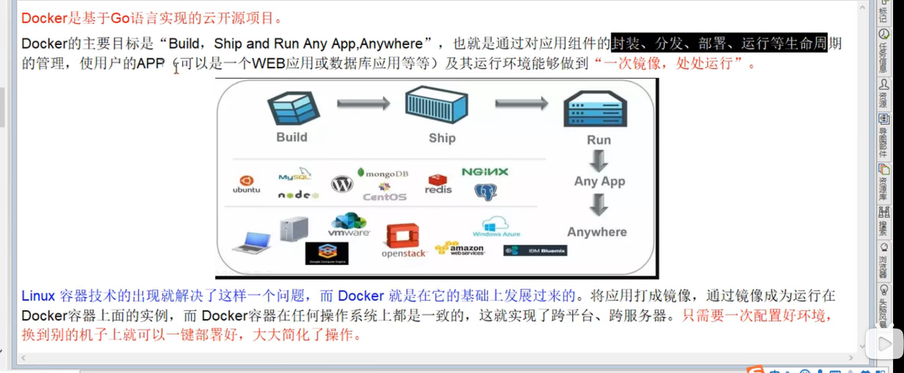
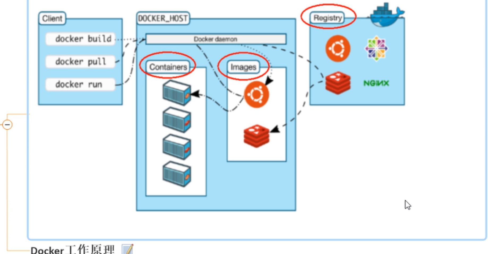

## 前提知识
2/12
boot cloud git redis nginx mysql
linux centos

## 下一个K8s

## Docker的解决的痛点
可以解决开发时 或者运维测试时 由于更换了机器导致 版本不同 无法允许的问题
如果我们使用docker 我们就可以将  100%可以跑起来程序的源码+配置+环境+版本 打包成一个镜像文件
然后将镜像文件放在docker上面

## Docker的理念
一次镜像 处处运行 从搬家到搬楼(将所有的文件包括依赖一起打包)

## Docker图解

## Docker容器与虚拟机的区别
(Docker启动 只需要一个类似软件启动的内存 )
Docker容器是在操作系统层面上面实现虚拟化 直接复用本地主机的操作系统 

(例如 VmStation 他需要本地系统的cpu资源 也就是使用一套硬件 在其上面运行一整个操作系统 在该系统上面运行所需的应用进程)
而传统的虚拟机则是在硬件层面实现虚拟化 与传统的虚拟机相比 Docker的优势体现为启动速度快
占用体积小

## Docker解决的问题
后端使用了Docker后 类似于后端做了运维的工作
能干嘛?
技术职级的变化 developer --> devops (后端开发-->后端兼运维开发)

## DockerHub 安装docker镜像的仓库

## 注意 
Docker并非是一个通用的容器工具 他依赖linux环境 
DOcker的本质就是在linux环境下创建一个隔离的文件环境 因此他只想的效率 几乎等于所部署的linux主机
因此docker必须安装在linux主机上面 如果其它系统想要使用 就必须安装一个linux虚拟机

## Docker的三要素
镜像(image) 你的项目的各种东西 打包成一个iso(镜像文件)
容器(container) 可以把容器看作为一个简易版的系统环境(只包括root用户权限 进程空间 用户空间 网络空间等) 和运行在其中的application
                并且一个容器运行一种微服务 当我们需要时 就可以通过docker客户端创建一个对应的运行实例 也就是我们的容器 
仓库(repository) 用于存放镜像模板的地方(maven存放jar包,github存放各种git项目,Docker也有一个DockerHub用于存放模板)
                仓库分为public(公开)private(私有)仓库两种形式
最大公开仓库为DockerHub 国内有阿里云

用一段java代码来形容 Docker容器的创建
Book    b1 = new Book();
镜像文件           Docker容器

一个Docker镜像可以创建多个Docker容器

从Docker角度
可以把容器看作为一个简易版的系统环境(只包括root用户权限 进程空间 用户空间 网络空间等) 和运行在其中的application

## Docker的原理

## CentenOs7的docker安装
https://docs.docker.com/engine/install/centos/#install-using-the-repository 官网教程
 - -阿里云镜像

yum-config-manager --add-repo http://mirrors.aliyun.com/docker
ce/linux/centos/docker-ce.repo

# 阿里云镜像加速

## docker 启动后 执行的run命令到底干了一些什么操作
code:
 docker run 镜像文件名

流程
 先去本机寻找对应的镜像文件 如果没有那么就从对应的镜像仓库地址中 Pull出来  如果有那么就从本地的机器上面获取
             如果仓库中含有该文件 那么就运行 如果仓库没有该文件 那就报错

## 为什么docker比vm虚拟机快
 1 
   docker不需要虚拟机那样实现硬件的资源虚拟化 运行在docker上面的容器的程序 直接使用的都是实际物理级的硬件资源 因此在cpu内存利用率上面
   docker就有明显的优势
 
2 docker利用的时宿主机的内核 而不需要加载操作系统的os内核

## 例如使用redis
 虚拟机 -- 打开vm --开机(整个系统) --运行redis
 docker --打开docker--开机(指定的微服务)--运行redis
 
## Docker常用的命令
 - 帮助启动类
   systemctl start docker
   systemctl stop docker
   systemctl status docker
   systemctl restart docker
   -- 开机启动
    systemctl enable docker
   -- 帮助
     docker -help 
   

  - 镜像命令
      docker images 列出本机的所有的镜像
        - 属性
          REPOSITORY 镜像文件的仓库源头
          TAG 镜像的标签的版本号
          IMAGE ID 镜像ID
          CREATED 创建时间
          SIZE 镜像大小
          
      同一个仓库原可以有多个TAG的版本 代表该仓库原的不同版本 我们使用 REPOSITORY:TAG 来定义不同的镜像
     如果你不指定 将默认使用 你下载的仓库名:latest镜像
    
     docker search 仓库   搜索仓库
        - 属性
         Name 名称
         Description 镜像说明
         Stars 点赞数
         Official 是否官方认证
         AutoMated 是否为自动构建的
         - 设置
        docker search --limit 行数 仓库  
         搜索仓库 结果显示前五个
    
      docker pull 镜像名字 [:TAG]
      下载镜像
       -- 指定版本
        docker pull mysql :8.0.0
    
      docker system df
       显示docker的内存使用 
    
      docker rmi 镜像名
      删除镜像
    

 
  -容器命令
    docker run [option] 镜像文件名 [command] [arg...] 
     option的选项
      --name 容器新名字
      -d 后台运行容器 返回一个id 也就是开启了守护式容器
      -i 以交互模式运行容器 通常于-t一起使用
      -t 为容器分配一个伪输入终端 通常与-i一起使用
      -P 随机端口 大写P
      -p 指定端口 小写p
        - 
          docker ps 查看运行的容器
      - 退出容器
         exit退出 容器停止
         ctrl+p+q退出 容器不停止 后台运行
        - 启动已经退出的容器
           docker start 容器Id or 名字
        - 强制停止容器
         docker kill 容器id or 名字
          - 停止容器
         docker stop 容器id or 名字
         - 删除已经停止的容器
          docker rm 容器id 

删除一个容器的流程
  关闭容器
  1 [exit ] or [docker stop xx] or [docker kill xx ] or [ctrl+q+p]
  删除关闭的容器
  2  docker rm xxx
   - 容器的概念 
     由于容器是建立在docker内部的 所以需要通过端口映射的方法 使外部可以访问到对应的微服务(容器)
         例如  -p 6379:6373  改行代码就是访问外部的6379端口会被转发进入docker内部的6373端口
    - 例子
      docker run -i -t ubuntu  使用前台启动ubuntu
     
     docker  run -it --name=ubuntu -p 8080:8080 ubuntu 使用前台启动ubuntu并且名字为ubuntu 端口映射为8080映射内部的8080 ubuntu也运行在8080端口

docker run  -it --name=redis  -p 6379:6379 redis:6.0.8 运行redis在6379

    

## 说明什么是虚玄镜像
 就是仓库名和Tag名都为none的镜像
 

## docker ps 
docker ps -a 
查看所有进程
## 容器命令补充
 启动守护式的容器 :
 在大部分的场景下 我们希望docker的服务是在后台运行的 我们可以通过-d 指定容器的后台运行模式
   docker run -d 容器名 返回一个容器id
   查看容器内部进程
   docker top 容器id or name
   查看容器日志 (一般在守护式容器中使用)
    docker log 容器id or name
   查看容器内部的细节(查看conf文件内容)
    docker inspect 容器id or name
 通过命令行操作后台运行的容器(也可以操控 ctrl+p+q的文件)
         docker exec -it 容器id or name  [command值]
     例子
                   启用前台     id            command值
      docker exec   -it        8d541d68a7a9  bash
     该命令如果通过exit退出 不会删除本来的进程
     - 进入后台容器的另一个命令
       docker attach 容器名 or id
      该命令通过exit退出 会删除原进程
 

## 容器备份对应数据到主机 也就是容器高可用
  docker cp 容器id :容器内路径 目的主机路径
## 容器导出
 export 导出容器的内容流作为一个tar包 (对应的import命令)
 import 从tar包中内容创建一个新的文件系统 再导入为镜像 (对应export)
案例
导出
 docker export 容器id > 文件名.tar
导入                [镜像用户 镜像名 和 镜像版本号 都是自定义]
 cat 文件名.tar|docker import - 镜像用户/镜像名:镜像版本号

## 总结
 一般我们启动容器就使用-d 来启动容器 
   通过exec 来进入容器来干活

## 镜像分层概念
 - 镜像的pull命令 是一层一层的下载的
  这就是镜像的原理 
     联合文件系统
   

## docker commit 提交镜像
 commit命令 提交一个容器副本使之成为一个新的镜像

  docker commit -m =提交的描述信息 -a=作者 要提交的容器id 要创建的对应的目标镜像名:[标签名]

 例子
 我们在不支持vim的ubuntu镜像上添加vim 然后提交 我们就得到了一个有vim功能的ubuntu镜像
 这种就是堆叠的镜像 也就是镜像分层  这样可以增强镜像功能

  before           after
   \               \
   ubuntu           vim
   bootfs           ubuntu
                    bootfs 
  

 ## 将镜像添加到阿里云中
与git一样 commit push pull
