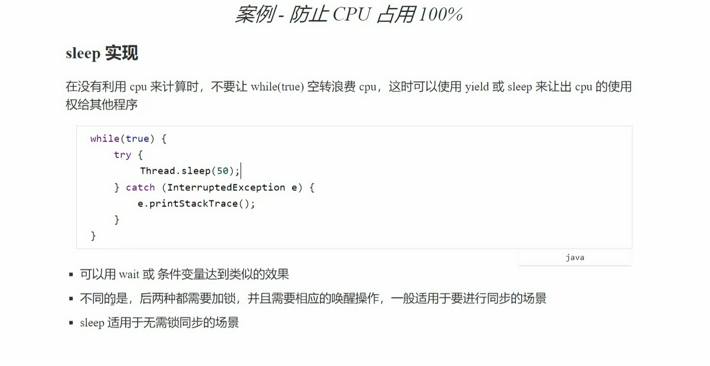
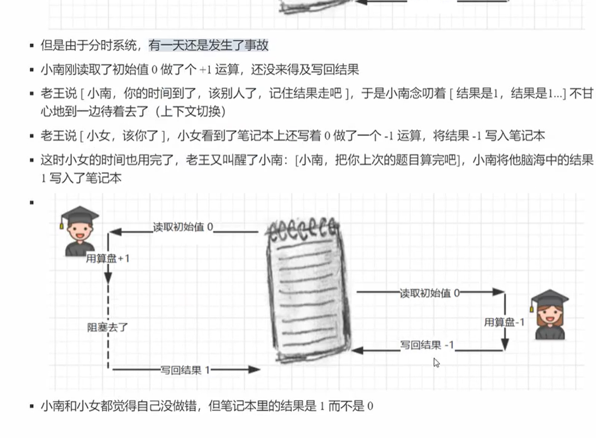
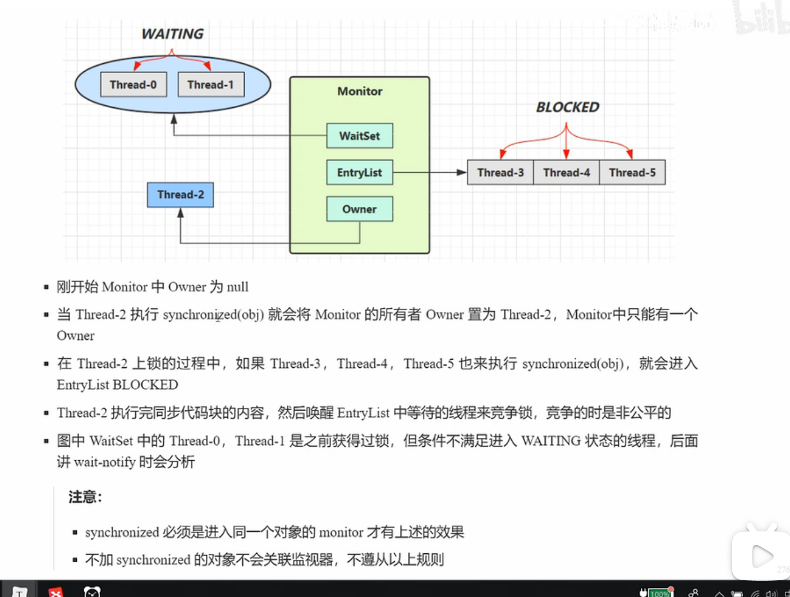
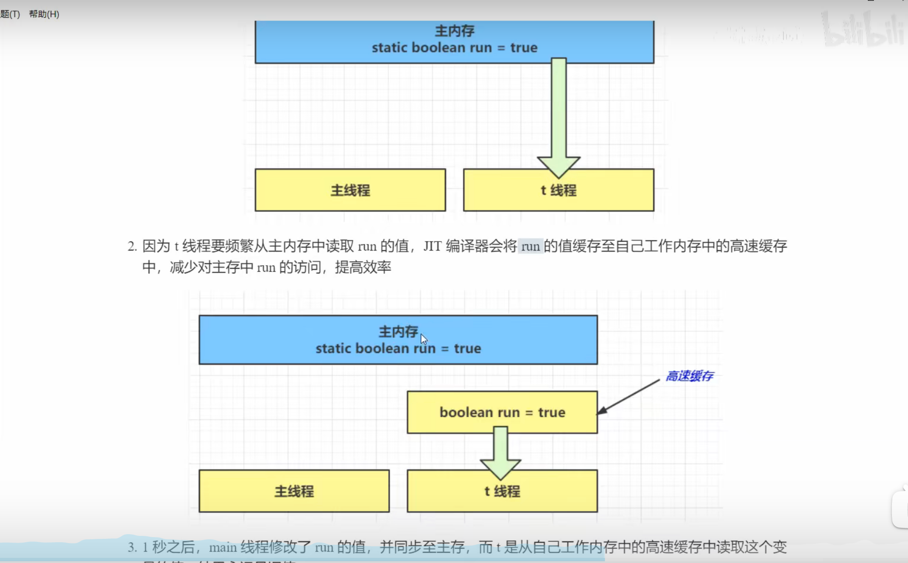
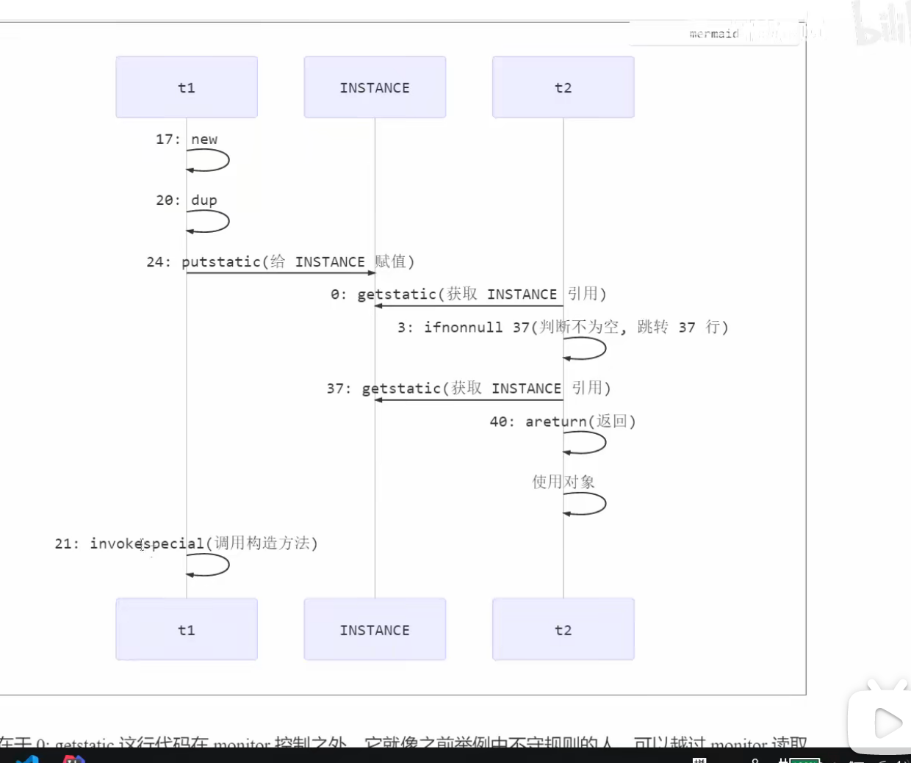

## JUC 并发编程
 这门课的并发 一词 涵盖了Java平台上的
 - 进程
 - 线程
 - 并发
 - 并行
 以上java并发工具 并发问题以及解决方案 同时我也会讲解一些其他领域的并发
 
## 进程与线程
 - 进程
   当一个程序被执行是 从磁盘加载这个程序的代码的内存 这时就开启了一个线程 
 - 线程 
   一个进程之内可以分为一到多个线程
   
## 并行并发的概念
并发
 就是在多线程运行时 cpu依次运行对应线程

并行
 就是多线程同时运行 cpu一起运行

## 同步 异步
需要等待结果返回 程序才能继续运行 这叫做同步
如果不需要等待 则为异步

## 多线程提升效率的案例

## 多核cpu 和单核cpu的多线程区别

## 创建和运行线程
使用Thread对象 来创建一个线程
然后调用该对象的start方法

使用Runnerble对象 实现run方法 
然后将其实现类作为参数放入Thread的构造函数

Runnable对象 使Thread对象脱离了继承体系 更加的灵活

##  FutureTask 配合Thread
FutureTask可以接收一个Callable类型的参数 用来处理有返回结果的
可以用于阻塞主线程 例如 该线程方法会返回一个值 主线程接收该值 如果该值还未被返回 主线程阻塞
FutureTask的实例对象 有一个get方法 作为其他线程获取它的返回值的方法
类似 前端的 async await
 

## 线程和栈帧
一个进程程会创建一个虚拟机栈 和 堆内存 方法区
一个线程会创建一个栈帧[方法返回值PC 操作数栈 局部变量表 动态链接 附加消息] PC寄存器

## 线程上下文切换 
 因为以下的一些原因 导致CPU不再执行当前的线程 转而执行另一个线程的代码
  - 线程的cpu时间片用完
 - 垃圾回收
 - 有更高的优先级的线程需要运行
 - 线程自己调用了sleep yield wat join park synchronized lock 等方法
当线程上下文切换时 需要保存当前的栈帧执行的PC的值 每一个栈帧都有 是线程私有的
   
   
## 常见的线程方法

 join() 等待线程运行结束
 join(long n) 最多等待n ms

## start vs run
- start 
 start方法 是由对应的线程对象执行的 
   就可以实现多线程运行
- run
 run 方法执行 不是由对应的线程对象执行的
  而是当前线程执行的 相当于是执行的run方法的方法体 
   

## sleep[暂停] 与 yield[让出]
调用sleep 会让当前的线程从Running 变为 TreadWatting状态
睡眠结束的线程 未必会被立即得到执行

yield 会让当前的线程从Running 跳转到 Runnable状态 然后调用其他优先级的线程
如果这时没有相同优先级的线程 那么不能保证让当前线程有暂停的效果

##  线程优先级
setPriority(int i) i[0-10]
线程优先级会提示 调度器 优先调用该线程 但他只是一个提示 调度器可以忽略它 
如果cpu比较忙 那么优先级高的线程会获得更多的时间片 但是cpu闲暇时 该设置几乎没有作用

## 防止while true 一直占用一核cpu

在while true 的方法体中 添加一个sleep 用于让出时间片

## join
等待线程进行结束
 等待谁的进行呢?
 例如 
  t1.join() 就是等待t1线程结束 再运行当前线程的下面的代码

 - 这就是线程的同步机制 一个线程等待另一个线程结束 
 - 如果不需要等待另一个线程的结束 两个线程同时进行 这种就是异步机制

 - join(long n) 限时等待
  等待对应的线程n毫秒 如果超出 则不等待 继续执行
   
## t1.interrupt方法
打断sleep wait join的线程 打断状态还是false 以sleep为例
打断sleep线程 会被InterruptedException catch抓出

 - 打断正常运行的线程 会将打断的状态为true [查看状态为 线程.isInterrupt() 返回值为boolean ]
     
   打断不会真正的停止线程 只是会更新打断的标记 然后可以在对应的线程内部获取标记 进行判断停止
   
## 两阶段终止模式
 在一个线程T1中如何优雅的停止T2线程 
这里的优雅就是给T2一个处理后事的机会
 - 实现思路

   - 图解
    

##  如何终止线程
使用两阶段终止模式 
 1 使用interrupt 打断线程
 2 在线程放一个监控器 例如while 配合 sleep 实时监控线程打断状态 并做出反应

## isInterrupted 和 Interrupted
isInterrupted 是一个实例方法
Interrupted 是一个静态方法
- isInterrupted 不会清除打断标记 即 不会将打断状态从true转为false[返回当前的状态 不清除打断标记]
- Interrupted  会清除打断的标记 即 会将打断的标记 从 true 转为false[返回当前状态 并清除打断标记]

## 打断park线程
      LockSupport.park();// Park的作用也是暂停当前的线程 当状态为true时 也就是打断时 结束暂停
  如果状态为true 以后调用park 也就停不下来了 所以要使用 会清空状态的打断方法 即 Interrupted静态方法

## 不推荐的方法
stop() 停止线程运行 [用interrupt 两阶段终止模式代替]
suspend() 挂起线程运行
resume() 恢复线程运行

## 主线程与守护线程
默认情况下 Java进程需要等待所有线程都运行结束 才会结束 有一种特殊的线程叫做守护线程 
只要其他的非守护线程结束 守护线程就会直接结束
 - 设置守护线程
 t1.setDaemon(true);
   
- 垃圾回收[GC]线程也是一种守护线程

## 线程的五种状态 从操作系统层面看
1 初始状态
2 可运行状态
 [2-3 状态可以来回切换 中间为阻塞状态]
3 运行状态
4 终止状态
- 图解

  
## 线程的6种状态 从Java层面看
1 New  初始化    创建了Thread对象 还没有运行
2 RunnerBle 可运行的状态 运行 阻塞
 -  Blocked        线程锁等待
 -  Waiting        join()[等待xx线程结束] 无时限的暂停方法
 -  Time Waiting   sleep  有时限的暂停方法
6 TERMINATED 运行终止

##  本章的重点在与掌握
 - 线程创建
 - 线程重要的API
 - 线程状态
 - 应用方面
   - 异步调用
      主线程执行期间 其他线程异步执行操作
   - 提高效率
      并行计算 缩短时间
   - 同步等待
      join
   - 统筹规划
    合理使用线程 得到最优的效果
 - 原理
  线程就是一个虚拟机站 内部方法为栈帧 线程切换就是虚拟栈的切换 
    [会包括 栈帧内容如局部变量表 操作数栈 方法返回PC 动态链接 附加信息, PC计数器 ]
 - 模式方面
   - 两阶段停止
      通过interrupt()方法来终止 线程 在方法的内部 对isInterrupted 进行监视
     
## 并发之共享模型
 - 线程安全问题 sleep 阻塞io操作 wait

   - 出现这种情况 主要是上下文切换时 会带着状态一起保存[操作数栈 局部变量表 动态链接 ... ] 而导致数据不同步
    - 分时系统导致数据错误的字节码分析
    
       - jvm图复习
    
         
## 线程安全问题的主要原因 - 临界区

 - 即访问线程共享的资源
   - 如果只是读取也没有任何问题
   - 但是如果是写入 就会发生jvm指令错乱问题
   - 一个代码块中如果存在对共享资源的读写 则被称为[临界区] 
    
## 竞态条件 - 由于代码的执行顺序不同 而导致结果无法预测 称为竞态条件
 - 线程上下文的切换
  线程上下文的切换主要是 CPU的任务调度器 通过CPU时间片分配
   可能JVM的写入内存指令还没有执行 就被CPU切换了上下文 并且线程上下文切换 会
   保存状态[局部变量表 操作数栈 ...]  切换回来时 JVM继续执行 并将之前计算的数据写入内存 导致
   内存中的数据发生错误
   
##  线程安全的解决方法
  阻塞方法
  1 线程锁 synchronized
  2 Lock
  非阻塞
  1 原子变量
 - 图解

    - 对象锁的图解 【对象锁 必须关联一个线程共享的对象】 
    
      
## 对象锁原理

 - 即使线程有对象锁 也是会切换上下文的 只是一直没有释放锁 其他线程进不来 所以看起来在一直运行
 - 被锁住的线程 状态会从Runnable 到 Blocked 当锁释放时[当锁的代码块执行完毕后释放] 会从Blocked 切换到 Runnable
- 锁运行JVM字节码图解

  - 总结
    对象锁实际是用锁保证了临界区内的代码的[原子性] 临界区代码对外是不可分割的 不会被线程切换所打断
    
   - [问题]
    如果将对象锁 包裹一个for循环 如何理解][原子性]
     就是 将for循环整个循环看作为一个整体 在该循环期间不会被其他线程干扰
    如果t1 的对象锁为o1 t2为o2 如何运行
      会互不干扰 还是交替运行 因为锁不一样[不是共享的数据] 无法阻塞
    如果 t1加锁 t2不加 会怎样
      也会互不干扰 因为即使加锁t1也会切换上下文 切换到t2时 因为没有锁 所以不会阻塞 更不会请求锁
      所以t2就直接执行 会导致数据错误
    - 图解
  
    - [锁操作总结 ]
        
      - 保证锁对象的一致性 不能锁不同的对象[共享数据]
      - 要保证原子性的线程 必须都加锁 否则没有作用 
      - 锁的代码块内部最好只包含临界区数据[操作共享数据部分]
        如果包含了for循环 则也就是标识for循环为原子性 在这段时间就不能和另一个同样锁的线程同时for循环了 
        会减低运行效率
        

## 锁写在方法上
 1 成员方法
  public synchronized void xx(){}
  等于
  public void xx(){
   // 这里的this就是实例变量 意思就是该实例变量方法 为原子方法
  / / 一般用于多线程操作类的成员变量方法使用
   synchronized(this){
    } 
  }
 2 静态方法
  public synchronized static void xx(){}
   等于
  public static void xx(){
    synchronized(当前静态方法所属的类.class){
    }
   }
        

## 成员变量 静态变量的线程安全分析
 -- 如果没有被线程共享 则安全
 -- 如果共享
   - 只读 安全
   - 读写 不安全为临界区 需要考虑线程安全问题

## 局部变量的线程安全
 -- 局部变量是线程安全的(不同的方法 局部变量表是互相独立的[不同的栈帧])
 -- 但是变量引用的对象就不一定了
    比如
     X x =传入的对象[外部的对象]; 如果修改了外部的对象就不安全了
    如果 该对象没有逃离方法的作用访问 他是线程安全的[未逃逸]
    如果逃离 则是不安全的 [逃逸]
  -- 这里要借助 [逃逸分析]

 [判断一个局部变量对象 是否逃逸 就判断外部线程是否可以获取该对象 如果可以 则逃逸 否则没有逃逸
  还可以通过判断对象是否为栈上分配来区分]
  - [复习]
   没有逃逸的对象 为变为栈上分配 而不是放入堆内存中[Eden区 s0 s1] 可以减少GC的次数 因为这种变量生命周期==方法的生命周期
    
    同步消除。如果发现某个对象只能从一个线程可访问[没有逃逸的情况]，那么在这个对象上的操作可以不需要同步。[这时变量为线程安全的]
   
    分离对象或标量替换。如果某个对象的访问方式不要求该对象是一个连续的内存结构，那么对象的部分（或全部）可以不存储在内存，而是存储在CPU寄存器中。

-XX:+DoEscapeAnalysis表示开启逃逸分析，JDK8是默认开启的
     
## 常见的线程安全的类
String
Integer
StringBuffer
Random
Vector
HashTable
JUC(java.util.Concurrent)包下的类
他们的每一个方法都是原子性的
 这里说它们是线程安全的类 是指多个线程调用他们同一个实例的方法时 是线程安全的
也可以理解为
 - 他们的每一个方法都是原子的
 - 但注意他们多个方法的组合不是原子的 见后面分析 
   
   
## 线程不安全的例子

上面的代码就是不安全的 
 - userService实例对象 为唯一的 所以是共享对象
 - 内部的update方法在多线程调用下 共享对象count++会出现错误
 
- 在spring中 单例@Bean 也就是只有Component修饰的类 
   内部的变量都是共享的变量 都有线程安全的问题 
 -   

[能不用成员变量就不要用 防止多线程安全问题
 最好使用局部变量 
  1 可以减少GC次数 因为是栈上分配
  2 没有同步的问题 多线程问题
 不想往外部暴露的方法或者变量 就设置为final 或者private 可以避免同步
线程是否安全的本质就是拿到的变量，其他线程里是不是共享的同一份，是同一份就可能线程不安全]

## 转账

## java对象头
ClassWord[类信息] MarkWord ObjectHeader
 1 Class指针 指向的是它对应的Class类
 2 哈希值
 3 年龄计数器  
 4 偏向锁
 5 GC标记 可达性分析算法

## monitor --[监视器 管程] 线程锁的底层实现
每一个java对象 都可以关联一个monitor对象 如果使用对象锁给对象上锁 
该对象的Mark Word中就被设置指向Monitor对象的指针
Monitor结构如下
 - 图解

   - 就是一个线程锁首次被一个线程访问时 会将该对象的Mark Word的值赋值一个monitor对象
    该对象有三个属性
     - Owner  当前锁的主人
     - EntryList 阻塞区域[链表结构]
     - WaitSet 
    如果线程进入时已经有monitor对象并且Owner已经绑定了线程 那么该线程会进入EntryList等待 状态为Blocked
    当Owner中的线程 运行完毕 就会通知EntryList中的线程 进入Owner 作为新的线程主人
       [必须为同一个对象 才有上述的效果 因为是通过获取对象头中的信息 进行判断的]
 - MarkWord 结构

   
- Monitor的原理

  
  - 字节码的角度
    
    - 字节码
      monitorenter 将操作数栈栈顶的元素的对象头 赋值一个Monitor对象[内部会将Owner属性 设置为当前的线程]
      monitorexit 将操作数栈栈顶的元素的对象头的MarkWord重置 并且唤醒所有在EntryList中的线程 
    - 异常表 
      如果在任意线程中出现了异常 
      也会释放对象头中的monitor对象的EntryList集合的所有线程
      最后抛出异常 
      
## 锁的优化
 从jdk6 开始 为了防止 线程锁过多的干扰同步性能 
 推出两种新特性 轻量锁和偏向锁
 轻量级锁 : 如果当前没有线程竞争就会使用轻量级锁 防止每一次都去访问monitor 
           但是如果有竞争了 就会升级为重量级锁(monitor)
 偏向锁 : 当前程序 偏向于一个线程使用 就叫偏向锁 但是如果有其他线程来了 就会升级为轻量锁
       - 批量重偏向 : 就是如果很多个对象的偏向锁被修改 如果超过了阈值 则jvm就自动偏向对应的线程
       - 禁止偏向 : 如果修改了太多次数的偏向 就会禁止偏向

## 轻量级锁的过程 
  1 当一个线程 遇到synchronized同步锁时 会将一个对象[Lock Record 锁记录] 压入栈帧的操作数栈的栈顶中
    - Lock Record 对象 有两个参数 
      Object Refrence : 该属性指向锁对象
      Mark Word : 将会用于替换对象头的Mark Word数据
  2 将栈帧顶部的 LockRecord对象的Mark Word 属性的数据 和 锁对象头的Mark Word的值进行交换
    比如 锁对象头 的数据 [hashcode 对象年龄 01] LockRecord的数据 [ LockRecord对象的地址 00]   [00 01 分别代表轻量级锁 和无锁]
    如果交换成功就 即加轻量级锁成功 如果该对象的标识不是01[无锁] 就会[锁膨胀]
  3 如果该线程再次对同样的对象加锁 就会在栈帧上面压入一个[Lock Record 锁记录] 与第一个的区别就是Mark Word的值为Null 仅作为计数[记录当前线程锁该对象的次数] 使用
  4 当临界区的代码执行完毕后 将会尝试将Lock Record的数据 交换回去给对象头 如果对象头的标识已经不是轻量级锁了[00] 那么就会进入[锁膨胀]的过程
    否则交换成功

## 锁膨胀
 如果在尝试加轻量级锁的过程中 发现了当前锁的状态已经为轻量级锁 就说明有其他的线程已经加上了锁(有竞争)
这时就需要锁膨胀 将轻量级的锁 变为重量级锁

 如果加锁失败 则进入锁膨胀的流程
 1 即为Object对象申请Monitor锁 让Object指向重量级锁地址
 2 然后自己进入Monitor的EntryList 并将状态变为Blocked[ 轻量级锁是没有阻塞的说法的 只是通过修改MarkWord的数据]
   [如果锁膨胀为了重量级锁 对象的对象头的MarkWord值 会变为Monitor对象的地址 而不再是一些状态或者轻量级锁的信息 并且状态为10 以前赋值出去的状态保存在Owner线程的栈帧的LockRecord对象属性中]

[
状态
00 轻量级锁
01 无锁
10 重量级锁
]

### 重量级锁之间的竞争 --自旋锁 重量级锁的优化
 - 自旋锁 
  即在竞争时 通过一定次数的循环 来等待Owner线程的运行 如果Owner在这段时间内部结束 就不用进入阻塞[EntryList] 就可以直接切换
   
 - 竞争图解

   
## 偏向锁 -- 轻量级锁的优化
 轻量级锁在没有竞争时(无其他线程) 每次重入还是需要CAS操作（即交换Mark Word值）
Java6以后引入了 偏向锁来进一步优化 只有第一次使用CAS将线程ID设置到对象的Mark Word头 之后发现这个线程ID
是自己就表示没有竞争 后续就不需要CAS了 标识该对象就是属于该线程所有

- 上图中 main线程 重复锁了obj对象3次 每一次重入的LockRecord还是会比较(CAS) LockRecord和锁对象的Mark Word的值
  但是该lockRecord为重入的栈帧 值为null 并且object的值标识已经为00[轻量级锁]
  所以替换【CAS】失败 但是jvm发现两个锁记录为同一个线程创建 所以会将其保留 作为重入的计数
  
  
- 无忧化时

  每一次重入 都要调用一次CAS判断

- 偏向锁优化

## 偏向锁的详解
- 状态的区别

  - 属性为 biased_lock:1 说明开启  并且会添加一些属性 如 Thread(线程id) epoch...、
  - 偏向锁是默认是延迟的 不会在程序启动时立即生效 如果想避免延迟 可以加VM参数 -XX:BiasedLockingStartupDelay=0 来禁止延迟
     
 - 偏向锁是默认开启的 
   但是偏向锁的处理场景更加偏向于没有线程冲突的情况下 可以避免CAS操作
   [撤销/关闭偏向锁]
   但是如果有很多线程的场景 就没有必要开启偏向锁了 就可以使用 -XX:-UseBiasedLocking 关闭线程锁
   [如果调用了类的hashcode()方法 也会关闭该对象的偏向锁]
   还可以通过其他线程锁掉使用对象 就可以将该对象的偏向锁膨胀为轻量级锁[101--->000]
   
## 批量重定向
  1 假如一个类的偏量锁一开始锁的是t1线程 但是可能会偏向t2[错峰运行] 如果撤销偏向达到20次
    则jvm认为锁偏向可能出错了 就会重偏向下一次加锁的线程
    也就是20次后 会将001的普通状态 再次改为101可偏向状态

## 批量撤销
  1 假如一个偏量锁 撤销偏量的次数超过40次 jvm就会觉得这个类就不应该加偏量锁
    然后jvm就会将其变为 不可以偏向的对象[即撤销偏向] 新建的对象也是不可偏向的[101-->001]

## 锁消除
JIT 即时编译器 会对字节码进行进一步优化[java是 半解释半编译语言]
 如果JIT发现热点代码[多次运行的代码片段]
  他就会寻找没有逃逸的局部变量[进行逃逸分析 ] 并做出[同步消除] [锁消除] 如果代码中有锁同步了该对象 就会删除该同步锁 提高效率

   剩下的还有标量替换 

  栈上分配
  

## wait 和 notify
 传统的同步锁机制
  如果锁没有释放 那么其他的线程就会阻塞 效率太低
 wait notify机制 call listen类似
  类似就是开了一片新的空间(wait方法) 让指定的线程到该空间进行等待 但这时如果锁释放了 其他线程可以随机进入
  直到xx条件达成 就可以通过调用noitfy方法 来让对应的线程 到线程队列继续竞争

## Wait notify原理
该原理 还是使用到了monitor对象

例如
Owner线程 发现xx线程这时条件还不满足 所以调用wait方法 让其进去 monitor的 waitset集合中 进行等待 状态变为Waitting状态
Blocked和Watting线程处于阻塞状态 不占用Cpu时间片
Blocked线程会在Owner线程释放时唤醒
Waitset集合中的线程 只会在Owner线程调用notify或者notifyAll时会被唤醒 唤醒后加入EntryList进行等待[不是立马执行 还是会重新竞争]

## API介绍
Object 为锁对象【共享对象】
Object.wait() 让进入Object监视器的线程到waitSet等待
Object.notify() 在object上正在waitSet等待的线程中挑一个唤醒
Object.notifyAll() 让Object上面正在WaitSet等待的线程全部唤醒
Object.wait(long time) 有时限的等待 如果超出时间限制 则不继续等待 直接执行

-   要调用对象的wait notify... 等方法 需要先获取该对象的锁
-   然后再调用 因为wait会将锁直接升级为monitor(重量级锁) 以便于获取WaitSet
-   wait()方法就是将当前的线程 放入当前Owner锁对应的moniter对象的waitSet中
-   如果想要唤醒 就需要另一个线程 也获取对应的锁对象 调用notify唤醒 对应的Monitor对象的waitSet的线程

## Sleep 和 wait
 Sleep是Thread的方法 Wait是Object的方法 
 sleep不需要强制和同步锁进行绑定 但是wait必须要有
 sleep在暂停时 不会释放同步锁 但是wait会释放

## While解决虚假唤醒

## Sleep notify通用的语法格式

synchronized(任务){
     while(!条件不成立){
         // 条件为false时
             任务.wait(); // 线程进入同步锁的WaitSet中等待 
     }
     // 如果可以跳出while则 代表条件为true
     执行任务();
}

另一个线程 唤醒wait线程
synchronized(任务){
      修改条件为true;
      任务.notifyAll();  // 唤醒所有的wait线程
}

## 同步模式保护性暂停
 即在一个线程中等待另一个线程的执行结果
 - 图解

 就是生产者+消费者模型
 - 测试代码

- 中间类

  
- 超时控制 

  

## join的原理 
 join就是应用了 同步保护性暂停的机制 达到多线程的同步机制
 
  

## 异步模式之生产者/消费者
与前面的保护性暂停中的GuardObject不同 不需要产生结果和消费者线程一一对应
消费队列 可以用来平衡生产和消费的线程资源
生产者仅负责产生结果 不关心数据如何处理 空时不会再消耗数据
JDK中 各种阻塞队列 都是这种模式

 [该模型是java内部线程中通信的  而不是RabbitMq那种消费者[交换机][消息队列]生产者模式 是进程间通信的]
 
## Park 和 UnPark
 他们是LockSupport类的静态方法

LockSupport.park(); 暂停当前的线程 [再isInterrupt的状态为T时 无法生效]
LockSupport.unpark(暂停的线程对象); 恢复线程的运行 [该方法可以再park之前调用 也可以在之后调用 都是恢复线程运行]
 -[与Notify wait对比]

 - [原理]

   
## 线程的状态的转换
New --> RunnerBle
当调用start() 方法时 就会转换New到Runnable
Runnable-->waitting

## 多把锁
 一间大屋子里面有两个功能 睡觉学习 互不相干
现在小南要学习 小女要睡觉 但是只用一个屋子(一个对象锁) 那么并发量很低
解决的方法 就是准备多个房间(多个对象锁)
- 例如

  
## 死锁
线程1 需要线程2的锁对象 但是线程2锁住了该对象 并且在线程2内部 要入锁线程1的锁对象 [因为线程1要线程2的锁对象 获取不到 导致无法释放锁 线程2也就获取不到线程1的锁对象 所以两边都无法释放 导致死锁]
- 图解

  
 - 死锁问题 可以在Dump文件中解析出来 并且定位错误的位置 来处理死锁
 - 死锁的原因 一个线程 想要另一个线程的锁对象 就有可能发生死锁
## 活锁
 就是线程间互相该变 对方的退出条件 导致所有的线程都无法退出 这就是活锁

## 饥饿

## 锁的活跃性
 也就是 死锁 活锁 饥饿
 
## ReentrantLock
相对于 synchronized 该类有如下特点
 1 可中断 [reentrantLock.lockInterruptly(); lock方法不能被打断 ]
 2 可以设置超时时间 [如果一个线程获取另一个线程的锁对象 超过一个阈值 则放弃获取 并且释放当前线程占用的锁xxx.unlock 避免死锁  lock.trylock() ]
    如果不加形参就是 判断当前获得到锁吗 返回布尔值
    如果加了形参就是 lock.trylock(时间,TIME.UNIT) ； 第二个形参是一个枚举值  如果超过时间还没有获取到锁对象 就返回false 获取到就true 
    可以避免死锁现象
 3 可以设置为公平锁
 4 支持多个条件变量
与synchronized一样 都具备[可重入]的特性
## 可重入
 可重入是指同一个线程如果首次获得了这把锁 那么因为他是这把锁的拥有者 因此有权力再次获取这把锁
如果不是可重入锁 那么第二次获取时 自己会被锁挡住

## 语法
reentrantLock.lock(); //获取锁
...
renntrantLock.unlock(); // 释放锁
## tryLock解决死锁的问题

## 公平锁 [解决饥饿问题 但是会降低并发度 而且可以用tryLock来解决 所以一般不设置]
Moniter是不公平锁 因为线程在EntryList中 是一个争抢的关系 谁得到谁就运行 而不是先来先得

ReentrantLock默认为不公平
但是可以通过修改构造参数改为公平锁
ReentrantLock(true); //公平锁

## 条件变量
synchronized也有条件变量 也就是waitSet集合 当条件不满足调用wait() 让对象锁的Owner线程 进入等待 等到notify唤醒[notify的唤醒机制 不是特别的准确 也是随机的]
ReentrantLock 的条件变量 比synchronized强大的地方在于 它支持多个WaitSet集合 
 - 就比如是 synchronized中 不满足条件的线程都在休息室中
 - 而 ReentrantLock中 支持多个休息室 有xxx的 xxx的 唤醒时 也是按对应的休息室来唤醒
- 创建队列的方法
  Condition xxxQueue = lock.newCondition();
使用流程
 await 前获取锁
 await 执行后 进入conditionObject中等待
 await的线程被唤醒(打断 超时) 就重新竞争lock
 竞争成功后 从await后面 继续执行

 - 释放对应的WaitSet后 该释放的线程必须在最后调用unlock释放锁 否则会一直占用锁 导致释放的线程无法运行[因为释放后也是进入EntryList等待]

## 同步模式 顺序控制
比如一个多线程 要一个先执行 一个执行
就可以通过wait notify 和 EeentrantLcok的await singel 还有 LockSupport的 park unpark 方法

## 第四章的小结
 1 分析多线程访问共享资源时 哪些代码片段属于临界区
 2 使用同步锁来解决临界区的安全问题
  - 掌握sychronized语法
  - 掌握synchronized放在成员方法和静态方法
  - 掌握wait/notify同步方法

 3 使用Reentrantlock解决临界区的线程安全问题
  - 掌握lock()的使用细节 : 可打断[interrupt] 锁超时[xx.lock(时间,时间单位)] 公平锁[创建ReentrantLock时传入true] 条件变量[通过Reentrantlock实例对象 来调用 .newCondition()方法 获取Condition对象]
 4 分析线程安全性[是否有操作公共数据操作]
    掌握常见的线程安全api[String Hashtable ...]
 5 了解线程安全性 饥饿 活锁 死锁 [饥饿 和 死锁 都可以用 锁超时来解决]
    
 6  应用方面
   互斥 使用 synchronized 或者 lock达到共享资源效果
   同步 使用 wait/notify 或者lock 的条件变量达到线程间通信的效果
 
 7 原理方面
   monitor[里面包含 Owner 当前占用的线程
    WaitSet 实现同步 等待的队列调用wait的线程
    EntrySet  实现互斥 线程竞争运行的队列]
   synchronized wait/notify 原理
   synchronized 进阶原理
   park&unpark 原理

## 第五章 JMM(java内存模型 Java Memory Model)
- what is JMM
 它定义了主存 工作内存抽象概念 底层对应 CPU寄存器 缓存 硬件内存 CPU指令优化等
    JMM主要体现在以下几个方面
   - 原子性 保证指令不会收到线程上下文的切换的影响 
   - 可见性 保证指令不会受CPU的缓存的影响
   - 有序性 保证指令不会受到CPU指令并行优化的影响
    主存标识所有线程共享的数据 [堆内存 方法区内存 ] 工作内存就是线程私有的数据[成员变量 PC寄存器...]
     
## 可见性

 
可见性就是JIT导致的热点缓存 导致数据更新不及时
[解决方法 ]
 - 加上 volatile 修饰符[只能修饰能被线程共享的变量 可逃逸变量 不可逃逸的变量 不能修饰 如局部变量]
   加上后 代表该变量为[易变]的
         所以JVM每次获取变量 只能到主存中[堆内存 方法区] 获取
         而不能到JIT缓存中读取值 防止值不对 [会降低效率]
   
## 可见性和原子性

synchronized内部的变量 可以保证原子性和可见性 但是synchronized效率很低 所以可见性一般还是用volitail[但是vo.. 不保证原子性]

## 终止线程的模式 - 两阶段的终止模式
利用可见性的原理 在其他的线程中修改退出条件 达到停止的目的

## 犹豫模式 Balking
在只希望有一个线程运行的场景中 通过可见性 可以在xx线程启动时 修改boolean值 来达到限制线程的作用
 例如 前端页面中点击多次 防止产生多余的线程

## 有序性
 JVM会在不影响正确的前提下 可以调整语句的执行顺序 思考下面的一段代码
 - 指令重排
 static int i;
 static int j;
    ...
   //在某一个线程中进行以下操作
    i =..;
    j=..;
    从上面的代码可以看出 至于先i 后j还是先j后i 所以上面的代码执行时 可以是
    i=..;
    j=..;
    还可以
    j=..;
    i=..;
    这种特性为[指令重排] 多线程下[指令重排] 会影响正确性
   为什么要有重排指令这项优化呢? 可以从CPU执行原理解释
   

## 为什么要有指令重排呢
 指令重排的前提是 重排指令不能影响结果 

## 重排序的场景

- 问题
 [指令重排可能导致 ready=true;比num=2 先执行 所以会导致结果为0]
  - 结果
    
    - 解决方法
      在可能发生指令重排 的地方 在其中的变量上面 加上 volatile关键字
      例如
      volatile boolean ready =false;
      [也就是说 volatile可以保证 可读性 和 有序性]
   
## volatile 原理

    - 在volatile变量的写指令后会加上写屏障；写屏障保证了在该屏障之前，对共享变量的改变都同步到主存中； 在volatile变量的读指令前会加上读屏障；读屏障保证了在该屏障之后，读取都是主存中最新数据
[ 也就是修改volatile关键词变量时 以上的所有变量 都会写入主存 后面 如果有读取以上volatile变量 就会直接读取主存的变量]

- 过程
static volatile boolean r =false;
static int x=0;

x=2;  //写屏障保证写入主存
r=true; //写屏障保证写入主存
// 写屏障 写屏障就是volatile变量改变时 写屏障上面所有共享数据(静态变量 成员变量) 保证都要写入主存的操作
[
 指令重排 [加入volatile后 volatile变量的修饰的变量 一定会在其他共享变量赋值完毕后执行 不会存在先执行的情况]
  x=2;  //其他的共享变量 写入主存
  r=true; //volatile变量 写入主存
 //写屏障  保证以上的共享变量写入主存

]

///// 读屏障 读屏障是出现在读取volatile变量之前的 保证以下所有的共享变量(静态变量 成员变量) 都能读取到主存的最新值 
if(r){ // true
  Sout(x+x); //4 
}

## 有序性 也不能解决指令交错(多线程问题 原子性 ) 
 
 - 写屏障只是解决了保证线程能得到最新的变量结果
 - 有序性也就是保证相关代码不会被指令重排
[volatile 可以解决有序性 可见性 但是不能解决原子性
 synchronized 可以解决有序性 可见性 原子性 但是操作比较"重" 所以一般只用于 解决原子性问题  ]

     
  
## DCL问题
以著名的DCL单例模式为例
 - 无DCL
 
 - 有DCL(Double - check - locking )
   防止每一次进入都会CAS一次 提高性能

以上的实现特点是 
- 懒惰实例化
- 首次使用getInstance() 才使用synchrnized加锁 后续使用时不用加锁
- 有隐含的 但很关键的一点 第一个if使用了 INSTANCE 变量 是在同步块之外
  

- DCL问题

   - 解决方案
     添加一个volatile关键词 原理还是读写屏障
     写入时 写屏障会保证写变量的字节码不会发生重排序 比如先putstatic 再调用 init()方法
           写屏障后 只能是 init() 后 putstatic
     读屏障 保证读取的是最新主存的值 而不是工作内存 或者 JIT的缓存值
     

## 单例模式
单例类只能有一个实例
单例类的实例 必须自己创建自己的实例
单例类必须给所有其他对象提供这一个实例
 - 单例的线程安全

           [static final = 基本数据类型变量 是在类加载的链接阶段的准备阶段 进行赋值的 如果是引用数据类型 就是clinit赋值 这些都没有线程安全
            因为是在jvm中运行的 类加载阶段是有同步锁 防止多线程问题的]
   
## 饿汉式 懒汉式

## 第五章的总结
 本章重点讲解了JMM中的
  可见性 由JVM缓存[JIT]优化引起的 可以通过volatile禁用
  有序性 由JVM指令重排引起 可以通过volatile禁用
  原子性 synchronized
 happen-before 原则 [线程值的传递]
  原理方面
   cpu指令并行 [重排]
   volatile [可见性 有序性]
  模式方面
   两阶段终止模式的改进(通过volatile来修改判断条件 避免使用interrupt来判断)
   同步模式之犹豫模式(Balking) 防止多条线程同时运行

## 无锁并发 -->乐观锁
  无锁也就是不用Reentrantlock 和 synchronized

 也就是CAS compareAndSet

         /*
                    * 如果AtomicReference对象的当前值等于期望值，则使用AtomicReference类的compareAndSet()方法以原子方式将newValue的值设置为AtomicReference对象，如果操作成功，则返回true，否则返回false。此方法使用设置的内存语义更新值，就像将该变量声明为volatile一样。
                    *
                    * */

                    /*1.取得当前值 value.get();
                     2.计算-10后的值
                     3.如果当前值还不是-10后的值(第二步的值) 就将value变为该值
                     4.如果设置没成功(即被别的线程改过了 也就是当前值==期望值 or 当前值!=当前值), 再从第一步开始. 所以要使用一个while循环
                    *
                    * */

##  英语

## CAS的底层
底层是一个volatile修饰的变量 保存的值 
 因为保证可见性 因为要从主存上面读取 而且必须要是最新的结果

## 无锁的效率为什么高
 1 无线程上下文切换行为 (切换还会切换状态 PC计数器...)

## CAS的特点
CAS适合线程数少 多核CPU的环境下
## 支持CAS的类
AtomicBoolean
AtomicInteger
   - 原子类自增

AtomicLong

## 原子引用类型
 AtomicRefernce<要保护的类型>
 AtomicMarkableReference<要保护的类型>
 AtomicStampedReference<要保护的类型>

## AtomicRefernece的 ABA问题
 如果多线程 修改CAS时 只是判断当前值 是否相等 那么就会出现ABA问题 因为
其他线程 假设修改当前值 A --> B 然后再修改 B--->A
下一个线程 就会拿到A -->C {这里是不会觉得A是被修改过的A 还有一个原因就是字符串是放在字符串常量池中的[不可变性] 所以地址也没有改变}
 -  所以CAS仅仅只能判断变量值值 与初始的变量值 是否相同 不能感知 A改B B又改回A的这种情况 所以要i使用一个AtomicStampReference

## AtomicStampReference Stamp(时间戳)
new  AtomicStampReference(初始值,初始版本号[计数器])
AtomicStampReference.CompareAndSet("A","B",现在的版本号,修改后的版本号);
这样通过修改一次 修改一次版本号 来判断是否已经被修改过 (计数器 引用计数分析 可达性分析)

## AtomicMarkableReference

## 原子类数组 
 AtomicIntergerArray
AtomicLongArray
AtomicReferenceArray

## 原子成员变量

 // 操作

##  累加原子类

## Unsafe
该类是通过 BootStrapLoader来加载的 所以我们无法直接创建他的实例
Unsafe是指 危险的类 而不是线程不安全的 一般sun不推荐程序员使用

## String不可变类设计
 - final的使用
 属性用final修饰保证了不可以改变
 类用final修饰 保证了类中的方法不能被Override 防止子类无意间破坏了不可变性
 - SubString对不可变类的操作 
  通过截取字符串数组 获取到字符串 然后重新new
   
## 享元模式
 例如 字符串中 -128 ~ 128之间的所有字符串 都会重用 而不是新建
byte Short Long 

