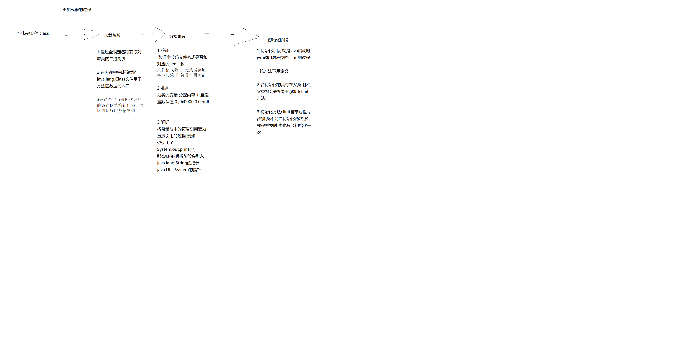
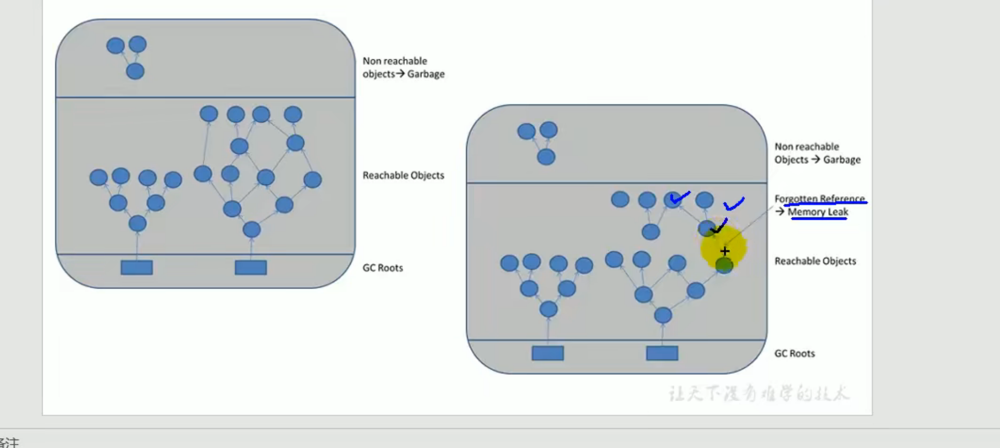
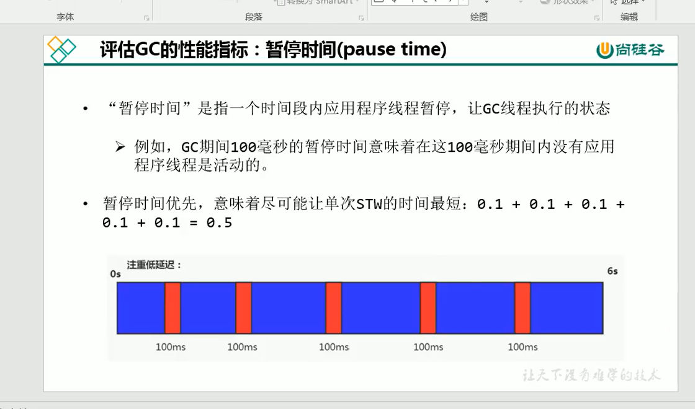
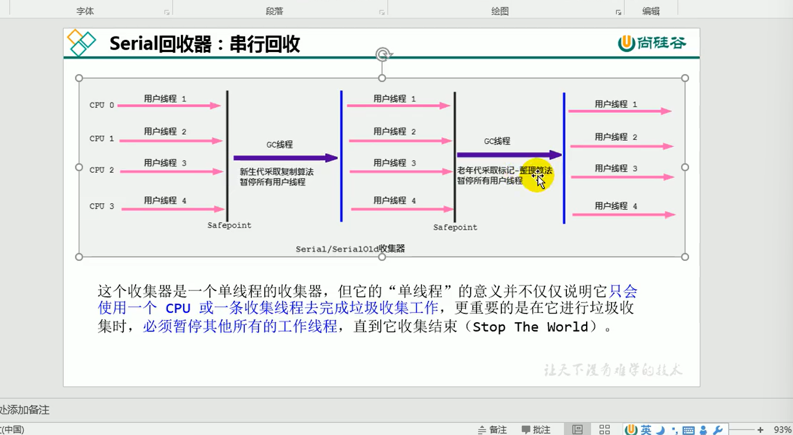

## java的编译周期
java文件-->字节码文件--->jvm虚拟机

## jvm
jvm是java的虚拟机 用于运行java编译后的字节码文件 也就是.class文件
jvm也是java能够跨越平台的原因 因为jvm他是负责运行字节码的 只要有对应的编译器 编译为符合java标准的字节码文件 就可以运行

## Hotspot
该虚拟机是Oracle公司提供的虚拟机 也就是java的默认的虚拟机

## jvm架构模型
 - 基于栈的指令集架构
  1 设计和实现更简单 使用在资源受限的系统中
  2 避开了寄存器的分配难题 使用零地址指令方式分配
  3 指令流中的指令大部分是零地址指令 其执行过程依赖与操作栈 指令集更小
    编译器更容易实现
  4 不需要硬件支持 可移植性更好 更好的跨平台 
   
 - 基于寄存器的指令集架构
  1 典型的应用是x86的二进制的指令集 比如传统的pc以及安卓的Davlik虚拟机
  2 指令集架构 完全依赖硬件 可移植性差
  3 性能优秀并且执行更加高效
  4 花费更少的指令去完成一项操作
  5 在大部分的情况下 基于寄存器架构的指令集往往都一地址指令 二地址指令
    和三地址指令为主 而基于栈架构的指令集却是以0地址为主
   
## 反编译操作
 - 反编译
javap -v xx.class
 - 查看jvm的进程
 jps
## jVM的生命周期
虚拟机的启动
  Java的虚拟机的启动是通过引导类加载器(bootstrap class loader)创建一个初始类
来完成的 这个类是由虚拟机的具体实现指定的

虚拟机的运行
  一个运行中的java的虚拟机有着一个清晰的任务 --执行java程序
  程序开始时他才运行 结束时他就停止
  执行一个所谓的java程序的时候 真真正正的是执行力一个叫做java虚拟机的一个进程

  {
  运行ing  运行java虚拟机进程
  41364 RemoteMavenServer36
  41780 Stack   --java程序运行时占用的进程
  45592 Launcher
  34060 Jps
  44780

  结束  自动回收进程
  12804 Jps
  41364 RemoteMavenServer36
  45592 Launcher
  44780

}

虚拟机的退出
 java虚拟机退出的几种情况
  1 程序正常执行结束
  2 程序在执行过程中遇到了异常或者错误而异常终止
  3 由于操作系统出现了错误而导致java虚拟机进程终止 
  4 某线程调用Runtime类或者System类的exit方法 或Runtime的halt方法
并且 java安全管理器也允许这次的exit或者halt操作

## java的三大虚拟机
HotSpot VM 
  默认的虚拟机
J9 VM  
  IBM自己的虚拟机 也比较快 定位于HotSpot接近 服务器端 嵌入式开发 桌面应用都有涉及
Jrockit VM
专注于服务器的开发 没有解析器(因为不用在意服务启动速度) 其所有命令都靠即使编译器来运行

所有虚拟机的原则 一次编译 到处运行(one compiler,run everywhere)

## 其他高性能的虚拟机

Azul Vm

 前面三大"高性能Jvm' 使用在通用硬件平台上
 这里AZUL VM 个 BEA Liquid VM 是于特定硬件平台绑定 软硬件配合专有虚拟机
  - 高性能jvm的战斗机

## Graal VM
2018.04月 发布的新一代虚拟机 号称 'Run Programs Faster AnyWhere' 于java的'write once,run everywhere' 一致

 -  Graal VM 在hotspot基础上面增强而成的跨语言全栈虚拟机 可以作为任何语言的运行平台使用
   包括 java scala groovy kotlin c c++ javascript ruby python 等
   - 支持不同语言中混用对方的接口和对象 支持这些语言使用已经编写好的本地文件
  - 工作原理就是将这些源代码编译后的格式 通过解释器转换为能够被Graal VM 接收的中间标识 
  - 如果有一天hotspot被取代 该vm的希望最大

## 内存结构概述

 - 简图
 
   

## 类加载器子系统过程
 
.class文件(字节码文件)  --> 加载阶段 --> 链接阶段 ---> 初始化

  - 类加载器的作用负责从本地or网络上面加载class文件 
  - 类加载器只负责加载class 至于是否可以运行 则由Execution Engine决定
  - 加载后的类信息存放在一块叫做方法区的内存空间 除了类的信息之外
  还会存放运行时的常量池信息 可能还包括字符串字面量和数字常量
 
## 类加载器的加载阶段
1 通过一个类的全限定名称获取定义此类的二进制字节流
2 在这个字节流所代表的静态存储结构转化为方法区的运行时数据结构
3 在内存中生成一个代表这个类的java.lag.Class对象(对象.class) 作为方法区的各种数据的访问入口

## 类加载器的链接阶段
验证
 目的在于确保class文件的字节流中包含信息符合当前虚拟机的要求
主要包含四种特征 文件格式验证 元数据验证 字节码验证 符号引用验证

准备
为类变量 分配内存 并且设置该变量的默认初始值 即0

这里不包含有final(常量)修饰的static 因为final在编译时后就会分配了 准备阶段会显示初始化

这里不会为实例变量分配初始化 类变量会在分配方法区中 而实例变量会随着对象一起被分配到堆内存中

解析
将常量池的符号引用改为直接引用的过程
直接引用就是直接指向目标的指针 
引用要使用的类
例如代码中含有 System.out.print("") 那么就会在解析阶段引入 com.java.System类 java.lang.String类.........

## ；类加载器的初始化阶段
- [初始化阶段但就是执行类的构造器方法(clinit())的过程]

-[ ****此方法不需定义 是javac编译器自动手机类中的所有类的变量的赋值动作和静态代码块中的语句合并而来]
  [构造器方法 中指令按照语句在源文件中出现的顺序执行]
  
- [若该类存在父类 则jvm会保证在子类cinit执行前 父类cinit已经执行完毕]
  
//父类
  public class Father {
  public static int num = 1;

  static {
  Father.num = 2;
  }
  }

//子类
public class Son extends Father {
//    获取父类变量 测试启动类有父类的情况下 父类是否会先调用clinit方法来初始化
  public static void main(String[] args) {
   System.out.println(num); //结果为2 说明父类已经在内部执行了一次 因为调用了静态代码块
  }

}

-[ 需必须保证一个类的<clinit> 方法在多线程下被同步加锁]

{

[创建一个多线程的类]
public class ThreadTest {
//    多线程
public static void main(String[] args) {
Runnable r = () -> {

//            if (Thread.currentThread().getName().equals("Thread-0")) {
//                try {
//                    Thread.sleep(5000);
//                } catch (InterruptedException e) {
//                    e.printStackTrace();
//                }
//            }
System.out.println(Thread.currentThread().getName() + "开始");
System.out.println(1);
//            创建对象 证明多线程环境下 对象只会被初始化一次 不会初始化第二次 因为cinit有同步锁
Dead dead = new Dead();
System.out.println(Thread.currentThread().getName() + "结束");

        };
        Thread t1 = new Thread(r);
        Thread t2 = new Thread(r);
        Thread t3 = new Thread(() -> {
            try {
                Thread.sleep(5000);
            } catch (InterruptedException e) {
                e.printStackTrace();
            }
            System.out.println("t3");
        });
        t3.start();
        t1.start();
        t2.start();

    }
}
class  Dead{
static  {
System.out.println(Thread.currentThread().getName()+"加载");
}
}

}

## cinit方法字节码解析
0 iconst_1  //创建一个变量 值为1
1 putstatic #3 <com/misaka/java/Init.a : I> //将1给一个静态变量作为值 静态变量的地址为#3
4 iconst_2 //创建一个量 值为2 也可以写  bipush 值
5 putstatic #3 <com/misaka/java/Init.a : I>//将2给一个静态变量作为值 静态变量的地址为#3
8 return

## 任何一个类在通过类声明后 在内部至少存在一个类的构造器

## Day3 图解

## Day3 复习

## 类加载器对象
 类加载器对象直接的关系 并非传统的继承 而是层级的关系

(默认类加载器 )最低层级  系统类加载器也叫应用类加载器  systemClassLoader(AppClassLoader)  该类为classloader的最低层

  上一层  扩展类加载器 ExtClassLoader对象 通过systemClassLoader.parent()方法获取
[查看指定对象所使用的类加载器 xxx.class.getClassLoader()]
  最高层 引导类加载器 bootstrapClassLoader 对象 Java的核心类库都是使用的该类加载器加载的 如 java.lang java.util

## 引导类加载器 
这个类使用的时c/c++ 语言实现的 嵌套在jvm内部

它用来加载java的核心类库(JAVA_HOME/jre/lib...)用于提供JVM自身需要的类

并不继承自java.lang.ClassLoader 没有父加载器

扩展类加载器和系统加载器 的父类加载器

出于安全考虑 该加载器只加载包名为java,javax,sun等开头的类

## 自定义类加载器
再Java的日常应用开发中 类的加载几乎是由上述三种类加载器相互配合运行的
在必要时 我们可以自定义类加载器 来定制类的加载方法

为什么要自定义
 隔离加载类
 修改类的加载方法
 扩展加载原
 防止源码泄漏

## 关于classLoader对象
  CLassLoader类 他是一个抽象列 其后所有的类加载器都继承字ClassLoader
  (不包括bootstrapClassLoader 因为是c/c++语言的)
  
## 获取ClassLoader的途径
 1 获取当前类的ClassLoader
   xx.class.getClassLoder()
   Class.forname(全限定名称).getClassLoader
 2 根据线程上下文对象来获取类加载器
 Thread.currentThread().getContextLoader()

 3 CLassLoader.getSystemLoader() 获取
 

# 双亲委派机制
 - 什么是双亲委派机制 
    java对class文件采用的是按需加载的方法 也就是当需要用到该类时
   才会将它的class文件加载到内存中生成 class对象 
   而加载某个类的class文件时 java虚拟机采用的是双亲委派模式 既把请求交给父类处理  (类似于前端的事件的委派触发(子元素事件托付给父元素事件通过e.target处理))
   他也是一种任务委派模式
   
## 双亲委派场景
 例如 
 我们也创建一个对象 并且包名为java.lang
类名为String 当我们创建对象时会发生什么事情呢?
 答案是 还是会使用java.lang.String(原)

## 双亲委派原理
 当一个类加载器收到了一个类的加载请求时(new xx())
那么 该请求首先会向上委派 也就是如果是AppClassLoader收到的请求
首先会给他的.parent()对象 如果还有.parent()对象则继续委派
如果父类加载器可以完成委派任务 那么就返回 倘若不能 则尝试使用子类加载器来初始化
这就是双亲委派机制

代码解释
public Class<T> getClass(ClassLoader cl){
    //判断是否为顶层
    if(cl.parent()!=null){
     //还没有达到顶层
     //继续递归
      getClass(cl.parent());
     // 这下面的代码是递归返回时调用的
     {判断该子类加载器可以类加载吗}

   }else{
    // 到达顶层
     {这里代码判断引用类加载器是否可以实现类加载}
   }
}

## 双亲委派图解

就是一个请求由低到高层传递 如果高层不能解决则再往下传递

## 双亲委派的作用
为了避免 自定义的类冲突了java底层的类 
并且避免了 类的重复加载
 并且防止核心api的源代码被修改

## 沙箱安全机制
 该机制就是防止包名为java,javax开头的类 使用main方法
如果使用 那么就会直接报错提示

## 在jvm中 一个类如何判断是否为同一个类
1 全限定名称必须一致
2 ClassLoader的种类也必须一致
  例如 应用类加载器 引导类加载器 扩展类加载器
 例如           1                     2
 name    java.lang.String       java.lang.String 
 Loader  BootStrapClassLoader   AppClassLoader     
 上面两种因为Loader不同 所以不是同一个类 并且第二个类会因为沙箱安全机制而被限制使用Main方法

## 以上就是类加载器的内容

## 运行时数据区
一个jvm只有一个运行时数据区
 - 运行时数据区的布局
  
   
 - 详细布局

   

在运行时区中 方法区(元空间) 和 堆区 都是一个进程一份
其他的如 PC寄存器 本地方法栈 虚拟机栈 都是一个线程一份
一个进程可以有多个线程

## jvm线程
JVM允许多个线程并发
在 hotspot中 每一个线程都与本地操作系统的本地线程直接映射

## PC寄存器
JVM中的程序计数寄存器（Program Counter Register）
 - PC寄存器是一个很小的内存空间 几乎可以忽略不计 也是运行速度最快的内存空间
 - 在jvm规范中 每一个线程都有自己的PC寄存器 是线程私有的 声明周期 与线程的生命周期保持一致
 - 任何事件一个线程都只有一个方法在执行 也就是所谓的当前的方法
   程序计数器就会存储当前线程正在执行的java方法的JVM指令地址 
   如果是在执行native方法*(本地方法) 则是未指定值(undefined) 
## Pc寄存器的作用
PC寄存器用来存储指向下一条指令的指令地址 也就是即将要执行的指令
代码 由执行引擎读取并且执行下一条指令

##  main方法字节码解析
`
  - 指令地址            操作指令                         读取常量池 #2对应的是  常量池里的指令地址为#2的对象 后面的<>里面的内容就是常量池里的内容的简述
  -  0                bipush 10
  -  2                istore_1
  -  3                bipush 20
  -  5                istore_2
  -  6                iload_1
  -  7                iload_2
  -  8                iadd 
  -  9                istore_3   
  -  10               getstatic                        #2 <java/lang/System.out : Ljava/io/PrintStream;>
  -  13               iload_3                   
  -  14               invokevirtual                    #3 <java/io/PrintStream.println : (I)V>
  -  17               return     
`

 --- 在上面的结构中 PC寄存器在哪里呢?
 -复习PC寄存器概念
  [ PC寄存器用来存储指向下一条指令的指令地址 也就是即将要执行的指令 代码 由执行引擎读取并且执行下一条指令]

 假设 我们的程序刚好运行到了  下面的代码
 指令地址    指令
 5         istore_2
 6          iload_1
那么PC寄存器就会保存改指令的指令地址[5]    并且执行引擎会到PC寄存器中读取该值 并且通过该值作为一个指针获取对应的指令[istore_2]
当改行代码运行结束时 PC寄存器会再次获取下一行指令的指令地址[6] 并且重复上面的操作 直到程序结束

## 字节码main方法图解

## PC寄存器的两个面试问题
使用PC寄存器存储字节码指令地址有什么用吗?
  - 因为cpu要不停的切换线程 这时候切换回来之后 就要知道接着从哪里开始继续执行

为什么使用PC寄存器记录当前线程的执行地址呢?
 -  JVM字节码解释器 就需要通过改变PC寄存器的值
来明确下一条应该执行什么样的字节码指令 
    
## 为什么PC寄存器要设置线程私有的呢
无线程私有场景
例如 
运行了一个java程序进程里面有三个线程 
 首先线程一运行到了第5个指令 指令地址为7 在这时Cpu开始运行第二个线程
 第二个线程运行到了第一个指令 指令地址为1 由于没有线程私有 所有的线程公共使用一个PC寄存器
 所以线程一的值被覆盖 当PC寄存器回到线程1时 就无法找到上一次运行的位置

而线程私有就可以做到每一个线程都有一个PC计数器 所以就不会出现指令地址覆盖的问题

## 虚拟机栈概述
 - 初步印象
   以前对内存区理解只有 java堆栈结构
   
 - 栈和堆
  栈是运行时单位
  堆是存储的单位
   
 - 是什么
  java虚拟机栈 在java线程中会自动生成一个 是[线程私有]的
   其内部包含一个个栈帧
   
- 生命周期
  生命周期与线程一致
  
- 作用
 主管java程序的运行 他保存的方法的局部变量 部分结果 并参与方法的
  调用与返回
  
- 虚拟机栈的栈帧
一个栈帧对应一个方法 栈顶的方法为当前方法 与js的方法栈一致
   - [与js的执行栈十分类似!]
## 栈可能会出现的异常
栈内存允许java栈大小是动态or固定

OutOfMemoryError 内存溢出异常 java虚拟机尝试动态扩展 但是内存不足无法创建虚拟机栈 就报错(栈内存动态) 
StackOverFlowError 栈溢出 线程请求超出方法栈容量 也就是死递归 (栈内存固定)

## 栈的存储单位和运行原理
每一个线程都有一个虚拟机栈 里面的数据都是以[栈帧]的格式存在
每一个栈帧就是一个方法 
栈帧是一个内存区块 是一个数据集 维系着方法的执行过程中的任何数据信息
## 栈的运行原理
虚拟机栈和普通栈一致 都要遵循 先进后出的原则
在一条线程上 一个时间点上 只有一个活动的栈帧 即只有当前正在执行的方法的栈帧(栈顶)
这个栈帧被称为 [当前栈帧]  栈帧对应的方法叫 [当前方法] 定义该方法的类叫做 [当前类]

 - 图解

   

## 栈帧的结构
 - 局部变量表 
      - 是一个数字数组 主要用于存储方法参数和定义在方法体内的局部变量
       这些数据包括基本数据类型 对象引用 以及返回值类型
      - 由于局部变量表是建立在线程的栈上 所以没有安全问题
        - 可以在字节码文件中找到 locals=9  这个就代表当前栈帧中含有9个局部变量([局部变量最大槽数])
          LocalVariableTable: 该属性里面可以查看当前栈帧中所有的变量以及它的数据类型
      - 局部变量表生命周期就是线程结束 就销毁
      - [变量槽]
        变量槽就是局部变量表的容器 是一个数组的结构
        32位占一个槽 int object...
        64位占两个 long double 
        变量槽的先后依照变量的创建时间来决定 越早创建就越早入槽
        this会第一个放在当前方法的局部变量表中 这也是为什么静态方法获取不到this的原因 因为静态方法当前的局部变量表中没有this
        { [测试 解析为什么static方法不能调用this?]
          [结果 因为static方法的局部变量表中没有this!!]
        `
             public void Test1(){
             //        测试 非静态方法的局部变量表
             //        结果
             //        局部变量表中有this
             //        Slot长度为 2    分别为 this 和 s
             String s = new String();

             }
             public static  void xx(){
             //        测试 静态类局部变量表
             //        结果
             //        局部变量表中无 this
             //        Slot长度为1   T
        /    // 因为当前方法的局部变量表中没有this!!
             int T = 102;
             }
             public Slot(){
             //        测试 构造器局部变量表
             //        结果
             //        局部变量表中有this
             //        SLot长度为1 this
             this.c=10;
             }
        `
        }
        

   [变量槽还有一个功能叫做槽位回收 功能是 回收局部变量开辟的槽位 给下一个变量 就不用多开一个槽位了 例如下面的代码]
   `
   public void TestBack(){
      //        测试下槽位的回收
      int a=10;
      //        创建一个局部作用域
      {
         int b=a;
         b=b+a;
      }
      int c=10;
   //        上面的Slot长度是多少呢? 答案是3
   // 虽然`` 有 this a b c 4个局部变量 但是 其中b变量在38行之后就不能使用了 所以空出来的槽位就给了变量c
   // 所以最后只有 this a c 三个局部变量
   }
    `
      - 图解
      
   

 - 操作数栈(或表达式栈)
   - 该内容的底层数据结构为栈 并且该栈是通过数组实现的
   - 作用 
       在方法执行的过程中 根据字节码的指令 往栈中写入数据或者提取数据 (即入栈与出栈的操作)
      - 某些字节码指令将值压入操作数栈 其余的字节码指令将操作数取出栈 使用他们后再把结果压入栈
      - 比如 执行赋值 交换 求和等操作
      - 图解
     
        其中 class文件中的Stack=2 就代表了该文件只用了长度为2的栈
        - 解析字节码
          
           public static void main(String[] args) {
                 byte a =10;
                 int b =5;
                 int c =a+b;
           
               /*  解析字节码
               *    i 代表int
     PC                     指令地址  指令         解析
 PC寄存器值: 0             * 0       bipush 10  存储一个int类型的数为10到操作数栈中
              *      
 PC寄存器值: 2               2       istore_1   存储该值并且放在局部变量表的变量槽1中 变量槽0为this or args
                *      
 PC寄存器值: 3               3       iconst_5   存储一个int类型的数为5到操作数栈中
               *      
 PC寄存器值: 4               4       istore_2   存储该值并且放在局部变量表的变量槽2中
               *      
 PC寄存器值: 5               5       iload_1   取出局部变量表中槽位为1的值 并且放在操作数栈中
              *      
 PC寄存器值: 6               6       iload_2   取出局部变量表中槽位为2的值 并且放在操作数栈中
               *      
 PC寄存器值: 7              7        iadd      对所有操作数栈的值进行加法运算 并且将结果压入操作数栈中
               *      
 PC寄存器值: 8               8       istore_3  将结果保存到局部变量表的第三个槽位中
               *      
 PC寄存器值: 9               9       return 结束函数
               *
               * */
     [指令介绍]
bipush :     byte类型转为int类型 存入操作数栈
iload_局部变量表槽位 : 取出对应槽位的值到操作数栈中
iadd :       int 类型相加
istore_槽位:  将操作数栈的栈顶数据以int类型存储到指定的槽位中

           }
    

[下面三部分 也叫帧数据区]
   
 - 动态链接(或指向运行时常量池的方法引用)
        - 字节码
         -  10               getstatic                        #2 <java/lang/System.out
        上面字节码中 #2就是一种动态链接 也就是会去常量池中 找到#2的引用并且获取

  - 方法返回地址(或方法正常退出或者异常退出的定义)
    ## 栈帧中的方法返回地址
    例如A方法中13行调用了B方法
    然后B方法执行完毕后 将PC寄存器(B方法执行完后 下一个执行的是A方法)的值给执行引擎
    然后就能回到A方法的13行继续执行 这个过程叫方法返回地址
    
    ## 方法返回指令
    在字节码指令中 返回指令包含 ireturn (int,Bool,Byte,Char都是这样一个 )
    lreturn  long
    dreturn  Double
    Freturn  float
    areturn  Object(引用类型)
    return返回void

 - 附加消息

## 变量的分类
 
  1 按照类型分类
  基本数据类型 引用数据类型
  2 按照声明的位置分
  成员变量(在类中声明) 会有默认值 可以不进行显式赋值
   -类变量 无static
    - 在使用前 都经历过类加载器的第二个阶段(连接阶段)的准备环节 进行默认赋值
   -实例变量 有static
    - 随着对象的创建 会在堆空间中会分配实例变量空间 并且进行默认赋值
       
  局部变量(在方法中声明) 没有默认值 必须进行显式赋值 否则报错
    

## 栈顶缓存技术(了解)

## 方法的调用(重要)

早期绑定(静态链接) 不是多态 方法唯一
 目标方法如果在编译期间就可知 且运行时期保持不变 即可将这个方法与所属的类型进行绑定
 这样一来 由于明确了被调用的目标方法究竟是哪一个所以就可以使用静态链接的方法将符号引用转为直接引用

晚期绑定(动态链接) 多态方法 例如一个类有多个实现类重写了父类方法 当要调用父类的方法时 就要通过子类来确定要调用哪一个子类的方法
 如果被调用的方法再编译器无法确定下来 只能在运行阶段根据实际的类型绑定相关的方法
这种绑定方法就是晚期绑定

## 虚方法和非虚方法
虚方法与晚期绑定是对应的
非虚方法与早期绑定是对应的

非虚方法
 - 如果方法在编译的阶段就确定了具体的调用版本 这个版本在运行是不可变的
   这样的方法叫非虚方法
   
 - 静态方法(static) 私有方法(private) final方法(不可修改) 实例构造器 父类方法 都是非虚方法
   其他方法为虚方法
   

## 虚拟机中字节码调用函数指令
普通调用指令
  - 非虚
  invokestatic 调用静态方法
  invokespecial 调用<init>(构造器)方法 私有方法及父类方法 解析阶段确定唯一的方法版本
  -   
  invokevirtual 调用所有的虚方法
  invokeinterface 调用所有的接口方法
动态调用指令
  invokedynamic    动态解析出要调用的方法 然后执行 (Lambda表达式)
  执行后去常量池中寻找   
## 子类对象的多态使用前提
 1 类的继承关系
 2 方法的重写

## 静态类型语言 和 动态类型语言
静态类型语言 (强语言)
 对类型的检查在编译期
动态类型语言 (弱语言)
 对类型的检查在运行期

java属于静态类型语言
 String  a= "abc";//需要定义类型
js属于动态类型语言
 var  a='abc';  //不需要定义类型 
  

## 方法重写的本质

## 虚方法表

## 虚拟机栈的面试题
举例栈溢出的情况?
StackOverFlowError 静态溢出报错
通过 -Xss调整 动态溢出 OOM报错

调整栈的大小 就可以保证栈不溢出吗
不能 只能将阈值变高

分配的栈空间越大越好吗
 不是 ！

垃圾回收是否涉及到虚拟机栈
不会 虚拟机栈只涉及Error

方法中定义的局部变量表 是否线程安全?
 - 线程安全?
   如果只有一个线程才可以操作这个数据 则是线程安全的
     - 在当前线程内部产生值 且没有返回该值给其他线程
     
  
   如果有多个线程操作此数据 则数据是共享数据 如果不考虑同步机制的话 则存在线程安全问题
     - 值作为形参传入 （有可能从其他线程传入） 有线程安全问题
     - 值作为返回值返回给其他线程 有线程安全问题

   
- 图解

## 本地方法接口
 - 什么是本地方法? 就是一个Java调用一个给Java代码的接口
   该方法实现不是java语言实现 比如C
 - 作用 : 融合不同语言 为java所用 最初是融合C/C++
 
## 本地方法栈 
管理本地方法的调用
 也是线程私有的 
也可以像虚拟机栈一样设置长度 -Xss
也会有StackOverFlowError 和 OOM报错

## 学习路线回顾!!! 复习

## 堆内存
 - 堆的核心描述
 堆是进程唯一的 也就是一个jvm只有一个堆内存
   也就是jvm所有的线程公用一个堆空间
   Java的堆内存在jvm启动时就被创建 其空间大小也被确定了 是Jvm管理的最大的内存空间
   - 堆空间的大小是可以修改的
   堆内存可以是一个不连续的内存空间(数组) 但是逻辑上他应该被视为连续的(链表) 
     
- 堆关于对象
  "几乎"所有的对象实例 以及数组 都应该运行时分配在堆内存上
   方法结束后 对象不会马上被移除 会等到GC回收来移出
- GC垃圾回收

## 堆内存空间细分
 Java7以前的堆内存逻辑分为 新生区 养老区 永久区
 
 Java8以后堆内存逻辑为 新生区 养老区 元空间
 
## 设置堆空间的大小
-Xms 用于标识堆区的最小内存
-Xmx 用于标识堆区的最大内存
 【 -X : 操作虚拟机的标识
     ms : memory start
     mx : memory max

一旦堆空间内存超过了-Xmx设置的值 则会抛出OOM错误

通常会将 -Xms -Xmx 设置为同一个值 其目的是为能在java垃圾回收机制 清理完堆区后
不需要重新计算堆区的大小 从而提升性能

默认大小  初始 物理电脑内存/64
         最大 物理电脑内存/4

## 查看设置的参数
 方法1 jps获取进程id  ---> jstat -gs 进程id
 方法2 -XX：+PrintGcDetails
 
## OOM报错 OutOfMemory
对象多次创建 导致报错

## 年轻代和老年代
 存储在JVM中的java对象 可以被划分为两大类
   - 一种是生命周期较短的瞬时对象 这类对象的创建和消亡都非常的迅速
   - 另外类的对象的生命周期却非常的长 在某一些极端情况下 可以和JVm的生命周期一样
 Java堆区所以被分为 两大区域 - 新生代 和 老年代
      - 其中年轻代又可以划分为Eden空间 Survivor0空间和Survivor1空间(也叫 from区和to区)
 
- 图解
  
  

## 配置新生代和老年代在堆中的比例
600M的堆空间 默认新生代为200M 老年代为400M
 默认 -XX:NewRatio=2 标识新生代占1 老年代占2 也就是 新生代占堆空间的1/3
 也可以设置为  -XX:NewRatio=4 标识新生代占1 老年代占4 也就是 新生代的占堆空间的1/5

## 年轻代内部的比例
Eden空间 和 from和to区的比例为
 8       :  1  : 1
可以通过 -XX:SurvivorRatio=比例 来调整
几乎所有的java对象都是在Eden区被New出来的
绝大部分的对象销毁都在新生代执行
可以使用 -Xmn来设置新生代的最大内存大小 [一般用默认值]

## Eden空间不是8:1:1而是6:1:1的原因
因为jvm有一个自适应 要将其关闭才是8:1:1
-XX:-UseAdaptiveSizePolicy

## 对象分配的流程
From区 : 也叫Survivor区 用于存储Eden满时 活下来的对象
to区 : 也叫Survivor区 作为准备存储Eden满时From区中活下来的对象 这时to区就转为from区 from区转为to区
总结 : [谁空 谁是to区]

From区和to区会互相变换 例如上一次Survivor0是From区 那么下一次Survivor1区为From区 Survivor0是to区
每一次Eden区满了就会启动一次GC 因为是新生代所以也叫YGC 
如果Eden的对象活下来进入了From区 并且在From区和to区中传递15次[阈值] 那么就会被送入老年代(元数据)

如果Survivor区直接占满 那么就会直接跳级到老年代存储
老年区如果也放不下 那么就会执行FGC(Full GC) 如果还是放不下 那么就会报错OOM(OutOfMemory)
 - 阈值的修改
  -XX:MaxTenuringThreshold=<N> 进行设置

 - new 对象时将其放在Eden区中 
    如果 new对象时Eden区方法 则开启GC开始垃圾回收 检查哪些对象已经没有引用 并且将其删除
    有引用的对象则从Eden区到From区  
   
-- 图解

## JVM常用工具
JDK命令行
Eclipse
Jconsole
VisualVm
Jprofiler
Java Flight Recorder
GCViewer
GC Easy

   
## 堆内存的GC垃圾回收 MinorGC(新生代) MajorGC(老年代) FullGC
-图解

- MinorGC触发机制
当Eden空间不足时触发MinorGC该GC是最快的
  该GC会引发STM 暂停用户线程 等垃圾回收结束 用户线程才继续进行
  
- Majorgc的图解

## 堆空间分代思想
经研究 不同的对象的生命周期不同 70-90的对象都是临时对象

 新生代 
 里面包含 Eden区 From区 to区

老年代 
 存放在From区和to区经历多次GC依然存货的对象

## 内存分配策略 总结篇
如果对象在Eden区出生 并且经过了第一次GC 依然存活 并且能够被from区收容的话
那将被移入 并且年龄设置为1 后续每一次GC都会增加年龄 直到增大到15(默认值)
就会进入老年代

对象晋升老年代的阈值 可以通过选项 -XX:MaxTenuringThreshold来设置

如果对象太大导致Eden区放不下 那么就直接放到老年区 所以要避免创建过大的对象

## TLAB
TLAB的全称是Thread Local Allocation Buffer，即线程本地分配缓存区，这是一个线程专用的内存分配区域。

如果设置了虚拟机参数 -XX:UseTLAB，在线程初始化时，同时也会申请一块指定大小的内存，只给当前线程使用，这样每个线程都单独拥有一个空间，如果需要分配内存，就在自己的空间上分配，这样就不存在竞争的情况，可以大大提升分配效率。

TLAB空间的内存非常小，缺省情况下仅占有整个Eden空间的1%，也可以通过选项-XX:TLABWasteTargetPercent设置TLAB空间所占用Eden空间的百分比大小。

TLAB 也是一块内存区域 用于存放一些线程本身的对象

## 堆空间的参数设置
- 常用的参数

  

## 堆是分配对象的唯一选择吗
- 不是 还有一个栈上分配
 ## 逃逸分析
 - 开启代码
-XX:+DoEscapeAnalysis
  快速的判断是否发生了逃逸分析 大家就看new的对象是否有可能在方法外部被调用 如果没有则使用栈上分配
   逃逸的情况
 1 方法返回对象
 2 为类的成员变量赋值
 3  引用成员变量的值 发生逃逸
   非逃逸情况
 1 对象的作用域仅在方法的内部有效  
   
 结论!!!
 [开发中 能使用局部变量就不要在方法外面定义]
## 代码优化
栈上分配 同步省略 标量替换
## 栈上分配
 - JIT 编译器在编译阶段时根据逃逸分析的结果 发现如果一个对象
没有逃出方法的话 就会被优化为栈上分配 分配完毕后 继续调用栈内执行 最后线程结束 栈空间被回收 局部变量对象也被回收
   （也就是直接放在虚拟机栈的栈帧的局部变量表中 生命周期与方法一致 所以就不需要GC来进行回收了）
    这样就无需进行垃圾回收了
   
 - JDK8自动开启逃逸分析
    开启GC日志    设置堆内存大小    开启逃逸分析
   -XX:+PrintGC -Xms500M -Xmn500M -XX:+DoEscapeAnalysis
- 逃逸分析可以大幅度的降低运行时长 提升运行效率 所以能使用局部变量就使用局部变量

## 同步省略
 原因 
  线程同步的代价时非常高的 同步的后果时降低并发性能 
  功能
  在动态编译同步块的时候 JIT编译器就可以借助逃逸分析来判断同步块所使用的锁对象是否只能被一个线程访问而没有被发布到其他线程
  如没有 娜美就会取消这部分代码的同步 这和过程就叫做同步省略 也叫同步锁消除
 
# 标量替换
 有的对象可能不需要作为一个连续的内存结构存储也可以被访问到 那么对象的部分(或者全部)
 可以不存储在内存中 而是存储在CPU寄存器中
 
## 堆内存总结

## 方法区(也叫MetaSpace(元空间))
- 虚拟机栈和堆和方法区的交互关系

  方法区用于存储对象的类型
  例如Person person = new Person();
  new Person(); 执行后会在堆空间中开辟一个地址 用于存放对象示例数据 
  该数据有一个指针 叫做到对象类型数据的指针 该指针会指向对象类型也就是Peroson对象 该对象类型就存储在方法区
  
## 方法区的基本理解
 方法区也是线程共享的区域
  方法区在jvm创建时创建
  方法区的大小是可以调节的
 方法区的大小决定了可以存储多少个类 如果类太多 则会此处报错 OOM
 关闭JVM就会释放内存
 
## 方法的大小设置
jdk7设置
-XX:PermSize=size
-XX:MaxPermSize=size
jdk8 
-XX:MetaSpaceSizea
-XX:MaxMetaSpaceSize

## jinfo -flag 属性值去-XX 端口号 用于查看属性值
## 如何解决OOM
 1 通过各种工具先判断是那种情况引起的错误 
   - 内存泄漏
     即 堆内存中对象因为有引用而导致GC无法进行回收 一旦这种对象过多 则会产生OOM报错  
   - 内存溢出
     解决方法 : 通过调整 -Xms -Xmx 来设置堆空间的大小
     即 堆内存中的新生区(Eden,from,to区)和老年区的空间占满 这时再往里面放对象 则会报OOM
     
## 方法区内部结构 重要！！
 方法区主要存储的是虚拟机加载的类型信息(Person,User...) 常量(final) 静态变量(static) 即使编译器(JIT)编译后的代码缓存
   [类信息] : 类 , 接口,枚举，注解
       方法区会存储类型信息的
        - 这个类型的完整全限定名称
        - 这个类型的直接的父类的全限定名称(接口和java.lang.Object都没有父类)
        - 这个类型的修饰符(public,static,final的其中一个)
        - 这个类型直接接口的一个有序列表
    [域信息]: JVM必须再方法区中保存类型的所有域的相关信息以及域的声明顺序
        - 域的相关信息包括 域名称 域类型 域修饰符  (public,protected,static,private,final..)
    [方法信息]:JVM必须在方法区中保存以下的信息
        - 方法名称
        - 方法的返回类型(如void ...)
        - 方法的参数的数量和类型(按顺序)
        - 方法的修饰符(public,private,protected,static,final.synchronized,native,abstrack)
        - 方法的字节码 (bytecode) 操作数栈 局部变量表及变量槽大小(abstrack和native除外)
        - 异常表(abstract和native方法除外)
            每一个异常开始的位置和结束的位置 代码处理在pc计数器中的偏移地址 被捕获的异常类的常量池索引(如异常类为NullPointException 常量池索引为#2)

## class字节码中常量池的理解
常量池表是Class文件的一部分 用于存放编译器生成的各种字面量和符号引用
这部分内容将在类加载后存放在方法区的运行时常量池中
 - 字节码文件的结构
  一个有效字节码文件中除了包含类的版本信息 字段 方法以及接口等描述以外
   还包含一项信息就是常量池表(Constant Pool Tabel) 包含各种字面量和对类型 域和方法的符号调用
   字面量 int a=10; 的'10'就是字面量
    常量池和符号引用: 符号引用是为了防止有一些数据过大不能直接存入字节码中 而是存在常量池 通过符号引用常量池的数据 防止字节码文件过大
                   在链接阶段的解析中 会将符号引用转为直接引用 也就是直接使用符号引用指向的类
## 常量池总结
  1 可以看作为一张表 虚拟机指令根据这一张常量表 找到要指向的类名和方法名 参数类型 字面量等类型
   
## 运行时常量池
 运行池常量池 是方法区的一部分
 - 在加载类和接口到虚拟机后 就会创建一个对应的运行时常量池
 - JVM为每个已加载的类型都为一个常量池 池中的数据项 就像数组一样 都是通过index访问的
 - 运行时常量池中包含多种不同的常量 包括编译器就已经明确的数值字面量 也包括到运行期解析后才能获得的方法
   或者字段引用 此时不在时常量池中的符号地址了 这里将会转为真实地址
     - 运行时常量池 相对于Class文件的常量池表来说 具备动态性
 - 当传概念类或者接口的运行时常量池时 如果构造运行时常量池的内存超过了方法区的所能提供的最大值 那么JVM会抛出OOM异常   

## 方法区的演进
jdk1.6 以前 有永久代 静态变量存放在永久代上面
jdk1.7 有永久代 但已经开始"去永久代"字符串常量池 静态变量溢出 保存在堆中
jdk1.8以后 没有永久代 类型信息 字段 方法 常量保存在本地内存中的元空间中 但字符串常量池和静态变量转移到了堆中
## 永久代被替换的原因

## 字符串常量池(StringTable)为什么要调整到堆中

## 如何证明静态变量的存放位置
 1 静态引用的对应的对象实体永远都在堆空间中 无论jdk版本 (即new的对象)
 2 如果要查看这个静态变量的存储位置 则要下载一个工具jhsdb(jdk9以上的bin目录中)
 

## 堆内存的复习
堆内存分为了三个阶段
年轻代      老年代               元数据
MirrorGC   MajorGC或者FullGC
年轻代又分为了 Eden区 From区和to区
老年区存放的是在From区和to区中经历一定的GC次数后的对象

命令复习
 设置堆空间大小
  -Xms -Xmx
 设置新生代和老年代的比例
  -XX:NewRatio
 设置(jdk7:永久区)jdk8:元空间大小
 jdk7 
  -XX:PermSize -XX:MaxPermSize
 jdk8
  -XX:MetaspaceSize -XX:MaxMetaspaceSize(默认值为-1 则无限制 与本地内存一致)

## 方法区（永久区 元空间）的垃圾回收
有些人认为方法区 是没有垃圾回收欣慰的 其实不然

常量的回收u
类的回收

## 运行时数据区总结
 - 老师图

    - 自己复习
    
      
## new Peroson在jvm中
1 加载对象到堆空间的新生代的Eden区中
2 将类信息存放在方法区(元空间or永久代)中
3 如果该对象是一个局部变量 还要把该对象写入对应的方法的栈帧的局部变量表中

## 对象的实例化的几个方法
1 new
2 Class的newInstence() 反射的方法 只能调用空参的构造器 并且权限必须为public(jdk9中被下面的替代)
3 Constructor的newInstance()反射的方法 可以调用空参和有参的构造器 权限没有要求
4 使用clone 不使用任何构造器 当前类需要实现Cloneable接口 实现clone方法
5 反序列化 : 从文件or网络中会获取一个对象的二进制流
6 第三方库Object 

## 创建对象的步骤
一共有六步
1 判断类是否完成了 加载 链接 初始化
2 在堆内存中开辟空间 
   - 内存连续 使用指针碰撞存储
   - 内存不连续 空闲链表分配
3 解决同步问题 加上线程锁
     每一个线程加上一个TLAB来避免堆内存发生并发异常
4 属性初始化 0值 null

5 设置对象的对象头 对象元数据绑定 (类中创建一个指针绑定方法区的类信息)

6 显式初始化(执行Init) 代码块赋值/直接赋值 构造器赋值

- 实例化对象的过程

  
## 对象的内存的布局
分为三部分 
  - 对象头
  - 实例数据
  - 对齐填充

## new Constmer的在内存中的步骤

## 直接内存
直接分配本地的内存空间
ByteBuffer b = ByteBuffer.allocateDirect(1024);//数值 单位为Byte

释放
b=null

直接内存也会有 OOM异常 
需要通过设置 jvm虚拟机属性来解决 
-XX:MaxDirectMemorySize=5m (代表最大虚拟内存为5m)

## 执行引擎
 - 作用 
 执行引擎的作用就是将字节码的指令解释/编译为对应的平台上的本地机器指令才可以 简单来说 JVM的执行引擎充当了将高级语言
解释编译为汇编语言(机器语言)的翻译
   
 - 执行
执行引擎 就是在运行时读取PC计时器的值 通过该值 执行对应的指令
   

   
## 什么是解释器 什么是JIT编译器
 解释器(Interpreter) ： 当Java虚拟机 启动是会根据预定义的规范对字节码采用逐行解释的方式执行 将每条
字节码的文件中的内容 "翻译"为对应的平台的本地机器的指令执行
 JIT :(Just In Time Compiler) 就是需笔记将源代码 直接翻译为和本地机器平台相关的机器语言

## 为什么Java是半编译半解释型语言
因为java的执行引擎中使用了 解释器和编译器两种 来处理字节码文件
hotspot采用了解释器和即时编译器共存的架构 在java虚拟机运行时
解释器和即使编译器 能够相互合作 各自取长补短 尽力取选择最合适的方法来权衡比那一本地代码的时间 和直接解释执行代码的时间

## 机器码 指令 和汇编语言
- 机器码
 各种用二进制编码方法标识的指令叫做机器指令码 
  机器语言虽然能被计算机直接接收 但是和人的语言差距太大 不易理解和记忆
  执行速度最快
   
- 指令
    由于机器码是由0和1组成的 可读性太差 所以将有序的01机器码封装为了指令
   例如 mov(写入数据)等等指令 但是在不同的系统上面有不同的指令集 所以对应的机器码也可能不同
  - 指令集
    不同的硬件平台有不同的指令 因此每一个平台所支持的指令 叫做指令集
    常见的有 ARM X86
     x86指令集 : 对应的是x86架构的平台
     ARM指令集 : 对应的是ARM架构的平台
    

- 汇编语言
  由于指令的可读性还是太差 于是人们发明了汇编
  在不同的硬件平台 汇编语言对应着不同的机器指令集 通过汇编过程转为机器指令
   - 由于计算集只认识指令码 所以用汇编语言写的程序还必须翻译为机器指令码 计算机才能识别和运行
    
##  不管是汇编语言还是机器指令还是高级语言 都需要通过翻译器翻译为机器码 

## 编译过程
 编译过程可以分为两个阶段 编译和汇编
   编译过程 是指读取的源程序(字符流) 对之进行语法分析 将高级语言指令转为功能等效的汇编代码
   汇编过程 实际上指汇编语言代码翻译成目标机器指令的过程
 
## 解释器
 - 解释器真正的意义就是一个运行时的翻译者 将字节码文件的内容 翻译 为对应平台的本地机器指令执行
  - 当一条字节码指令被解释执行后 接着在根据PC寄存器中记录的下一条需要被执行的字节码指令 执行解释操作
解释器的执行效率较低
    
## JIT编译器 (Just In Time Compiler)
 - 速度快
 - JIT会直接寻找字节码 并且直接转为机器码指令 而不是逐行执行

## 为什么hotspot 选择使用编译器解释器并存 而不像其他虚拟机一样只保留JIT
 - 这个问题 hotspot回复的是 取长补短
   JIT的优点
   - 速度快 但是在第一次启动时 没有解释器的响应速度快
   解释器的优点
    - 当程序启动后 解释器会马上开始执行 响应时间快 (JIT则需要将代码翻译成本地代码后执行
      需要时间 但是一旦翻译结束 JIT的响应时间就会变高)
## 编译器
Java语言的编译器 其实是一个 "不确定"的过程 因为它可能是指一个[前端编译器]把 .java文件转为.class文件
也有可能叫[后端编译器] 就是JIT 将字节码文件 转为机器码的过程
还有可能是[静态提前编译器] (AOT编译器) 直接将.java的文件转为机器码的过程

## Hotspot是如何选择使用解释器还是即使编译器的
通过一个计数器来记录一个方法调用的次数 如果次数达到一定的阈值 就使用JIT编译器来编译

 - 计数器的设置
   -XX : CompileThreshold
   
   
## 方法调用时 执行引擎的操作

## JIT的热度衰减 非常类似Sentinel的熔断机制
sentinel的原理 
 1 在一定的时间内 错误的请求 如果超出了阈值 那么就会关闭链接 如何在一定的时间内错误
   的请求没有达到 则在下一个周期中 错误次数会清0
 
JIT的热度衰减
 1 在一定时间内 如果方法的调用次数达不到启动JIT的高度 那这个方法的调用计数器就会减少一半
这个过程叫做 热度的衰减 这段时间叫 半衰周期
 可以通过 -XX:-UseCounterDecay 来关闭热度衰减 这样而来只要系统运行的时间足够长
那么大部分的代码都会通过JIT来编译
 可以通过 -XX:CounterHalfLifeTime 来设置半衰期的时间 单位为秒s

## 回边计数器
 就是一个方法循环调用时的一个计数器 在编译方法判断时 要将回边计数器的值加上普通计数器的值 来判断是否达到阈值
## JIT一旦执行后 会将翻译好的机器码缓存起来
## 缓存保存在方法区中

## Graal编译器

## String的不可变性
 - String的基本特性
   
   使用""引起来标识
   
   String声明为Final不可被继承
   
   String实现了Serializable接口 标识支持序列化
         实现了Comparable接口 标识可以比大小
   
   String在jdk8及以前内部定义了final char[] value 用于存储字符串数据 
         jdk9后 改为byte[]
   
## String底层为什么抛弃了char[] 改用byte[]
因为java公司现大部分的字符粗对象都是用于存储拉丁字符
而一个拉丁字符只占一个byte(一个字节) 而不是一个char（两个字节） 从而导致了资源浪费了一半
而且字符串对象在堆空间中占比很大
## 字符串存储字面量的方法
String a1 = "abc"; //这里是把"abc"这三个字符存储到堆空间的字符串常量池中 并且返回一个内存地址给a1

String a2 = "abc"; //判断堆空间中字符串常量池是否有"abc"值 有的话直接使用 并且返回一个地址给a2

a1==a2 ; //答案为true 这里是比较地址 由于a1和a2的常量池地址一致 所以相等

并且如果进行字符串修改 也是重新开辟一个字符串常量池空间存储修改后的值
而不是在原有的字符串上面修改 这就是字符串的[不可变性];

## 测试字符串不可变性
public class StringTest {
//    测试String的不可变性
                String str = "hello";
                char[] c = {'t','e','s','t'};
          public void Exchange(String str,char[] c){
                      剖析
                      str传入后 形参是一个赋值操作 str=传入值 此时地址一致
                      str="ex"  这时进行了修改 但是根据字符串不可变 这里只是在字符串常量池中添加了一个新的字符串叫做"ex"
                      并且只是函数体内部的变量指向它 函数外部字符串保持不变
                 str="ex";
                     c 是一个数组 形参传入时 内部c和外部c都指向了一个数组 这里修改了数组是会生效的
                 c[0]='b';
          }
              public static void main(String[] args) {
                  StringTest stringTest =new StringTest();
                  stringTest.Exchange(stringTest.str, stringTest.c);
                  System.out.println(stringTest.str); //hello
                  System.out.println(stringTest.c); //best
              }
}

## 字符串常量池的底层 - HashTable
 [字符串常量池不会存储相同的字符串 - 也就是有一个字符串在里面 如果下一次存储
  值相同于已有的字符串 则直接引用 而不是添加]
 - 因为底层是一个哈希表 之前的内容可以知道 hash表的key是不可以重复的
 - 默认长度为1009
  - 如果字符串常量池的值过多 就会造成哈希冲突 从而导致链表变长 而链表长了以后 就会直接影响到
String.intern的性能下降
 - 使用 -XX:StringTableSize来设置大小
 - 其他 -图解

   
-- jdk8后 -XX:StringTableSize 的最小值为1009

## 测试字符串常量池大小对于大量数据的影响
//    通过Stirng的intern()方法来存储字符串到常量池中 数据量为20w
//    并且查看字符串常量池大小 对运行时长的影响
// -XX:StringTableSize
// 1009大小 228ms
// 100009大小 80ms

可以看出大容量换来的提升非常大
## 字符串常量池的总结 如果有大量的字符串 可以将-XX:StringTableSize调大
## intern()方法
//    intern() 方法
//    将对应的字符串对象的值存储到字符串常量池中 如果存在就不存储 而是返回地址
s.intern();

## String的内存分配
常量池酒类是一个java系统级别提供的胡拿出 8中基本数据类型的常量池都是系统协调的
String的比较特殊 它的主要的方法有两种
 
直接使用双引号声明出来的String对象 会直接存储到对象常量池中
 比如 String s1 ="atguigu.com";
如果不是用双引号申明的String对象 可以使用String提供的intern()方法
这个后面重点
 
  - 字符串都存储在堆空间中 和其他的对象一样 这样可以让你进行调优时 只需要调整堆的大小就行了(-Xms -Xmx)
String对象的存储的地址 jdk6及以下 存储在永久代中 通过-XX:[Max]permSize 来调整大小
                    jdk7及以上 存储在堆空间中 通过 -Xmx -Xms 来调整大小 
    [元空间(jdk8以后 用于替代永久代)是方法区的存放地址 存放类信息 方法信息 域信息 JIT编译缓存... 通过-XX:(Max)MetaspaceSize 来调整大小]
                     
## String的基本操作
 - 字符串的字符拼接操作
    例如 "a"+"b"  
    拼接的操作会分为4步
  -  1 常量和常量的拼接结果在字符串常量池
  -  2 字符串常量池中不会存在相同的内容的常量
  -  3 只有参与拼接的数据中 有一个不是常量 结果就在堆中 变量拼接使用的是StringBuilder
  -  4 如果拼接的内容调用intern()方法 则主动将字符串常量池中还没有的字符串对象放入池中 并且返回该对象的地址
   
`
    public class StringConnectTest {
    //    测试不同情况下的字符串拼接操作
    static final String a="a";
    static final String b="b";
    
        public static void main(String[] args) {
    //        测试常量*************************************************************************
    FinalConnect(a,b);
    String S1="abc";//这里的操作是 将"abc"放入字符串常量池中 并且返回地址给S1
    String S2="a"+"b"+"c"; // 这里就是要判断是否也是使用的字符串常量池的值
    /*
    字节码文件的编译结果显而易见
    String S1 = "abc";
    String S2 = "abc";
    System.out.println(S1 == S2);
    System.out.println(S1.equals(S2));
    * */
      System.out.println(a+b);// 常量池的字符串拼接都是放在字符串常量池中的 这个叫编译期优化
      System.out.println(S1==S2); //true
      System.out.println(S1.equals(S2));//true
    
    //        测试有变量的场景********************************************************
    String t ="hellox";
    String t1 = "hello";
    String t2 = t1+"x";
    //        将t2的值放入字符串常量池中 并且赋值地址给t3
    String t3  = t2.intern();
    System.out.println(t==t2); //false 因为字符串拼接时有变量 那底层会将其放在堆空间中 而不是字符串常量池中
    System.out.println(t==t3); //true 这这里已经将t3的值放入了字符串常量池中 根据字符长常量池中字符不能重复的规则 所以直接引用已有的地址 所以为true
    System.out.println(t.equals(t2)); //true
        
       //*****************************测试变量字符串拼接的比较
        String c1 = "hello";
        String c2 ="x";
        String c3 =c1+c2;
        String c4 =c1+c2;
        System.out.println(c3==c4); //false 因为变量字符串拼接 结果是存储在堆内存中的 堆内存没有对字符串做不可重复的限制(底层不是hashTable) 所以有一个新的 就开辟一个新的空间
    
        }
        public  static void FinalConnect(String a,String b){
            System.out.println(a+b); //使用的是StringBuilder.append(a) StringBuilder.append(b)
        }
    
      }

`

## 字符串拼接的总结
 1 常量字符串拼接 都是将结果存储到字符串常量池中 有不可重复的性质
    例如
    String b="abc";
    String a ="a"+"b"+"c";   //这两个相等

    final String t ="c";
    final String t2 ="b";
    String t3 = "cb";
    String a =t+t2;   //这两个也相当 因为该变量由final修饰

2 变量字符串拼接 都是将结果放入堆空间中 (因为底层是将拼接的字符串用 new String()进行处理) 可以重复 (可以通过调用intern()方法来做到显式的存储字符串到字符串常量池中)
    例如

    String d = "ab";
    String a ="a";
    String b="b";
    String c=a+b;  

     c==d?  // false 因为在堆空间中 字符串可以重复 每一个都是单独的对象

    String e = c.intern();
    e==d?  //true 这里是显式的将c的值 放入了字符串常量池中 而常量池中是不可重复的 有重复的直接引用 所以为true

## 变量字符串拼接的细节
例如 执行一个 s1+s2
字节码运行的
 1 StringBuilder s = new StringBuilder();
 2 s.append(s1);
 3 s.append(s2);
 4 s.toString() //这里的toString类似于 new String(s1+s2)

## 拼接字符串(+) 和 append的效率区别
`

    public class StringAddTest {
     public static void main(String[] args) {
     Add();
    //        append();
    }
    public static void Add(){
    String str = "";
    long start=  System.currentTimeMillis();
    for (int j = 0; j < 1000000; j++) {
    String s= str+j;
    }
    long end =  System.currentTimeMillis();
    System.out.println("Add"+(end-start)+"ms"); //50ms
    }
    public static void append(){
    StringBuilder str = new StringBuilder();
    long start=  System.currentTimeMillis();
    for (int j = 0; j < 1000000; j++) {
    str.append(j);
    }
    long end =  System.currentTimeMillis();
    System.out.println("ap"+(end-start)+"ms"); //38ms
    }
    }
`
上面的结果标识 +耗时50ms append耗时38ms
append的效率更高

因为 + 在底层运行时 每一次都会产生一个StringBuilder来用于拼接 String用于存储结果值

而 append() 就没有创建任何对象
append()也可以优化 StringBuilder的底层是一个char[16]的数组  
如果数组满了 就会进行扩容操作(新建数组 复制数组 抛弃老数组[暂用堆空间的eden区位置 容易发生mirrorGC])
 所以我们可以使用一个确定不会溢出的长度 并且通过构造形参来初始化

StringBuilder str = new StringBuilder(10000); 10000指长度的最大值 实测100000个数据 能减少4ms 38ms->34ms

## intern()的使用 重要!!

Intern()方法是确保整个堆空间中 对应的字符串只在字符串常量池中有一份拷贝 
其他地方就不会出现任何关于字符串的对象 这样就可以节约内存空间 加快字符串的执行速度
[调用Intern()方法的字符串 都会放在字符串常量池中]
[any String invoke Intern() method it will be put in String Intern Pool]

 - 如何保证字符串变量 永远都是指向的字符串常量池里面的数据呢?
    有两种方法
     1 String s = "xxxx" ; //字面量声明
     2 String s = [任意].intern();  //intern()方法也能保证变量为字符串常量池的变量
        [任意] 可以为new String() ,"....",字符串变量 ,字符串对象
   
## new String会创建几个对象??
 new String("ab");

public static void main(String[] args) {
     new String("ab");
     //    会创建两个
     /*
     *  new 类型  时会创建一个对应类型的对象在堆空间中
     *  "ab" 在字节码中代码为 ldc ab   就是在常量池中存储一个"ab"对象
     *
     * */
}

new String("1")+new String("1");
创建五个对象
两个new出来的String对象 在堆空间中
一个"1"字符串 在字符串常量池中 因为字符串常量池不能重复 所以第二个"1"是直接引用的
由于是两个变量 所以要使用StringBuilder对象 
并且最后StringBuilder会调用toString方法 该方法也是调用new String() 所以这里也有一个 [但是StringBuilder.toString的字符串不会放在字符串常量池中 而是在堆空间中]

String s3 = new String("1")+new String("1");
s3.intern(); // intern方法 是检查是否常量池有对应的字符串 有则返回地址 没有则添加 [不会影响到调用者本身的地址]
String s4 = "11";// 使用的是上一行 生成的字符串的地址
s4==s3? jdk6:false  jdk7:true

jdk6的intern() 方法 :  首先 因为s3是一个变量字符串相加 所以字符串使用的是StringBuilder 但是StringBuilder的toString方法不会将字符串存入字符串常量区中
                         [如果不满足以上条件 例如只有 new String("1") 而没有拼接操作 那intern()方法就会没有任何用处 因为"1"已经在字符串常量池中申明了!!(相当于是字面量创建) ]
                          [那么下面的s4==s3 就会变成 s4指向的是字符串常量池中的地址 对比 s3指向堆空间String对象的地址 那么就肯定为false]
                       所以intern() 在字符串常量池中生成一个"11" 并且是一个全新的地址 所以肯定不和s3的newString()的地址一致
jdk7的intern() 方法 : 在jdk7中由于字符串常量池已经移入到了堆空间中 java为了节省空间 如果字符串调用intern() 
                     不是像以前一样生成一个全新的对象在字符串常量池中 而是直接在字符串常量池中记录当前在堆空间的new String的地址
                     所以s4指向的就是s3的new String的地址 
                     
## intern()方法 面试二题 Pass!
String s1 = new String("1")+new String("1"); //这里拼接字符串 因为是变量拼接 那么会使用StringBUilder.toString 该方法不会添加字符串到字符串常量池中
String s2 ="11"; // 添加一个"11"到字符串常量池中 并且s2指向它
s1.intern(); // 判断字符串常量池中 是否有 11 有就直接返回地址 没有就新加  明显常量池中已经有了 所以不会有任何操作
System.out.println(s1==s2); //s1 指向的是堆内存中的String对象 值为11
                                //s2 指向的是字符串常量池中的"11"       所以为false

## intern() 小结

## intern() 小题 1

## 小题2

## 总结
调用intern()之前  注意看字符串数据 是否已经在字符串常量池中创建
jdk7调用intern()方法为  如果常量池没有 将调用者的地址 作为对应的字符串常量池的值
jdk6调用intern()方法为  如果常量池没有 直接在字符串常量池中开辟空间 生成一个字符串

变量字符串的底层使用的是StringBuilder.toString来拼接 该方法不会存储字符串在字符串常量池中!!!!!
字面量初始的字符串 ""   在底层是直接调用的ldc指令 来直接存储数据到字符串常量池中!!! 

## intern() 空间效率测试
1 使用Intern() 更加节省内存空间 因为intern是将堆内存的对象 放入字符串常量池中存储 堆内存就没有对象了 只有字符串常量池中有一个对象
   而 直接new String("xx") 会产生两个对象 一个是String对象在堆内存中 一个是"xx"在字符串常量池中 所以会更花空间
   如果是拼接字符串 则更加花费空间 所以最好以后拼接使用 StringBuilder.append(); 然后再使用 StringBuilder.toString().intern(); 将其放入常量池 减少堆空间中的字符串对象数量
   
2  总结 
  如何项目中存在大量的字符串 最好每一个字符串对象 都调用intern()方法

## 查看字符串常量池信息
-XX:+PrintStringTableStatistics

## StringTable(字符串常量池)的GC
StringTable的GC也是使用的堆空间的GC处理方法
1 年轻代 mirrorGC
2 老年代 majorGC FullGC
当字符串常量池被装满时 就会使用GC垃圾回收
## 字符串常量池调优(避免GC)
调整字符串常量池的大小
-XX:StringTableSize

## G1的String的去重操作

1 背景
 - 例如
  String str1 = new String("hello");
   String str2=new String("hello");
   - 默认情况创建的对象
     两个堆空间对象 str1 str2
     一个字符串常量 'hello'
     
   - 问题?
      上面两个堆空间的value都是指向的"hello"这一个字符串常量
      能否去除一个堆空间对象 只留下一个呢?
     
2 重复的意义
 String1.equals(String2)==true 就说明这两个字符串堆内存的value指向的字符串常量是一样的 也就是重复了

3 处理 
 通过G1垃圾回收器 实现自动持续对重复的String对象进行去重 这样就可以避免浪费内存

4 实现

5 命令行实现
 UseStringDeduplication true 开启String去重 默认为false

## GC 垃圾回收器 !!!! 重要
 - 什么是GC 为什么需要GC?
   
    - 对于高级语言来说 一个基本的认知就是如果不进行垃圾回收 内存迟早都要被消耗完
     因为不断的分配内存会导致空间不足
      
    - 随着应用体积的加大 用户的数量变多 没有GC就无法保证程序能够正常的运行 
     但是GC回收时又会导致STW(Stop The World) 所以我们要对其进行优化
      
    - GC除了可以释放垃圾对象 还可以整理内存的记录碎片 碎片整理将占用的堆内存
      移到堆的一段 以便JVM将其整理出的内存分配给新的对象 

  垃圾回收的经典问题
1 哪些内存需要回收?
2 什么时候回收?           
3 如何回收?
2 什么是垃圾
  垃圾是指运行程序中 没有任何指针指向的对象 这个对象就是一个垃圾对象
## 堆空间是GC的重点区域
 频繁收集年轻代
 较少收集老年代
 基本不收集永久代

## 垃圾回收相关算法
 标记阶段 引用计数算法 可达性分析算法
 对象的 finalization机制
 清除阶段 标记-清除算法

## 垃圾回收算法
 - 如何判断一个对象是否需要回收
 在堆里面存放着几乎所有的Java对象的实例 在GC执行垃圾回收之前 首先需要区分出内存中 哪些是存活的对象
   哪些是死亡的对象 只有被标记已经死亡的对象 才会被回收 这个过程叫做[垃圾标记阶段]
  一般有两种算法 [引用计数算法 ]  [可达性分析算法]

    - 引用计数算法
     对每个对象保存一个int型的计数器 
       如果对象有一个引用则加1 所以没有引用的对象就是0 可进行回收
       优点
       1 实现简单
       2 垃圾对象容易辨识
       3 判断效率高
       4 回收没有延迟
       缺点
       1 需要单独的计数器 增加了内存消耗
       2 每次赋值都需要更新计数器 伴随着加法和减法的操作 这增加了时间的开销
       [3!!] 引用计数器有一个[严重]的问题 即[无法处理循环引用]的情况 这时一条致命的缺陷
         导致在Java的垃圾回收器中 没有使用这类算法
      
## Java不是使用的引用计数回收算法的测试

`
   
     public class JavaGcMethodTest {
     //    测试java垃圾回收算法
     public byte[] mem = new byte[1024 * 1024 * 50]; //50m
     public JavaGcMethodTest refrence;
     public static void main(String[] args) {
     JavaGcMethodTest j1 = new JavaGcMethodTest();
     JavaGcMethodTest j2 = new JavaGcMethodTest();
     j1.refrence=j2; //互相调用
     j2.refrence=j1;
     j1=null;
     j2=null;
      //      垃圾回收
      System.gc();

     /*
     * [GC (Allocation Failure) [DefNew: 1533K->512K(4928K), 0.0010260 secs][Tenured: 31K->542K(10944K), 0.0016745 secs] 1533K->542K(15872K), [Metaspace: 2086K->2086K(4480K)], 0.0030201 secs] [Times: user=0.00 sys=0.00, real=0.00 secs]
     [GC (Allocation Failure) [DefNew: 202K->35K(4992K), 0.0004279 secs][Tenured: 51742K->51777K(62148K), 0.0010058 secs] 51945K->51777K(67140K), [Metaspace: 2188K->2188K(4480K)], 0.0016173 secs] [Times: user=0.00 sys=0.00, real=0.00 secs]
     * 这里进行了垃圾回收 如果是计数器算法的话 就不会 因为即使j1 和 j2 都不指向堆空间中的对象 但是堆空间的对象中的refrence还有引用 计数器就不为0 所以不会回收
     */
  
`
## 验证java不是引用计数算法图解

## Python使用的垃圾回收算法是引用计数算法

## 可达性分析算法(根搜索算法 追踪垃圾算法)
 相对于引用数据算法而言 可达性分析算法不仅也具备实现简单和执行高效
  并且可以解决循环引用的问题 防止内存泄漏
 
 Java C# 就是使用的这个算法

## 可达性分析算法原理
   要有一个根对象 叫做GC Roots 必须为活跃的引用
  1 可达性分析算法就是以GC Roots作为起点 按照从上到下的顺序搜索被根对象链接的目标对象是否可达
  2 使用可达性分析算法后 内存中的存活对象 都会被[根对象]集合直接或者间接的链接搜索所走过的路径叫做 引用链
  3 如果目标对象没有任何引用链那么对象就是不可达的 意味着对象已经死亡 就是垃圾对象
  4 在可达性分析算法中 只有能够被对象集合直接或者间接链接的才是存活对象

## 可达性算法图解

## 可达类算法的GC root对象选择
1 虚拟机栈中的对象
 比如 每一个线程中的方法中使用的参数 局部变量等(方法体内部声明的变量)
2 本地方法栈中JNI(本地方法)引用的对象
3 方法区中静态属性引用的对象
 比如 Java类的引用类型静态变量
4 方法区中常量的引用对象
  比如 StringTable(字符串常量池) 里面的引用

## GC root的小技巧
  如果一个对象变量不在堆空间中 但是它指向堆空间中的数据 他就是一个GC root对象
 例如 虚拟机栈中局部变量表的变量
     字符串变量 like String s = new String("xx");
               s 指向的是堆空间的对象
                但是s本身在虚拟机栈中 
     方法区的静态变量和常量
                static Student a =new Student();
                final Student a = new Student();
           这些 a都在方法区中 而 Student()在堆内存中
       
 ##  可达性分析算法的 STW问题
 如果要使用可达性分析算法 来判断内存是否可以被回收 那么分析工作必须在一个能保障一致性
 的快照中进行 这点不满足的话 分析结果的准确性就无法保证
  也就是在GC时[会暂停线程 保存快照 在快照中操作完毕后 同步状态给线程]
 这就是STW的重要原因 即使是(几乎)不会停顿的CMS收集器中 枚举根节点时 也是必须要停顿的[保证一致性]
 
## Object的finalize()方法
在对象回收时 GC就会调用该方法 通常都是在其内部 使用[资源释放] 也就是对象的生命周期方法
 
## 永远不要调用主动调用 finalize()方法
因为 调用该函数时 可能导致对象复活 (xx.finalize() xx会被加载)
finalize()方法的执行时间时是没有保证的 他完全有GC决定 极端情况下 甚至不会调用(即对象没有死亡)

## 三种状态
 1 可触及的 从根节点开始 可以到达该对象
 2 可复活的 对象的所有引用都会释放 但是对象可能在finalize中复活[复活后的对象 再次==null时 则不会再调用finalize()方法]
 3 不可触及的 对象的finalize被调用 并且没有复活 娜美就会进入不可触及的状态 
            所以就是垃圾对象了 [finalize()方法只会被调用一次!!!]  
 
## 所以如何判断一个对象 是否需要回收 
 1 如果一个对象 没有引用链 根据可达性算法 则将其标记一次
 2 进行筛选 判断对象是否有必要执行finalize()
     1 如果对象没有重写方法 或者已经调用过一次 则虚拟机视为[没必要执行] 直接设置状态为不可触及
     2 如果重写了方法 且未执行 就会将其计入一个队列中 一次执行 finalize()方法
     3 finalize()方法 是对象最后逃离回收的机会 GC会在这里第二次标记 如果ObjA在Finalize方法中于引用(GC ROOTS)上面任意一个对象
       产生了链接 那么会在第二次标记时会被移除"名单" 如果该对象再次出现没有引用的情况 则直接判断为[不可达状态] 也就是说
       [一个对象的finalize()方法 只会触发一次]
 ## finalize()中的this
this就是要被回收的对象

## GC ROOT对象的调试工具(JProfiler MAT)
Mat 
他是一个强大Java堆内存分析器 用于查找内存泄漏 内存消耗情况
 - 使用方法 获取Dump文件
   通过jvisual可以生成
   生成后 通过MAT打开
   

## OOM调试
-XX:+HeapDumpOnOutOfMemoryError 
在OOM时 生成Dump文件

## 垃圾清除阶段
当成功的区分出死亡和存活的对象后 GC接下来就是要垃圾回收 释放掉内存空间 以便于可用的空间为新对象分配内存
目前JVM使用的有三种算法 [标记清除算法 复制算法 标记压缩算法]
## 标记清除算法
在堆内存消耗完毕后 就会执行 STW 暂停线程 然后进行两项工作
   1 标记 : 从引用根节点开始便利 标记所有被引用的对象 一般时在对象的对象头信息中标记是否为可达对象
   2 消除 : 从堆内存从头到位进行线性便利 如果发现对象头信息不是可达对象 就将其回收
   优点
   简单
   缺点
   速度慢 效率低 因为都是循环
   产生的空间不连续 需要维护一片内存空间 会出现碎片问题
## 复制算法
 该算法很类似堆内存中的新生代中的 from 区 和 to区原理
 只不过是将堆内存 分为了内存from区 和内存to区
  jvm先在堆内存from区 做一个判断 判断对象是否存活 存活就放入to区 
  然后在清除from区所有数据 然后to区变from区 from区变to区 这样子来做到垃圾回收
- 优点
 效率好 简单实现 没有标记和清除的过程 
 保证空间的连续性 不会出现碎片问题 不需要以后创建对象 需要维护一个对象内存表(详情见 对象创建过程的第二个判断对象内存是否连续)
[如果一个应用 死亡的对象特别多 存活的很少 那么复制算法是最好的 例如新生代的 From区和To区 就是使用的复制算法 
  From区和To区 死亡的对象特别多 活下来的很少 所以复制算法的复制动作也会很少 死亡的就直接删除 所以效率很高]

- 缺点
  内存消耗大 需要两倍的空间
  会修改对象地址 引用也需要修改对象的引用地址非常消耗时间 
  [复习  对象指向方法 
    1 直接指向 即 变量直接指向堆空间内存 对象内部一个指针指向方法对应的对象元数据 java使用  对象改变位置 引用也要改变
    2 句柄指向 即 变量指向一个对象 该对象中有两个指针 一个指向堆内存对象 一个指向方法区对象数据 对象改变位置 修改句柄数据]
# 直接指向 图解

# 句柄指向 图解

## 复制算法 图解

## 对象的创建 复习

## 标记压缩算法
 [在堆空间的老年代中 存活的对象非常多 复制算法在这种环境下 速度非常慢 因为执行复制次数多
   所以有了标记压缩算法]
  标记压缩算法过程
 - 1 标记阶段与标记算法一致 
 - 2 压缩阶段 是将所有的存活对象压缩到对象的一段 按顺序排放
     之后清理边界外的所有的空间[就是清除垃圾对象]
   缺点
    1 因为压缩处理会将对象的位置移动到其他的地址 外部的引用需要修改
    2 效率低于复制算法
    3 移动过程中 需要STW暂停
   优点
    1 碎片化问题被解决了 底层为有序的 以后JVM创建对象分配空间时 只需要一个最后的对象的指针就行[指针碰撞]
    2 空间比复制算法小(减半)
   [标记压缩算法 也可以细分为 标记->清除->压缩]
   ## 标记压缩图解

## 总结三种GC算法 标记压缩算法(Mark-Compact) 标记清除算法(Mark-Sweep) 复制算法(Copying)

## 分代收集算法
 上面的三种算法 标记清除 标记压缩 复制算法 都有适合直接的处理情况 
  所以jvm选择了 分代收集的思想 (年轻代 老年代 永久代)
  - 什么是分代收集?
   分代收集算法 是基于这样一个事实 不同的对象的生命周期是不一样的
     因为[不同的生命周期对象可以采取不同的收集方法 以便提升效率] 一般是把Java堆
    分为新生代和老年代 这样就可以根据各个年代的特点 使用不同的收集算法 
    在java运行时 会产生大量的对象 其中有些对象时与业务信息相关 比如http请求的session对象 
    线程 socket链接 这类对象跟业务直接挂钩 因此生命周期较长 但是还有一些对象 只要是程序运行过程中 生成的临时变量
    这些对象生命周期比较短 例如String 由于其不变性的原因 系统会产生大量的这些对象 有些对象甚至只用一次就回收
    
  - 年轻代
年轻代的特点 区域比老年区小 对象生命周期短 回收频繁 大部分对象都会死亡
     综上述述 最适合的算法一定是复制算法 
        - 回收频繁 那就一定要效率高 并且大部分的对象都会死亡 所以复制算法的复制动作也会变得很少
                  并且由于复制算法特性 占用空间大 
                 所以JVM新生代底层中 用S0 S1区作为复制算法区(作为对象的计数) 他们的比例只有20%的新生代 多数的对象还是放在伊甸园区中(8:1:1)
  - 老年代
老年代的特点 区域大 生命周期长 存活率高 回收不频繁
    这种情况存在大量的存活对象 复制算法明显不合适 一般是由标记压缩 标记清除 两种算法 混合运行
           标记压缩                标记清除
标记阶段           开销与存活对象成正比
压缩阶段     开销与存活对象的数据成正比
清除阶段                           开销与管理空间的大小成正比
    
 - 老年代的落地GC回收器
  以HtoSpot的为例 其中老年代使用的是[CMS回收器] 
   CMS就是基于Mark-Sweep实现的 对于对象回收效率高 但是碎片化问题依然存在
   所以 CMS采用基于Mark-Compact算法的[Serial Old回收器]作为补偿措施   [Serial Old是CMS回收器的串行回收器]
   如果内存回收不佳(碎片导致回收失败时) 将采用[Serial Old回收器] 执行FullGC达到堆老年代的内存整理
   
## 分代的思想被现有的虚拟机广泛使用 几乎所有的垃圾回收器 都区分新生代和老年代

## 增量收集算法[用于解决STW占用主线程时间过长的情况]
上述的所有的算法 在垃圾回收的过程中 应用软件将处于一种 STW的状态 在STW状态下 应用程序的所有线程都会挂起 暂停主线程 等待垃圾收集
完成  如果垃圾回收时间过长 应用程序就会暂停很久 将严重的影响用户的体验或者系统的稳定性 为了解决这个问题 
即对实时垃圾收集算法的研究  就产生了[增量收集算法]

 - 实现
如果一次性收集所有的垃圾 会非常的慢 增量收集算法就是 每次回收 只回收一小部分 然后就转到主线程执行 然后再回收
   交替执行 直到回收完毕
   
- 实现算法
  增量收集算法 是使用的[标记清除 和 复制算法 ]
  增量收集算法主要解决了 线程的冲突问题的妥善处理 允许垃圾回收线程 以分阶段的方法完成标记 清理 复制的等工作
  - 图解
    
    
- 缺点 
 使用这种方法 由于再垃圾回收的过程中 间断性的执行力主线程的代码 虽然减少了停顿时间
  但是因为线程的切换 会使得垃圾回收成本上升 [造成系统吞吐量的下降]

## 分区算法
分代算法 按照对象的生命周期长短划为两个部分 分区算法将整个堆空间划分为连续的不同的小区间

每一个区间都独立使用 独立回收 这种算法的好处是可以控制一次回收多少个小区间
- 图解

## GC算法 分代算法 分区算法 增量收集算法
- 分代算法(堆空间分代)
底层 
   新生代 : 复制算法
   老年代 : CMS垃圾回收器 (标记清除 标记压缩)
  
- 分区算法(堆空间分区)
   
- 增量收集算法(减少STW时间 线程交替运行)
   标记清除 复制 算法
## 垃圾回收相关概念
 - System.gc()方法的理解
 调用时会显式的触发FullGC 同时对老年区和新生区的对象进行回收
   尝试释放被丢弃的对象占用的内存
   
 - 然而System.gc() 无法保证对垃圾收集器的调用(不能确保能够马上调用)
 JVM实现者可以通过System,gc()调用来决定JVM的GC行为 而一般的情况下 垃圾回收应该是自动进行的
   无需手动触发 否则就太过于麻烦了 在一些特殊的情况下 如我们正在编写一个性能基准 我们就可以运行之间调用System.gc()
   
[补充:System.runFinalization() 会强制的调用失去引用的对象的finalize()方法]

 -System.gc()的测试
`
 
    package com.misaka.java;
    
    public class SystemGcTest {

    //    测试回收
    public void GCTest1(){
    byte[] bytes =new byte[1024*1024*10];
    System.gc();  //不会回收 因为对象还有引用
    }

    public void GCTest2(){
    byte[] bytes =new byte[1024*1024*10];
    bytes=null;
    System.gc(); //回收
    }

    public void GCTest3(){
    {
    byte[] bytes =new byte[1024*1024*10];
    }
    System.gc(); //不会回收 因为bytes虽然已经脱离了作用域 但是局部变量表中的变量槽1依然是bytes(只是标记为可覆盖 等待下一个变量声明覆盖 不会删除 也就是说局部变量表中bytes变量依然存在) 所以对象还是有指向
    }

    public void GCTest4(){
    {
    byte[] bytes =new byte[1024*1024*10];
    }
    int value =10;
    System.gc();//回收 因为bytes脱离作用域 然后又声明了value 所以jvm将value值存入了bytes变量原先的局部变量槽中 从而byte对象失去引用 所以回收
    }

        public void GCTest5(){
            GCTest1();
            System.gc(); //会回收GCTest1里面的对象 因为GCTest1方法已经出栈了(从虚拟机栈中脱出) 其内部的局部变量表也会销毁 从而对象失去引用 所以回收
    
        }
    
        public static void main(String[] args) {
            SystemGcTest s= new SystemGcTest();
            s.GCTest5();
        }
    
    }

`

## 内存溢出
OOM(OutOfMemory) java中对该错误的解释是 没有空闲内存 并且垃圾收集器也无法提供更多内存
OOM会在抛出前 调用FullGC 来回收老年区和新生代中的死亡对象 调用完毕后再放入 放入成功就ok 失败就抛出错误
但是如果对象的大小超过了-Xmx的值 则就直接报错 不需要再去调用FullGC
 - 原因
1 堆内存大小不够 
    -Xms -Xmx 来调整 
   
2 代码中大量的生命周期过长的大对象 并且长时间不能被GC所收集(存在引用)

## 内存泄漏
对象不会被程序所使用了 但是GC又没有回收 才叫内存泄漏 内存泄漏会间接的导致OOM

 - 图例

   
- 举例
 1 有些对象的生命周期是和JVM一样长的 如果有外部的引用关联了它
   那么这个外部引用根据可达性分析算法 就无法回收 从而导致了内存泄漏
  [ 补充 引用计数算法的内存泄漏 是指对象本体即使销毁了(赋值null) 但是如果对象的属性
    有被其他对象所引用 即使对象属性已经无意义了 但是属性的值也无法销毁 因为引用计数器不为0 这就是引用计数算法的内存泄漏]
  
  
2 一些提供close()方法的对象例如io对象 database对象 socket对象
   这些对象如果不调用close()方法 则也无法回收 从而导致 OOM

- 图解

  
## STW(Stop The World)
 指的是 GC事件调用时 会产生应用程序的停顿 这就是STW
可达性分析算法 必须要一个确保一致性的快照中进行
如果分析过程没有STW 则分析结果的准确性无法得到保证(万一 一个对象的值刚好为null 过一会就要重新赋值 就在这是GC回收了该对象 就会导致程序报NullPointError)
该事件 只能控制时长和频率 而不能避免

开发中不要使用System.gc();会导致STW的发生

## STW测试
1 测试用例 两个线程 一个每1s输出一次 一个每当list容量>100000 时清空并且调用GC
  - 结果
`
                   
      
        public class StopTheWorldDemo {
        //    测试STW
        //    设置两个线程 一个为输出 一个为触发System.gc()
        public static void main(String[] args) {
        PrintThread printThread = new PrintThread();
        WorkThread workThread = new WorkThread();
        //通过lamba 表达式来实现java的函数式编程 复习
        //        java c c++   为编译阶段语言 所以要声明数据类型 通过数据类型判断存储类型
        //        js php python为运行阶段语言 所以不用设置数据类型  通过变量值来判断存储类型
        Thread thread = new Thread(() -> {
        System.out.println("hello" + Thread.currentThread().getName());
        });
        workThread.start();
        printThread.start();
        thread.start();
        }
      
      
      //    测试结果
      //    1 正常模式 无GC调用时 输出清空
      /* 可以看到ms在10左右波动
      * 1008ms
      1006ms
      1010ms
      1004ms
      1006ms
      1006ms
      1005ms
      1001ms
      1002ms
      1009ms
      1005ms
      1005ms
      1004ms
      1006ms
      *
      * */
      //    2 开启GC 查看STW情况
      /* 几乎全都大于10ms 只有一个没有STW清况 最大停顿为29ms
      *1014ms
      1017ms
      1014ms
      1016ms
      1013ms
      1024ms
      1012ms
      1027ms
      1017ms
      1029ms
      1021ms
      1003ms
      *
      *
      * */
      
      
      
          static class WorkThread extends Thread {
      
              @Override
              public void run() {
                  super.run();
                  List list = new ArrayList();
                  while (true) {
                      list.add(10000);
                      if (list.size() > 1000000) {
                          list.clear(); //断开数据
                          System.gc();//调用FullGC
      
                      }
                  }
              }
          }
      
          static class PrintThread extends Thread {
              @Override
              public void run() {
                  super.run();
                  while (true) {
                      long start = System.currentTimeMillis();
                      try {
                          Thread.sleep(1000);
                      } catch (InterruptedException e) {
                          e.printStackTrace();
                      }
                      System.out.println(System.currentTimeMillis() - start + "ms");
                  }
              }
          }
      }
## 程序的并发 并行
 - 并发
  并发不是真正意义的"同时执行" 只是CPU把一个事件短划分为几个时间区间 
    然后在几个时间区间之间来回切换 由于CPU处理的速度非常快 只要把时间间隔处理的得当
   即可让用户感觉到是在"同时运行"
 - 并发图解

   
- 并行
如果CPU为多核心 当一个CPU执行一个进程时 另一个可以执行另一个进程 两个进程互不抢占资源
  可以同时执行 这就是并行
  
适合科学计算 后台处理 等弱交互环境
- 图解

  
## 程序并行并发的对比
并行
在同一个时间点内 多个事情同时发生
多个任务之间不会抢占资源

并发
在同一个时间段内 多个事情同时发生
多个任务之间会抢占资源

- 只有CPU在多核心的基础上 才会发生并行 否则执行的再快再像并行执行也是并发执行

## 垃圾回收的并行(主线程STW)和并发(主线程垃圾线程交替执行 也就是增量收集算法)
 - 并行 
   指多条垃圾收集线程并行工作 但此时主线程STW等待 回收完毕后继续执行
   
 - 串行
  相较于并行的概念 单线程执行（效率较低 因为只有一条线程处理垃圾回收）
   如果内存不够 则程序暂停 启动JVM的垃圾收集器回收 回收完毕后 再启动程序的线程
   
-图解

 - 并发
  指用户线程和垃圾回收线程 交替运行 垃圾回收时 不会暂停主线程
    - 必须为多核心
       用户线程继续运行 垃圾回收线程在另外一个cpu核心上面
      使用的垃圾回收器
       CMS G1
       
    - 并发执行图解
    

## 垃圾回收器的并行会阻塞主线程STW 并发不会阻塞 而是在另一个CPU上面创建垃圾回收线程 进行回收

## 安全点 和 安全区域
 - 安全点 
  程序执行时 不是在所有的地方都能停顿GC的 只有在特定的位置才可以开始GC 这个点就叫安全点
   安全点的选择很重要 如果太少可能导致GC的等待时间过长 
   如果太多 也会GC的太频繁 大部分指令的执行时间都非常短暂 通常会根据
   "是否具有让程序长时间执行的特征" 为标准 比如: 选择一些执行时间较长的指令 作为Safe Point 如方法调用 循环跳转 和 异常跳转等
   - 中断的方法 
     设置一个标识 每一个线程运行到标识时 主动询问这个标识
      如果中断标识为true 则自行中断
     
- 安全区域
  是指在一个代码片段中 对象的引用关系不会发生变化 在这个区域中的任何位置 都可以开始GC 这个就是安全区域
  - 流程
    
    
## 关于引用
 我们希望能描述一类对象 当内存空间还够用时 则保留在内存中 如果内存空间在进行垃圾回收后 还是很紧张 则可以抛弃对象
这是就要用到 [强引用(99%的对象) 软引用 弱引用 虚引用]
- 图解

  ## 下面的情况默认都是 可达(可达性分析)的情况
## 强引用  --可达 不回收
 最传统的引用的定义 是指程序代码中普通存在的引用负责制 及类似 Object a = new Object() 这种关系
无论什么情况下 只要强引用的引用关系还在 就永远不会回收
## 软引用  --  可达 如果内存不足 回收
内存足够时 不会回收
在系统将要OOM之前 才会将这些对象 列入回收 
范围之中的第二次回收 如果这次回收后还没有足够的内存则就抛出OOM

## 弱引用 -- 可达 GC启动就回收
被弱引用关联的对象只能生存到下一次GC之前  当GC工作无论空间是否足够 都直接回收
## 虚引用 -- 对象回收追踪
一个对象是否有虚引用的存在 完全不会对其生存时间构成影响 也无法通过虚引用来获取一个对象的实例
为一个对象设置虚引用关联的唯一目的 就是能在这个对象被收集器收集时收到一个系统通知
  
## 复习 对象的死亡判断状态[可触及 不可触及 可复活]

## 弱引用 软引用 虚引用 通过判断条件也能分为 弱可触及 软可触及 虚可触及
上面三种引用 在某一个条件下都是可以被回收的 所以
[强引用是造成内存泄漏的主要原因]

## 强引用实现
只要有引用可达堆对象(可触及 [可达性算法]) 那么就永远不会回收

Object a = new Object();

## 软引用实现
JVM即将抛出OOM时 直接回收 不管是否为死亡对象

Object a= new Object(); //创建强引用
SoftReference<Object> s = new SoftReference<Object>(a); //创建软引用 并且变量为s 指向堆内存中的Object
a=null; //断开强引用索引

 - 测试用例

              
              import java.lang.ref.SoftReference;
              
              public class RefrenceSofttest {
              //    测试用例 设置堆空间大小为1g -XX:NewRatio=1 也就是老年代500m 新生代500m
              // 如果softReference对象没被回收 那创建第二个对象时 一定会报OOM报错
              public static void main(String[] args) {
              byte[] bytes = new byte[1024*1024*500]; //500m
              //        设置为软引用
              SoftReference<byte[]> softReference = new SoftReference<>(bytes);
              //        删除强引用关联
              bytes=null;
              // 再放入一个对像 查看是否会GC清除 软引用对象来避免OOM
              /*
              * [GC (Allocation Failure) [DefNew: 16778K->579K(471872K), 0.0014024 secs][Tenured: 512000K->512578K(524288K), 0.0015513 secs] 528778K->512578K(996160K), [Metaspace: 2188K->2188K(4480K)], 0.0030337 secs] [Times: user=0.00 sys=0.00, real=0.00 secs]
              [Full GC (Allocation Failure) [Tenured: 512578K->562K(524288K), 0.0010438 secs] 512578K->562K(996160K), [Metaspace: 2188K->2188K(4480K)], 0.0010584 secs] [Times: user=0.00 sys=0.00, real=0.00 secs]
              *
              * */
              //        测试结果成功 就算软引用对象还有引用指向它 在OOM即将发生时 就会直接回收 来避免OOM
              byte[] bytes2 = new byte[1024*1024*500]; //500m
              
                      try {
                          Thread.sleep(1000000);
                      } catch (InterruptedException e) {
                          e.printStackTrace();
                      }
                  }
              }

`
[软引用的使用一般用于存储缓存 在内存空间充足时存在 OOM即将发生时 直接清除]
弱引用实例对象.get(); 该方法会返回你包装的对象 
## 弱引用
 在GC执行时 直接回收 不管是否为死亡对象 
 弱引用也是用来保存一些缓存数据 如果内存不足时 那么就会删除
 内存充足时 可以用来作到加速系统的目的

 - 弱引用实现
   Object a =new Object(); //创建一个强引用
   WeakReference<Obeject> w = new WeakReference<>(a);//将强引用包装为弱引用
   a=null; //删除强引用与对象的关联关系
   
弱引用和软引用的不同是
 软引用是在OOM即将发生时才被清除
 而软引用 在第一次GC时 就直接清除 
`

       import java.lang.ref.WeakReference;
       
       public class WeakReferenceTest {
       //    弱引用test
       public static void main(String[] args) {
       //   查看是否GC时直接回收 不管是否达到内存不足和无引用
       byte[] bytes = new byte[1];
       //包装为弱对象
       WeakReference weakReference = new WeakReference(bytes);
       //    删除强引用
       bytes=null;
       //    查看是否有值
       System.out.println(weakReference.get()); //[B@16d3586
       //    调用GC
       System.gc();
       //    查看是否已经回收
       System.out.println(weakReference.get()); //null
       //    证明弱引用 只要GC 直接回收
       }
       }
       

`
与弱引用一样 也有.get() 来获取包装的对象

## WeakHashMap(弱哈希表)
WeakHashMap可以避免 OOM的出现
因为底层的数据都是弱引用 GC时就直接清除

## 虚引用 - 对象回收追踪
 该引用时所有中最弱的一个 
 一个对象如果只有虚引用 就几乎和没有引用一样 随时可能被回收
他不能单独使用 也无法通过get() 获取对象
 [他唯一的作用 目的是追踪垃圾回收过长 比如能在这个对象回收时 收到一个系统通知]

 - 实现
  Object a= new Object(); //创建强引用
   ReferenceQueue q = new    ReferenceQueue(); //创建引用队列
   PhantomReference p =new    PhantomReference(a,q); //包装为虚引用
   a=null; //清空强引用
   -- 图解
   
   [虚引用的创建需要一个引用队列作为参数!!!!!]
   
## 为什么虚引用需要一个队列??
 因为当虚引用被回收掉的时候 JVM会将其对应的强引用对象 放在队列中

## 虚引用的代码
`
 
         public class PhtomReferenceTest {
         //虚引用的作用 就是追踪他所包裹的对象的销毁状态 如果销毁 就将其虚引用对象数据类型为(PhantomReference<所包裹的对象>) 放入队列中
         //    创建一个实例对象
         public static PhtomReferenceTest phtomReferenceTestPhantomReference;
         static ReferenceQueue<PhtomReferenceTest> referenceQueue;
         
             @Override
             protected void finalize() throws Throwable {
                 super.finalize();
                 System.out.println("复活咯");
                 //复活对象
                 phtomReferenceTestPhantomReference = this;
             }
         
             //    该线程用于检查对象状态
             static class CheckState extends Thread {
                 @Override
                 public void run() {
         
         //        检查队列是否为空
         while (true) {
         
                         if (!(referenceQueue == null)) {
         //               不为空
         PhantomReference<PhtomReferenceTest> phtomReferenceTest = null;
         try {
         //                        获取 死亡后放入队列的虚引用对象
         phtomReferenceTest = (PhantomReference<PhtomReferenceTest>) referenceQueue.remove();
         System.out.println(phtomReferenceTest + "死亡"); //这就是追踪操作
         
                             } catch (InterruptedException e) {
                                 e.printStackTrace();
                             }
                         }
                     }
                 }
             }
         
             //虚引用的使用
             public static void main(String[] args) throws Exception {
                 CheckState checkState = new CheckState();
        checkState.setDaemon(true);//设置为守护线程 意思就是 如果程序中只有守护线程在运行了 那么就结束该线程

                 checkState.start();
         //        创建对象
         phtomReferenceTestPhantomReference = new PhtomReferenceTest();
         //       创建引用队列 用于存放被销毁的虚引用
         referenceQueue = new ReferenceQueue<>();
         //        创建虚引用对象
         PhantomReference phantomReference = new PhantomReference(phtomReferenceTestPhantomReference, referenceQueue);
         //        获取虚引用的值
         System.out.println(phantomReference.get()); //null
         //        删除强引用
         phtomReferenceTestPhantomReference = null;
         //        调用GC 虚引用会被 直接回收 但是finalize方法 中 会复活对象
         System.gc();
         try {
         Thread.sleep(1000);
         } catch (InterruptedException e) {
         e.printStackTrace();
         }
         if (phtomReferenceTestPhantomReference == null) {
         System.out.println("死亡咯");
         } else {
         System.out.println("没死");
         }
         //        再次调用GC 因为Finalize方法 只能调用一次所以死亡
         phtomReferenceTestPhantomReference = null;
         //        调用GC 虚引用会被 直接回收 但是finalize方法 中 会复活对象
         System.gc();
         try {
         Thread.sleep(1000);
         } catch (InterruptedException e) {
         e.printStackTrace();
         }
         if (phtomReferenceTestPhantomReference == null) {
         System.out.println("死亡咯");
         } else {
         System.out.println("没死");
         }
         }
         }
`
   
## [虚引用的作用 就是追踪他所包裹的对象的销毁状态 如果销毁 就将其虚引用对象数据类型为(PhantomReference<所包裹的对象>) 放入队列中 这样可以随时知道对象什么时间被销毁掉]

## 守护线程复习
checkState.setDaemon(true);//设置为守护线程 意思就是 如果程序中只有守护线程在运行了 那么就结束该线程

## 面试题 强引用 弱引用 软引用 虚引用的作用是什么? 使用的场景
 强引用  是最常见的引用 GC回收时 如果强引用对象为可达状态(有引用指向) 就永远不会回收   [可达不回收]
 - 最常用

 软引用(SoftReference(对象)) 在内存充足时不会被GC回收 内存不足(OOM之前) 即使对象可达 也会被回收 通过get()获取所包裹的对象 [可达 内存不足回收 其他不回收]
 - 存储一些缓存

 弱引用(WeakReference(对象)) 遇到即回收 也就是GC执行一次后 即使可达也马上回收  通过get()获取所包裹的对象 [可达 遇到GC就回收]
 - 存储一些没必要的数据 以及没必要的缓存

 虚引用(new PhantomReference(对象,引用队列)) 被虚引用包裹的对象相当于无引用 也就是GC遇到就马上回收  通过get()获取不到包裹的对象为null [可达 遇到GC就回收 并且存储回收的虚对象到引用队列中]
                                          与弱引用不同的是 他的构造函数不仅要传入要包裹的对象 还要传入引用队列(ReferenceQueue) 
                                          该队列用于存储被回收的虚引用包裹对象 数据类型为(PhantomReference<包裹对象的类型>)
                                          可以通过一个线程来循环判断队列是否为空 并且不为空就取出对象 这样可以监视对象的回收时间
 - 用于追踪对象的回收状态

## 复习之前的内容 Day15
 - 对象的创建分为6步 例如Object a= new Object()
  1 判断是否类加载完毕
    -类加载包括
      自定义类加载器  ApplicationClassLoader(自定义类) ExtClassLoader BootStrapClassLoader(系统类)
      算法有 双亲委派机制
  2  开辟堆空间 
      - 判断内存是否连续 连续就用[指针碰撞算法]
      - 不连续就用内存表
  3 开启同步机制
      - 设置同步锁
      - 设置TLAB(线程独立空间 不会有线程安全问题)
  4 初始化 赋值 0 null..
  5 设置对象头信息
          例如 设置指针指向方法区中 对象对应的类信息
  6 执行<init>方法 
        
- java的运行
  [类加载阶段]
  0 .java文件 通过编译器 编译为对应的.class文件
  1 通过类加载器三步骤
    - 加载阶段
       将class文件转为2进制流 并且通过2进制流 在常量池中创建对应的java.lang.Class对象 作为操作入口
    - 链接阶段
        1 验证
         - 检查class文件格式(这里不会涉及语法检查) 是否对应jvm
        2 准备
           - 给类成员属性赋默认值  
        3 解析
           - 将动态链接转为直接链接  
    - 初始化阶段
        执行<init>方法的过程叫做初始化
        一个对象只能初始化一次
        初始化有同步机制 防止多线程重复初始化
        如果当前类有父类 则父类必定会先初始化
      
    [运行时]
   1 堆内存 进程私有 (-Xmx -Xmx 调整大小) 有GC 有保错 OOM
    堆内存分为了三部分
   - 新生代 mirrorGC
    分为了三代 Eden区 From区 to区 比例为8:1:1
     
    -老年代(与新生代比例通过 -XX；NewRatio=比例 调整)  FullGC MajorGC
     当对象在新生代中的From区to区切换次数达到阈值(默认15)
     就转入老年代
      或者对象太大 也会直接放入老年代
  
     - 元空间(方法区)
       主要存储类信息 方法信息 类中的静态变量和常量 常量池 JIT缓存

   2 方法区 进程私有 有GC(要设置) 有保错
  主要存储类信息 方法信息 类中的静态变量和常量 常量池 JIT缓存
  
   3 PC计数器 线程私有
  用于存储程序的执行地址 执行引擎就是通过PC计数器 来执行对应的代码
  一个线程一个 防止执行错误
  
   4 本地方法栈 线程私有 有错误 无CG
   用于调用本地的方法 用native标识 本地方法一般为C语言
  
   5 虚拟机栈  线程私有 有错误 无CG
  与js方法栈一致
    - 栈帧
      一个栈帧就是一个方法的调用 方法开始 栈帧入栈 方法结束 栈帧出栈
      栈帧分为了五部分
      1 局部变量池[方法中没有静态变量和常量]
      存储方法中的所有变量 static方法没有this 普通方法有this
      底层为数组 存储的单位叫做变量槽
      方法中的局部变量即使失效 也不会删除变量槽 下一个变量声明时 会使用失效数据的变量槽 来节省空间

      2 操作数栈
      主要用于赋值 加减 取值 等等
      3 方法返回PC
      方法返回时 回到主线程 会返回一个PC计数器的值 该值就是方法在主线程中的PC位置 用于主线程继续执行下面的代码
      4 动态链接
      引用常量池的链接 例如 调用方法 invokevictual(普通方法)[invokespecial(父类方法) invokestatic(静态方法) invokeinterface(接口方法) invokedynamic(动态引用)] #3  这个#3就是动态链接
      5 附加信息

 - 执行引擎
   java是一个解释编译型语言
   执行引擎作用就是将JVM的指令 通过解释编译成2进制机器码 交给cpu运行
    解释器的效率慢 响应速度快(逐行编译)
    JIT编译器 效率高 响应慢(整体编译)
    -JIT的热度衰减
   sentinel的原理
   1 在一定的时间内 错误的请求 如果超出了阈值 那么就会关闭链接 如何在一定的时间内错误
   的请求没有达到 则在下一个周期中 错误次数会清0

   JIT的热度衰减
   1 在一定时间内 如果方法的调用次数达不到启动JIT的高度 那这个方法的调用计数器就会减少一半
   这个过程叫做 热度的衰减 这段时间叫 半衰周期
   可以通过 -XX:-UseCounterDecay 来关闭热度衰减 这样而来只要系统运行的时间足够长
   那么大部分的代码都会通过JIT来编译
   可以通过 -XX:CounterHalfLifeTime 来设置半衰期的时间 单位为秒s

  [GC的算法]
  1 三大基本算法
   标记清除
    速度较快 碎片化问题 
   标记压缩
     速度最慢 无碎片问题
   复制算法
     速度最快 无碎片问题 空间要求大一般是存活对象内存的两倍

  2 三大衍生算法
     分代算法 STW
      堆空间的算法
      新生代  ； 复制算法
      老年代  : CMS垃圾回收器 (   标记清除   标记压缩 )  
-
     分区算法 STW
     将堆空间对象按照生命周期分成区域 每次回收一个区域
-
     增量收集算法 无STW
     该算法就是主线程和垃圾回收线程并发交替执行
      你执行一些 我执行一下 没有阻塞 但是线程交互成本高
   3 安全点 安全区域
      安全点 : 可以安全暂停主线程 执行GC的点
      安全区域 :可以安全暂停主线程 执行GC的区域
     
    4 引用
      强引用
      软引用
      弱引用
      虚引用
      [上面就是引用的复习]
  
    [String的不变性]
   0 为什么String不能改变??
     因为StringPool的底层为StringHashTable (哈希表结构)
     哈希表结构中 key值不能重复 String重复声明 后面重复的值 都是一个内存地址([复用性])
   1 String底层为什么从char[] 变为byte[]?
     因为java公司发现大家存储的大部分都是英文字符 只占一个byte 用char(占两个byte)太浪费
   2 String的intern()方法
     [前提]
    jdk6 : 字符串放在永久代 通过 -XX:[Max]PermSize 来调整
    jdk7+ : 字符串放在堆空间的字符串常量池中 通过 -XX:[Max]MetaspaceSize 来调整
    [方法]
    intern()方法  检查调用方法的字符串如果字符串常量池中没有 将调用该方法的字符串放入字符串常量池中
                  有的话就返回字符串常量池中对应的字符串的地址
    jdk6存储形式 : 在永久区中new一个String放在字符串常量池中
                  后续创建该字符串都是指向该new String()的地址 [这里等于有两个对象 一个堆空间中的String对象 一个永久区的字符串常量]
  
    jdk7+ 存储形式 : 在堆空间的字符串常量池中 存储调用该方法的[对象]的地址 作为对应的字符串地址
                    后续创建该字符串都是指向调用该方法对象的地址 这里比jdk要省下一个字符串常量的内存 [这里只有一个对象 堆空间中的String对象 ]
  [所以所有不会加入字符串常量池的字符串对象 最好都调用一次intern()来节省空间]
    例如 new String("xx")+new Stirng("yy")
    不调用清况
       [   6个对象]
     两个String对象
     两个字符串常量
     一个StringBuilder对象
     一个StringBuilder.toString()的对象(toString()值不会加入字符串常量池)
    调用后 new String("xx")+new Stirng("yy").intern()
      [ 4个对象]
     两个Stirng对象
     [两个字符串常量 被两个String对象替代 ]
     一个StringBuilder对象
     一个StringBuilder.toString()的对象(toString()值不会加入字符串常量池)
    [所以说 真的非常节省堆空间内存!!!]
  

## 复习完毕!!!

## 垃圾回收器(算法的落地实现 包括[增量收集算法 分代算法 分区算法] 以及最底层的[标记-清除算法 标记-压缩算法 复制算法] 以及STW的[并发与并行] 以及最后的引用[强引用 软引用 弱引用 虚引用]) (JVM上篇终)
-- jvm上篇的最后一章
 
       

## GC的分类 性能的指标
- 1 按线程分
 串行回收器 和并行回收器 都有STW
 串行为只有1条线程 并行为多条线程处理
  平台配置较低 单核cpu 比较适合

  
- 2 按工作模式分
  独占式垃圾回收 并发式垃圾回收
  独占式就是并行 会阻碍主线程运行 在安全点or安全区域开始执行GC STW
  并发式就是并发 不会阻碍主线程 线程交替执行
  
  
- 3 按碎片处理 
  压缩式和非压缩式
  压缩式会进行碎片整理 
   非压缩式就不会
   [压缩式使用 指针碰撞来分配对象 非压缩式通过空闲列表分配]
  
- 4 按工作的内存区间 又可分为年轻代和老年代回收器

  
## GC的性能指标
[*吞吐量 ] 
运行用户代码的时间 占总运行时间的比例
(总运行时间 程序的运行时间 + 内存回收的时间)
[垃圾收集开销 ]
垃圾回收时间与总运行时长的比例
[**暂停时间]
执行垃圾回收时 程序的工作线程暂停的时间
[收集频率]
相对于程序的执行 发生GC的频率
[*内存占用]
Java堆区 所占空间的大小
[快速]
一个对象从诞生到回收所经历的时间
[其中上面标注*的为重点指标 其中暂停时间是最重要的]
[并且这三点垃圾回收器不能全部达到 也就是最多有两个]
内存大 (内存大导致GC不频繁)暂停时间就久 吞吐量大(因为GC次数少 所以总GC时长短 吞吐量大)   (高延迟因为STW长)
内存小 (内存小导致GC频繁)暂停时间短 吞吐量小(因为GC次数多 所以总GC时长长 吞吐量低)      (低延迟因为STW短)
  
## 吞吐量
 也就是 用户代码运行时间 /(用户代码时间+垃圾回收时间[jvm运行总时长])
   - 例如 java虚拟机运行了100s 用户代码运行花费了99s 垃圾回收花了1s 那么吞吐量就是(99/(99+1)) 就是0.99 也就是99%
     (higher is better)
     
   - 这种高吞吐量 应用能够容忍较高的暂停时间 因此高吞吐量的应用程序有更长的时间基准 快速响应是不必考虑的
   - 吞吐量好 说明暂停时间(STW)短(因为吞吐量是与GC时长挂钩的)
- 图解

       

## 暂停时间
 是指一个时间段内主线程暂停 让GC运行的状态
 - 暂停时间优先 意味着让每次的STW缩短
   比如 0.2+0.2+0.2=0.6
        0.1+0.1+0.1+0.1+0.1+0.1=0.6[注重暂停时间]
   - 图解
    
 

## 高吞吐和低吞吐的优劣
内存大 (内存大导致GC不频繁)暂停时间就久 吞吐量大(因为GC次数少 所以总GC时长短 吞吐量大)   (高延迟因为STW长)
内存小 (内存小导致GC频繁)暂停时间短 吞吐量小(因为GC次数多 所以总GC时长长 吞吐量低)  (低延迟因为STW短)

 - 高吞吐量
  如果注重高吞吐量 这回让应用程序的最终用户感觉只有用户线程在运行 直觉上 高吞吐=运行速度快

- 低吞吐
  低吞吐的优点是 STW时间较短 因为执行频繁 在一些交互性引用上面
  200ms的STW可能都是非常影响用户感知的 所以低延迟适合"交互性应用"
  
- 不幸的是 吞吐量和暂停时间互相矛盾
 1 因为高吞吐必然会带来较少的GC次数 从而增加每一次的GC暂停时间
  
 2 低暂停时间 又会带来较多的GC次数 从而使吞吐量下降

- 在涉及 GC算法时 我们必须有一个明确的目标 (较大吞吐量还是最小暂停时间)
  [现在最多的是 在较大的吞吐量上面 降低暂停时间]
  

## 常见的垃圾回收 [java的招牌能力 内存自动分配 垃圾自动收集]
 7种[经典]垃圾回收器
 串行垃圾回收器 Serial ,Serial Old
 并行垃圾回收 ParNew, Parallel Scavenge ,Parallel Old 
 并发垃圾回收 CMS.G1 
- 图解 每一个垃圾回收器原理

  
## 每一个垃圾回收器 对于分代的关系
 - 分代 年轻代 老年代 
   年轻代 Serial , ParNew , Parallel Scavenge
   老年代 Serial Old,Parallel Old,CMS
   
 - 整个堆内存
   G1
   
 - 图解

   
## 依照分代 可以排列出组合关系
- 图解

  - 红色虚线 代表在jdk8之废除的关系
  - 绿色虚线 代表在jdk14废除的关系  
    JDK14后
    Serial GC + Serial Old GC处理
    ParNew GC+ CMS+(Serial Old GC) 处理  括号内容为后备方案 如果CMS失败 就是用括号中的内容
    Parallel Scavenge+Parallel Old 处理
    G1 GC
    

## 如何查看当前垃圾回收器是什么
 -XX:+PrintCommandLineFlags

## Serial回收器 串行回收
最老的回收器
串行的回收 适合单核的cpu
[Serial收集底层为复制算法 串行回收 和 STW机制 实现的回收]

除了年轻代以外 
还有一个 Serial Old 垃圾收集器 作为老年代收集器 
同样使用了[串行回收] STW 和只不过使用的是[标记压缩算法]

Serial Old 还可以和Parallel Scavenge  
还可以作为CMS的备选方案
  
- 图解

  
-  优势
- 简单并且高效 (与其他收集器的单线程比)
   对于限定单个CPU的环境来说 Serial由于没有线程交互的开销 
    可以获得最高的单线程性能
 -  在用户场景中 可以使用的内存一半不大 (几十MB到100-200mb) 可以在较短的时间中
   完成垃圾收集(几十ms到几百ms) 只要不频繁的收集 使用串行是可以接收的
 -  在HotSpotVM中 通过 -XX:+UseSerialGC 来开启
    上面的指令一旦执行 那么默认
   新生代为 SerialGC 
    老年代为 Serial Old GC
    
## ParNew 并行回收 也就是和串行是线程数量的区别 都有STW
如果SerialGC是年轻代的单线程版本 那么ParNew就是SerialGC的多线程版本
这两个垃圾回收器除了线程数量的差别其他几乎无差别
算法也是使用的复制算法 和 STW机制
如果使用ParNew 就是用 +UseParNewGC
年轻代为 ParNew
老年代为 Serial Old 或者 CMS+(Serial Old)

 - 优势 
  如果有多核心的CPU那么ParNew的处理速度很快
   
- 劣势
 如果只是单线程CPU 就是用SerialGC更快 因为SerialGC不会考虑线程切换的问题
  
[限制垃圾回收线程的数量 -XX:ParallelThreads 默认为CPU数据相同的线程数]

//Java HotSpot(TM) Client VM warning: Using the ParNew young collector with the Serial old collector is deprecated and will likely be removed in a future release
 [ParnewGC 在JDK8环境中 显示将被移出 因为后期单线程用SerialGC效率高
   多线程又有 ParallelScavenge 和 G1 甚至 ZGC 所以就被取消了]
    

## Parallel Scavenge GC 收集器 吞吐量优先
前面的可以知道 吞吐量高 延迟高 STW暂停时间长
             吞吐量低 延迟低 STW时间短
Parallel Scavenge GC 的底层同样使用的是[ 复制算法 并行回收 和 STW机制]
那么和ParNew的区别在哪里?
 1 和ParNew不同的是 Parallel Scavenge的目标是达到一个可控制的吞吐量 它也被称为吞吐量优先的GC
 2 自适应调节也是Parallel Scavenge的特色 也是和 ParNew的一个重要的区别
[高吞吐量的GC 注定不适合做 用户交互频繁的环境 因为延迟非常的高 所以例如
 订单处理 科学计算 批量处理 都不适合]
 
Parallel Scavenge的老年代GC
 - 替代SerialOldGC为Parallel Old 底层算法依然是 标记-压缩算法 也有STW机制
   但是从串行回收 改为了并行回收 效率提高
   
所以 组合为 Parallel Scavenge + Parallel Old
     并且作为Java8的默认GC
[jdk8默认开启]
通过 -XX:+UseParallelGC 来开启组合 
     -XX:ParallelThreads 值 来限制线程

  
## 复习
常见的GC
 新生代 SerialGC(单线程) ParNewGC(多线程) Parallel Scavenge GC(并发专注吞吐量)

 老年代 SerialOld  , ParallelOld , CMS
 整堆 G1
 
常见的GC组合
SerialGC+SerialOld (单单)
ParNewGC+SerialOld (多单)
Parallel Scavenge GC+ParallelOld (多多)

调整线程数量
[-XX:ParallelGCThreads] 值
[jinfo -flag ParallelGCThreads 74888 查看对应的线程数 默认为cpu线程数量]

[-XX:MaxGCPauseMillis] 最大暂停时间(STW时间)
为了尽可能的达到设置的时间 GC会自动调正堆内存大小 和其他参数
对于用户来讲 当然单次STW越短越好(低吞吐量) 但是在Server端
我们注重高并发场景  整体的吞吐量 所以服务器适合 Parallel Scavenge GC(高延迟 高吞吐量)
[该属性要小心使用]

[-XX:GCTimeRatio]:垃圾收集器的运行时长占时间的比例 也就是设置吞吐量
取值范围(0-100) 默认为99 也就是例总时长为100s 垃圾回收器只运行1s 用户线程运行99s
[该属性与MaxGCPauseMillis又有矛盾性 暂停时间越久 那么GCTimeRatio容易超过比例]

[-XX:+UseAdaptiveSizePolicy ]设置自适应策略 默认为开启状态
1 在这种模式下 年轻代的大小 会和Eden区 和 Survivor比例 晋升老年区时对象的年龄
都会被调整 回达到在堆大小和吞吐量和STW的平衡点
2 在手动调优较为困难的情况下 可以直接使用这种自适应的方法 只需要指定虚拟机最大的堆(-Xmx)  GC垃圾回收时长占比(GCTimeRatio)和 停顿时间(MaxCGPauseTimeMillis)三个参数
就能直接自动调整

## CMS (Concurrent-Mark-Sweep)注重低延迟
与 Parallel Scavenge不同的是 
 Para 是注重 高吞吐量 所以延迟高 用户交互体验不好
 CMS 是注重 低延迟 并且是一款 并发处理的垃圾回收(开辟一条GC线程 与主线程同时执行)

- CMS的低延迟在应用程序 或者网站上面表现优异 给用户体验非常好

-CMS 的垃圾回收算法为 [标记-清除算法] 并且也会Stop-The-World(CMS也有停顿时间 只不过会尽量缩短停顿时间)

- CMS作为老年代的垃圾回收器 却无法与Parallel Scavenge合作
只能和ParNew和 SerialGC合作 
  在G1出现之前 CMS使用非常广泛
  
## CMS步骤
- 图解

  
 - 四个步骤
 1 初始标记(STW)
    在这个阶段中 程序的所有的工作线程 将会因为STW暂停
    这个阶段主要内容 [就是标记出 GC Roots 直接关联的对象]
     一旦标记完成 就会恢复之前的暂停的所有应用线程 由于直接关联的对象比较小 所以速度很快(STW时间短)
   
 2 并发标记
   从GC Root的直接关联对象开始遍历整个对象图的过程(也就是遍历子类 和父类) 这个过程较长 但是不停顿用户线程 
    和主线程同时(并发)执行
 3 重新标记((STW))
   由于在并发标记阶段中 程序的工作线程和垃圾线程 一起运行 因此为了修正并发标记期间 因为用户线程运行而导致的标记变动的那一部分对象的标记记录
   这个阶段的STW时间比初始标记稍微慢一点 但是也比并发标记时间短 
 4 并发回收
   此阶段清理标记阶段以及确认死亡的对象 释放空间 该阶段也是并发执行
 [这里由于清除算法使用的是 标记清除算法 所以会有碎片化的问题 后续可以通过其他的手段来处理碎片化的问题]

 所以流程 
  初始标记 --> 并发标记 --> 重新标记 --> 并发清理

## CMS的缺点
 1 由于并发标记时 主线程还在运行所以[要保证内存足够在垃圾线程并发时 还足够使用 而不会OOM]
因此CMS不能像其他的GC一样老年区几乎要被填满的时候才开始会输 而是在堆内存的使用率到一定的阈值后 就开始回收
以确保应用程序在CMS工作的时候不会OOM 要是CMS运行时内存不足 就会出现一次 [Concurrent Mode Fail]失败
这个时候虚拟机将启用预备的方案 临时的启用Serial Old收集器(单线程)来避免 但是这样的代价是STW时间会很长
[这就是为什么CMS需要配合SerialOld 来使用]

 2 CMS收集器的垃圾收集算法 还是采用的标记-清除的算法 这意味着每次执行后 分配新内存时 无法使用指针碰撞
而是要使用一个稀疏数组(空闲列表)

 3 CMS为什么不使用 标记压缩算法呢? 
 1 因为是并发执行 如果使用压缩算法 标记压缩会与一个整理内存的动作
   但是在清除时 主线程还在运行 主线程中调用对象的引用就会找不到对应的对象
   会抛出空指针异常 复制算法同理 所以只有使用标记清除算法

##  总结CMS缺点
 1 会产生内存碎片
   因为内存碎片 会导致用户线程的空闲空间不足(空间浪费)
   如果这是来了一个大对象 就会触发 FullGC
 2 CMS对CPU非常敏感 因为要占用CPU线程资源 而且如果性能不好 会导致主线程运行缓慢 吞吐量也会降低
 3 CMS无法处理浮动垃圾
   即 在并发标记阶段时 由于主线程还在run 主线程新废弃的对象就不会被标记 
 (因为只有初始标记时才会生成要回收的对象 后续的例如并发标记 重新标记 都是基于最开始的初始标记的结果 所以后期新增的对象 无法第一时间回收 这也是内存泄漏)
      最终这些对象可能会因为没有即使的回收 导致 FullGC

## CMS收集器可以设置的参数
 1 -XX:+UseConcMarkSweepGC （启动CMS）
手动指定使用CMS收集器 执行内存回收的任务

  开启该参数后 会自动将-XX:UseParNewGC打开 即ParNew(Young区)+CMS（Old区）+SerialOld(备用)的组合
 2 -XX:CMSInitiatingOccupancyFraction 设置堆内存的使用率阈值 一旦达到 就执行CMS回收
 JDK5  默认为68 也就是堆内存占用达到68%时 启动CMS
JDK6 默认为92 
如果内存增长缓慢 则可以试着设置一个较大的阈值 防止GC次数过多
减少老年区的回收 能够明显的提升性能
如果内存增长很快 那么就要设置一个较低的阈值防止出现"Concurrent Fail"也就是
防止调用Serial Old GC  因此较低的阈值 可以避免 Serial Old GC 或者Full GC

3 -XX:+UseCMSCompactAtFullCollection
  使用内存碎片管理 在FullGC后 以避免碎片化 但是STW时间会很长
4 -XX:CMSFullGCsBeforeCompaction
   设置 多少次FullGC后 执行碎片管理(压缩)
5 -XX:ParallelCMSThreads 设置CMS线程数量
 CMS默认的启动数量为 (ParallelGCThreads+3)/4
ParallelGCThreads : 为设置Parallel Scavenge的线程数的属性 默认值为cpu核心数量

## 小结
 1 如果想要内存消耗小 SerialGC
 2 如果想要最大化吞吐量(Server端) Parallel Scavenge GC
 3 如果想要最小化延迟 (多交互场景) CMS GC

## CMS在后续版本
 jdk9中被标记为即将废除
 jdk14中  CMS被废弃

## G1回收器 区域化分代
分区算法 区域(Region)
1 业务庞大复杂 用户越来越多
2 为了适应不断扩大的内存和处理器数量 进一步的降低STW 同时兼顾吞吐量
3 官方给G1的定义是 在延迟可控的情况下 获取较高的吞吐量
## 为什么叫G1

## G1的场景
 1 G1是一款面向Server应用的垃圾回收器 主要针对
 配置多核CPU以及大容量内存的机器 以极高的概率满足设置的STW时间 以及兼顾高吞吐量
 
 2 在JDK9后 Parallel + ParallelOld组合 被G1取代 被成为"全功能的垃圾回收器"
 3 通过-XX:+UseG1GC 来启用

## G1的特点
与其他的GC来相比 G1使用了全新的分区算法 
 1 并行与并发
  并行 G1在回收期间 可以有多个GC线程同时工作 有效利用多核计算能力
  此时用户线程STW
  并发 G1拥有队应用程序交替执行的能力 部分工作可以与应用程序同时执行 
      延迟一般来说 不会出现完全阻塞的情况发生
 2 分代收集
 - 从分代上来看 G1依然有分代的特性 他也会区分年轻代和老年代 年轻代依然有Eden区和Survivor区
  但从堆结构上看 他不要求整个Eden区 年轻代 或者老年区 都是连续的内存空间 也不再固定大小 和固定的数量 
 - 将堆空间分为若干个的区域 这些区域包含了对逻辑上的年轻代和老年代
 - 和之前的垃圾回收器不同 他同事兼顾两代 而不像以前的GC 要么老年代 要么年轻代 也就是"淡化"了分代的概念
   通过分区替代
   
 - 图解

   - G1的分区处理
    
     - 分区的处理 每一个分区的小方格 可以叫做一个区(Region)
    
 ## CMS和G1的内存整理算法
  - CMS 可以设置 在多少次FullGC后执行一次碎片整理
    -XX:CMSFullGCsBeforeCompaction
    
  - G1将内存划分为一个一个的区域 内存的回收单位是区
    区和区之间都是使用的[复制算法] 但是整体利用看作
    是[标记-压缩] 两种方法都可以避免内存碎片 这种特性
    使得程序可以长时间稳定运行[无内存泄漏因素]
    分配超大对象时不会因为无法找到连续空间而触发下一次GC
    尤其当Java堆非常大时 G1优势更大 *[Java堆内存越大 GC时长越久 如果GC执行还频繁 则吞吐量会很低]
    

  ## 可预测的时间停顿模型
G1除了追求低STW之外 还能建立可预测的STW时长模型 
线程跑了了M秒的时长 那么GC时长就不得超过N秒(例如程序总时长100s 设置GC不得超过1s)
- 由于G1采用的是分区算法所以G1只会选取区域进行回收这样缩小了范围 所以STW时长也比较好控制
- G1跟踪每一个区域的垃圾价值大小[回收后获取的空间和花费的时长的比例] 在后台中生成了一个
  list 每次根据允许的STW时长 来选取价值最大的垃圾区间 包装G1可以在时间内获取尽可能高的收集效率
  - 相比于CMS G1未必有CMS的控制时间好 但是最坏情况要好很多 毕竟CMS回收失败 使用的是Serial OldGC(串行) 来代替处理

## 缺点
CMS在小应用的应用大概率优于G1 分界点大概在 6-8g之间是平衡点
- 图
’
  
## G1参数
 -XX:+UseG1GC
 -XX:G1HeapRegionSize 设置每一个的Region的大小 值为2的次方 因为是复制算法
                      范围为 1-32mb 默认值为1/2000的堆内存大小
 -XX:MaxCGPauseMillis 设置期望的STW时长 默认200ms
 -XX:ParallelGCThreads 设置STW时的线程数 最大8
 -XX:ConcGCThreads 设置并发的线程数 为ParallelGCThreads的1/4左右
 -XX:InitiatingHeapOccupancyPercent 设置占用多少堆内存的阈值 触发GC
      默认为45
  - 图解

    
## G1使用的场景

## Region
- 在G1收集器中 他将堆空间分为2048个大小相等区域
每一个区域根据堆空间的大小确定 整体被控制在2的次方 最大为32mb
- 图解

  
- [如果对象的大小超过了Region的大小怎么办? *(存储大对象)]
 - G1添加了一种新的分区 不同于 Eden Survivor Old 
    叫做[humongous] 简称h区
   h区用于存储大小超过1.5个Region大小的大对象
   - [设置H区的原因]
      堆中的大对象 以前的分代思想 是Eden放不下就MajorGC 还放不下就放入老年区 还放不下就FullGC 最后OOM
      G1想到如果是一个 短期的大对象 分配到老年区下一次GC如果清除就是老年区的FullGC
      为了解决这个问题 G1设置了H区 它用来专门存储大对象 如果一个H区放不下  为了能找到连续的H区存储 
      有时候不得不要调用Full GC 清理堆空间 G1的大多数行为都是将H区看作为老年区的一部分
     
- 

## Region内部的存放对象算法
 1 指针碰撞
   对象在Region中 依次有顺序的存放
 2 TLAB
   每一个线程独立一份区域 
   一个线程在Region块中分一小份的区域存放对象 避免同步问题

 - 图解

  
  
# G1的回收过程主要有三个环节
 1 年轻代GC
   当伊甸园区的内存用尽时 开始年轻代的回收 G1的年轻代回收 是一个并行的独占式收集
   在年轻代回收区 G1会暂停所有的app线程 启动多线程回收 然后从年轻代区间移动存活的对象 到老年区也可能是两个区间都会涉及

 2 堆空间阈值超过后-->老年代并发标记
   当堆内存的阈值超过设定的阈值时 老年区开始标记要回收的Region
 3 老年代并发标记过后-->混合回收(年轻代和老年代同时回收 与FullGC不同的是 老年代不会全部回收 只会回收标记的对象)
   标记完成后 马上就会进行混合回收 对于一个混合回收起 G1从老年区移动存活对象到空闲区
这些空闲区也会成为老年区的一部分 G1垃圾回收器与其他的GC不同的点在于 G1的老年区回收 不需要
回收整个老年区 而是只需要回收标记的一部分(标记的规则 就是垃圾价值算法) 并且老年代Region和年轻代会一并回收 

## G1的记忆集 (Remembered Set)
解决区域之间的对象调用
比如YGC的时候 如果要判断老年代中是不是有引用新生代 就得去扫描老年代

- 每一个Region都有一个记忆集
 所以一个Region的对象 引用其他Region中的对象时
为了避免区域不同带来的全面扫描 所以就将引用该对象的引用地址计入记忆集 要回收的时候 
  直接判断记忆集中的值就可以知道是否还有引用
   - 记忆集图解
    ‘
     
## G1的回收详细的过程
 - 年轻代GC-->(年轻代GC+并发标记)-->混合回收

   
 - YGC 年轻代GC
    JVM启动时 G1会先准备好Eden区 当Eden内存耗尽时 G1会启动YGC
   [YGC只回收Eden 和 S0 S1]
    -  该GC发生时 会先STW G1创建一个回收列表 回收列表 是指需要被回收的内存分段的列表
      年轻代在回收过程中 包含[年轻代整个空间 和其他的GC一致](Eden Survivor区)
    - GC后 会将Eden Survivor存活的对象 放在一个空闲的Region中 通过复制算法 并将其标记为Survivor区
        并且由于是复制算法 所以原先的空间被清空了 变为空闲的Region
    - 图解
      
      
    - [YGC阶段]
    - 1 扫描根节点关联的所有对象
       根是指static变量 指向的对象 正在执行的方法调用执行链上的局部变量等
       上述的扫描的引用和记忆集 会作为后续操作的入口(类似CMS的初始扫描)
    -  2 更新Rset(记忆集)
      处理 dirty card Queue 中的数据 更新Rset 此阶段完成后 Rset可以准确的反应老年代对所在Region的对象的引用关系
      [dirty card Queue : 是java在运行时 如果在代码中 出现Object a =Object 的对象引用 就会将该引用的信息保存在dirty card queue
       中 在年轻代GC时 就会取出数据 更新Rset 保证为正确的引用关系]
       [为什么不在运行时直接更新Rset呢? 因为Rset是线程同步的 会造成阻塞 用队列要好很多]
    -  3 处理Rset(查看是否为空引用的垃圾对象)
      识别被老年代对象引用的年轻代对象 这些为存活的对象 其他为死亡的对象
    - 4 复制对象
      此阶段 对象树被遍历年轻代中存活的对象 会被Copy到Survivor区中 并且年龄加一 如果
      Survivor区中的对象年龄到达阈值 就会被复制到Old区的内存中 如果Survivor不够 Eden区的部分数据
      会直接晋升到老年代中
    -  5 处理引用
      处理 Soft(软引用-内存不足GC) Weak(弱引用-发现就GC) Phantom(虚引用-发现就GC 跟踪对象回收)
      最终Eden区空间数据为空 设置为空闲区 GC停止 而且目标内存为连续的 没有碎片 因为是[复制算法]
       
   [并发标记过程- 老年区]
 -  1 初始化标记 
     将根节点中 直接关联的对象标记 STW
 -  2 根区域扫描
    G1 GC扫描Survivor区直接可以达到的老年代区域对象 并且标记被引用的对象 这一过程必须在YGC之前[因为YGC会改变Survivor区]
 -  3 并发标记
    在整个堆内存中进行并发标记(与主线程同步执行) 此过程可能被[YGC]打断(Eden区满)
    在并发期间 若[发现区域中对象都是垃圾 则直接回收] 同时在标记过程中 会计算每一个区域的对象活性
   (区域中存活对象的比例)
 -  4 重新标记(与CMS一致)
    修正并发带来的可能数据不一致
 - 5 独占清理 (该阶段 不会清理对象)
   计算每一个区域的存活对象和回收的比例 并进行排序 识别为可以混合回收的区域 STW
 -  6 并发清理
    识别并清理空闲区域

  
  [混合回收]
 当越来越多的对象晋升到了老年代 为了避免内存耗尽 虚拟机会触发一个混合的垃圾收集
 即MixedGC 该算法不是一个OldGC 除了回收整个年轻代 还会回收部分老年代[在独占清理中]
  - 图解

  - 老年代中 内存默认为8次回收 垃圾比例越高的区域 就优先回收 并且有一个阈值 决定是否回收 默认为65%
 因为这存活对象占比高的话 在复制时会花费更多的时间
    - 图解2
    

## G1的FullGC
  如果堆内存天笑 G1复制存活的对象的时候没有空闲的空间
  则会FullGC 清理堆内存 通过调整堆内存大小解决
  发生的情况
  1 回收时to空间没有足够的空闲的空间
  2 并发处理完成之前 主线程内存耗尽[如果暂停时间较短(吞吐量小 堆内存小) 说明每一次的GC垃圾数量回收的少 就有可能运行时内存溢出]
  
##RSET 记忆集图解

## G1的补充

- 年轻代的大小
 1 避免使用  -Xmn  -NewRatio 来显式的设置年轻代的值
  固定年轻代大小会覆盖STW目标 因为设置了大小后 太大的年轻代 STW时长一定久 
  所以让G1自适应(就和Parallel Scavenge的-XX:UseAdaptiveSizePolicy)
  
 2 暂停时间限制不要太苛刻
  1 G1的吞吐量是默认90% 也就是 100s中90s运行 10s垃圾回收
  2 评估GC的吞吐量时 STW不要太苛刻 目标苛刻 表示你愿承受更大垃圾回收开销[STW短 回收频率高 吞吐量低]

## 7款GC的总结
 1 Serial 串行 响应速度优先 复制算法
 2 ParNew 并行 响应速度优先 复制算法
 3 Parallel Scavenge并行 吞吐量优先 复制算法
 4 CMS 并发 响应速度优先 标记清除算法
 5 G1 并发 响应速度优先  复制算法 标记压缩算法
  老年代
 1 Serival Old 串行 响应速度优先 标记压缩算法
 2 Parallel Old 并行 吞吐量优先 标记压缩

[组合 ]
 Serial + SerialOld    场景单线程CPU 不吃设备性能 效率较低 单线程效率高
 ParNew + (CMS+SeriOld) 
- 并行的收集器 其他与Serial一致 CMS是并发但是要和SerialOld一起使用
  CMS优点
   低延迟
   使用的并发 速度块
  缺点
   1 无法收集浮动对象
   2 如果回收失败就会使用SerialOld 非常慢
  3 对CPU敏感
   4 CMS有内存碎片问题( 标记清除算法)
  
 Parallel+ ParallelOld
 注重高吞吐量 适合服务器端

 G1+G1
 注重高吞吐量的情况下 兼顾一下STW时长
## 组合

## 图解

## GC的选择推荐

 
## GC的发展
Serial(串行)==>ParNew，Parallel Scavenge(并行)==>CMS(并发)==>G1(并发 分区分代算法)

## 面试
垃圾收集的算法哪些 如何判断一个对象是否可以回收?
- 复制算法 标记压缩 标记清除 
- 分代 分区 增量收集算法(并发)
- (引用计数算法)如果一个对象 没有其他任何对象指向他 就可以回收 有一个都不会回收 容易内存泄漏
- (可达性分析算法) 从RootGC对象出发如果检查的对象 没有RootGC直接或间接关联 则是一个垃圾对象
- (不是堆内存中的对象都是Root对象 例如 方法内的局部变量(在局部变量表中) 本地方法的局部变量 类的静态变量和常量(在方法区的类信息中))
- 引用类型的回收 弱引用 软引用 虚引用...
垃圾收集器的基本流程
  SerialGC       Old
 ---标记 -->复制-->清除--->压缩
  Parallel ParNew
  ---标记 -->清除(并行)--->压缩
  ParNew-->CMS
  -->初始标记-->并发标记-->重新标记-->并发清除
  G1
  YGC
  -->扫描-->更新Rset-->处理Rset-->复制对象-->处理引用
  并发标记阶段(Old)
  -->初始化标记-->扫描根节点-->并发标记-->重新标记-->独立清理-->并发清理
  混合回收
  独立清理会给出一个列表 该列表中的区域可以采用混合回收
  [混合回收就是把老年代的一些区域加在将要回收的Eden和survivor的后面，这些所有将要回收的区域叫做Collection Set（CSet），最后用年轻代回收算法一起回收。]
  https://www.jianshu.com/p/0b978e57d430
  
## GC的日志分析
ParallelGC
      GC原因                         GC前占用    GC后占用 总共的年轻代空间   GC前占用 GC后占 堆空间总大小              耗时
[GC (Allocation Failure) [PSYoungGen: 1515K->  248K(1792K)]           1515K->672K(5888K), 0.0011278 secs] [Times: user=0.00 sys=0.00, real=0.00 secs] 
- 参数列表

-XX:+PrintGC 输出GC日志
  [图解]
  
  
  
## 不同的种类GC 日志区别

## 原因的解释

##GCDetail YGC的具体

## FullGC

## 堆空间的日志分析
Heap              
PSYoungGen      total 1536K[这里年轻区内存只会有eden加from区的内存 ], used 64K [0x04cc0000, 0x05000000, 0x05000000)
eden space 1280K, 5% used [0x04cc0000,0x04cd0048,0x04e00000)
from space 256K, 0% used [0x04fc0000,0x04fc0000,0x05000000)
to   space 1024K, 0% used [0x04e00000,0x04e00000,0x04f00000)
ParOldGen       total 6912K[老年区的总内存], used 5168K [0x04600000, 0x04cc0000, 0x04cc0000)
object space 6912K, 74% used [0x04600000,0x04b0c368,0x04cc0000)
Metaspace       used 154K, capacity 2280K, committed 2368K, reserved 4480K

## GC日志输出
-Xloggc:绝对路径or相对路径
## GC日志的可视化
GC Easy
## 垃圾回收器的新发展 Day19 200集达成！
ZGC 主打低延迟
ZGC几乎都是并发执行的 分为四个阶段
 1 并发标记
 2 并发预备重分配
 3 并发重分配
 4 并发重映射

## JVM中篇
 - Class的文件 结构

## Jvm前端编译器 AOT(提前编译器)
 1 前端编译器的职责就是将Java文件根据jvm的规范将转为Class文件
 Javac 就是一个前端编译器 
 Javac的将字节码文件的编译经历了4个过程
  - 词法解析
  - 语法解析
  - 语义解析
  - 生成字节码
## 复习前端编译器和后端编译器
前端编译器是指将java文件解析为字节码文件的 处理引擎
后端编译器就是将字节码文件转为机器指令
后端编译器包含解释器 和 JIT(即时编译器) java是半解释半编译型语言
 - Javac.exe就是java的默认的前端编译器
 - idea默认为javac
## 前端编译优化
前端编译不会之直接涉及到编译优化
而是在后端编译器中优化 如热度衰减机制

## 从字节码看代码
 看底层的方法调用 invoke....
## 面试题
类文件结构有几个部分?

## 字符串intern()复习

-    [ String str = new String("hello")+new String("world");] //该字符串值不会存储到字符串常量池中 因为StringBUilder的toString()方法
// 不会将字符串添加到常量池中 而是在堆内存中 这里如果想使str==str1 那么就要调用intern()方法
// 并且jdk必须大于6 调用intern()后 jvm会将str的堆内存地址 作为对应字符串的地址 这样可以省下一个String的内存
// jdk6之前 调用intern()后 就是在字符串常量池中 new String(对应字符串) 比较浪费空间
// intern() : 检查字符串字面量是否在字符串常量池中存在 如果存在
// >jdk7 : 将对应的字符串地址 复制到字符串常量池中 作为对于字符串的地址 下次有变量使用该字符串 就直接调用
// <jdk7 : 将对应的字符串创建一个该字符串的对象 存储到常量池中 下次有变量使用该字符串 就直接调用
//        str.intern(); true
     [String str1 ="helloworld";]
     [System.out.println(str==str1);]//无 intern()  false 因为str在堆内存中 而str1在字符串常量池中 肯定不相等
// 有 intern() true 首先str调用intern() 然后jvm发现字符串常量池中没有该值
// 所以将str的地址作为"helloworld"字符串的引用
// 所以 str1="helloworld" 就相当于 str1=str; 所以为true
     
## 非静态成员变量的赋值过程
 1 默认初始化
  2 显式初始化 
  3 构造器初始化
 4 对象创建后 可以 对象.属性 or 对象.set()....
 
## 多态的执行过程 和赋值过程
- Person是People的父类
Person p = new People();
首先类加载 必须父类先加载
我们这里new People() 所以先要调用 Person的构造器函数(这里构造器的this是People因为是People调用的 所以如果在构造器中调用方法 就会调用子类的方法  ) [这一步是比子类属性初始化还要早 所以所有的属性都还是父类初始化的0或者null]
然后再根据类构建过程 初始化---》显式赋值--》构造器赋值--->对象.属性赋值 最后对象创建完毕

## Class文件
- 里面是什么?
 源代码经过了编译机器编译之后 生成一个字节码文件 字节码文件是一个二进制文件 它的内容是JVM指令
  而不是像C语言直接生成机器码

- 字节码指令?
 Java虚拟机的指令有一个字节长度的 代表某种特定操作含义的操作码 以及随后的多个操作数 所构成
  虚拟机中许多指令没有操作数 只有操作码
  还有特殊的操作指令
 -  astore_0: 底层有缓存 所以有一个_链接地址 因为0 1 2 3 比较常用
 -  astore_1: 底层有缓存 所以有一个_链接地址
 -  astore_2: 底层有缓存 所以有一个_链接地址
 -  astore_3: 底层有缓存 所以有一个_链接地址
 -  astore 4  底层无缓存 
 -  astore 5  底层无缓存
  
## Class文件的解读方法
 1 二进制读取
  一个一个二进制的看 
 2 Javap -v -p 文件 反编译
 3 Jclasslib插件

## Class文件的本质
 任何一个CLass文件 都对应一个类or 接口 但反过来说 Class文件不一定是一个磁盘上的文件也可以通过网络传输二进制流来实例化类
 Class为文件是一组以8为字节为基础的 [二进制流]
 
## 十六进制转十进制
34(十六进制) --> (3*16)+4--->52(十进制)
## Class文件的结构
- 魔数(cafe baby这几个字母 代表当前文件是一个Class文件)
大多数的文件都是通过这个来保护通过 修改后缀来让JVM运行
.mp3也有这种保护机制

- Class文件版本
经过了魔数的4个字节之后 后面的4个字节的就是Class文本
前两个字节是副版本
后两个字节为主版本
34(十六进制) --> (3*16)+4--->52(十进制)
52就对应的是1.8的jdk版本
[jdk编译时 比如jdk1.6编译jdk1.8的字节码文件就会失败 但是高版本编译低版本是可以的]

- 常量池[存放所有的常量]
常量池对于Class文件的字段解析有着至关重要的作用
该区域是Class文件的基石
- 常量池内部标识符图解

  - 常量池的计数器
    值占两个字节
    比如 00 16
    然后计数器的长度就是
    (1*16)+6=22
    但是索引从1开始 所以取值范围为1-21
     常量池计数器 主要是存储常量的个数 以便于控制常量池的大小
    常量池计数器的下标是从1开始的

 - 常量池的主要存储的内容
    首先每一个常量占用两个字节 第一个字节 为标识符为1-16的值
    比如 0A 转为10进制为10 
     对于的类型为 CONSTANT_Methodref_info类型(类中的方法的符号引用)
   
    1 字面量
      也就是文本字符串"1000" 和声明为final的常量值final int a =10;
    2 符号引用
      - 类和接口的全限定名  
         com.misaka.xxx;这是全类名
         com/misaka/xxx;这就是全限定名称
      - 字段和名称的描述符
        就是变量名 比如 方法名 和 变量名 
      - 方法和名称的描述符
        描述符就是用来描述对象的数据类型 方法的参数列表和返回值
        基本数据类型为 byte char int long short boolean double float
        void返回值都用首字母大写标识
        - 引用数据类型 用L+全限定名称标识
        - 列表
          B  byte
          C  char
          D  double
          I  int
          S  short
          F  float
          J  long
          V  void
          Z  boolean
          [  数组
          [[ 二维数组
          L该对象的全限定名称 引用数据类型
          
[复习]
 - 常量池加载完毕后 运行时是放在方法区的运行时常量池中
    并且引用也都是直接引用[因为在ClassLoader的类加载的链接阶段的解析环节 会将动态链接转为有真实内存地址的直接引用]
   栈帧通过动态链接 获取所需的常量
   
   - 符号引用
      符号引用通过一组符号来描述目标对象 符号可以是任何形式的字面量 只要使用时能无歧义的定位到目标即可
      符号引用与虚拟机实现的内存布局无关 引用的目标对象 不一定加载到了内存中
   - 直接引用   
    在类加载器的链接阶段的解析环节 将符号引用转为直接引用 直接引用就是直接指向目标本体的指针 是已经存在 在运行时常量池中了
       - 符号引用转为直接引用的图解
         
         - 标识符的占用地址 
           - u数值 数值为占用的空间大小 单位为byte
         
         
             

     - Pass!!
[常量池小结]
 二进制解析常量池要配合标识符图表
 后期还是使用jclasslib 和 javap -v 来解析
 - 1 这14中常量类型 都是以Tag标识符开头 占用大小为u1(1 byte) 代表表类型
   
   - 2 只有UTF8这一个表 的内容是动态的大小其他都有固定的大小
   - 图解
     
     
 Day21 完成 魔数 + Class版本信息 + 常量池

- 访问标志 
  在常量池后面 紧跟访问标记 访问标记使用的两个字节标识 用于设别一些类或者接口的访问信息
  包括Class是类还是接口 是否为public 是否为abstract类型 如果是类的化 是否为final等
  - 访问标识 一般都是ACC_开头的常量
    - 例如
     ACC_PUBLIC
      ACC_FINAL..
      - 更多
    

- 类索引 父类索引 接口索引集合

 在访问标记后  就是类的类型 父类的类型 以及实现的接口 
  结构为 当前类u2字节 父类u2 接口计数器u2 【接口列表u2】
  计数器如果为0 那么就没有接口列表结构
  每一个都是两个字节 一共八个字节

- 字段表集合(属性 filed)
  - 存储对象的属性包括类变量 以及实例变量的集合但是不包括类方法内部定义的变量(在局部变量表中)
  - 字段叫什么名字 字段被定义成什么类型 这些都是无法固定的 只能引用常量池中的常量来描述
  - 它指向常量池的索引集合 他描述了每个字段的完整信息 比如字段的标识 访问的修饰(public ..)
  是类变量(static)还是实例变量 是否为常量（final）
   - 继承的类属性 在字段表中 也只会有一个 而不会有父类 和 子类两个属性
    [字段集合结构]
     1 字段集合计数器 u2
     2 ( 计数器>0) 字段元素 [字段元素包含 字段描述符u2 字段名u2 字段类型u2 字段属性集合计数器u2 字段属性集合 ]
     - 字段属性 只有当前字段为常量 才有这个属性 否则没有
         将常量的值作为属性 写入字节文件
       字段属性结构
        - u2 属性名常量池下标
         -u4 属性长度
          -u2 属性值常量池下标
      - 描述符对应图
    
    
- 方法表集合
  指向常量池的集合 他完整的描述了每一个方法的签名
  在字节码文件中 每一个方法表元素 都包含方法的返回值 形参 等
  如果方法不是抽象或者native 会在字节码中标识
  方法表只描述当前的类方法 不包括父类方法 或者接口重写的方法 但是<init>也在方法表中
    1 方法计数器
     大小u2
  2 方法表
    结构 
   访问标志 u2
   方法名常量池 u2
    描述符索引(方法的形参信息和返回值) u2
   属性计数器 u2
    - 属性集合
      [关于Code的属性集合]
      
   方法表的集合 就是Code
   - 结构解析
  
   - Code解析
    
     
  

- 属性表集合
  方法表之后的属性表集合 指的就是class文件携带的辅助信息 比如Class的原文件.java名称
  
 - 图解

   
- 总结
魔数+Class版本+ 常量池 + 访问标志 +父类引用 类引用 接口列表 + 字段表 + 方法表+属性表
    