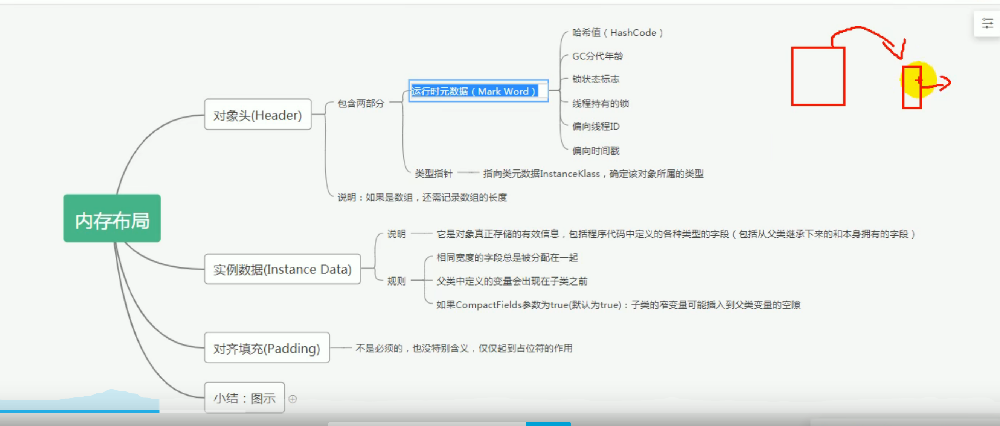
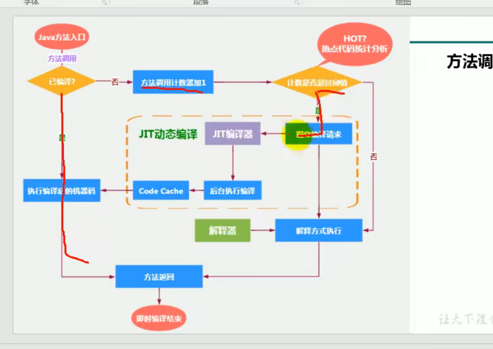

## java的编译周期
java文件-->字节码文件--->jvm虚拟机

## jvm
jvm是java的虚拟机 用于运行java编译后的字节码文件 也就是.class文件
jvm也是java能够跨越平台的原因 因为jvm他是负责运行字节码的 只要有对应的编译器 编译为符合java标准的字节码文件 就可以运行

## Hotspot
该虚拟机是Oracle公司提供的虚拟机 也就是java的默认的虚拟机

## jvm架构模型
 - 基于栈的指令集架构
  1 设计和实现更简单 使用在资源受限的系统中
  2 避开了寄存器的分配难题 使用零地址指令方式分配
  3 指令流中的指令大部分是零地址指令 其执行过程依赖与操作栈 指令集更小
    编译器更容易实现
  4 不需要硬件支持 可移植性更好 更好的跨平台 
   
 - 基于寄存器的指令集架构
  1 典型的应用是x86的二进制的指令集 比如传统的pc以及安卓的Davlik虚拟机
  2 指令集架构 完全依赖硬件 可移植性差
  3 性能优秀并且执行更加高效
  4 花费更少的指令去完成一项操作
  5 在大部分的情况下 基于寄存器架构的指令集往往都一地址指令 二地址指令
    和三地址指令为主 而基于栈架构的指令集却是以0地址为主
   
## 反编译操作
 - 反编译
javap -v xx.class
 - 查看jvm的进程
 jps
## jVM的生命周期
虚拟机的启动
  Java的虚拟机的启动是通过引导类加载器(bootstrap class loader)创建一个初始类
来完成的 这个类是由虚拟机的具体实现指定的

虚拟机的运行
  一个运行中的java的虚拟机有着一个清晰的任务 --执行java程序
  程序开始时他才运行 结束时他就停止
  执行一个所谓的java程序的时候 真真正正的是执行力一个叫做java虚拟机的一个进程

  {
  运行ing  运行java虚拟机进程
  41364 RemoteMavenServer36
  41780 Stack   --java程序运行时占用的进程
  45592 Launcher
  34060 Jps
  44780

  结束  自动回收进程
  12804 Jps
  41364 RemoteMavenServer36
  45592 Launcher
  44780

}

虚拟机的退出
 java虚拟机退出的几种情况
  1 程序正常执行结束
  2 程序在执行过程中遇到了异常或者错误而异常终止
  3 由于操作系统出现了错误而导致java虚拟机进程终止 
  4 某线程调用Runtime类或者System类的exit方法 或Runtime的halt方法
并且 java安全管理器也允许这次的exit或者halt操作

## java的三大虚拟机
HotSpot VM 
  默认的虚拟机
J9 VM  
  IBM自己的虚拟机 也比较快 定位于HotSpot接近 服务器端 嵌入式开发 桌面应用都有涉及
Jrockit VM
专注于服务器的开发 没有解析器(因为不用在意服务启动速度) 其所有命令都靠即使编译器来运行

所有虚拟机的原则 一次编译 到处运行(one compiler,run everywhere)

## 其他高性能的虚拟机

Azul Vm

 前面三大"高性能Jvm' 使用在通用硬件平台上
 这里AZUL VM 个 BEA Liquid VM 是于特定硬件平台绑定 软硬件配合专有虚拟机
  - 高性能jvm的战斗机

## Graal VM
2018.04月 发布的新一代虚拟机 号称 'Run Programs Faster AnyWhere' 于java的'write once,run everywhere' 一致

 -  Graal VM 在hotspot基础上面增强而成的跨语言全栈虚拟机 可以作为任何语言的运行平台使用
   包括 java scala groovy kotlin c c++ javascript ruby python 等
   - 支持不同语言中混用对方的接口和对象 支持这些语言使用已经编写好的本地文件
  - 工作原理就是将这些源代码编译后的格式 通过解释器转换为能够被Graal VM 接收的中间标识 
  - 如果有一天hotspot被取代 该vm的希望最大

## 内存结构概述

 - 简图
 
   

## 类加载器子系统过程
 
.class文件(字节码文件)  --> 加载阶段 --> 链接阶段 ---> 初始化

  - 类加载器的作用负责从本地or网络上面加载class文件 
  - 类加载器只负责加载class 至于是否可以运行 则由Execution Engine决定
  - 加载后的类信息存放在一块叫做方法区的内存空间 除了类的信息之外
  还会存放运行时的常量池信息 可能还包括字符串字面量和数字常量
 
## 类加载器的加载阶段
1 通过一个类的全限定名称获取定义此类的二进制字节流
2 在这个字节流所代表的静态存储结构转化为方法区的运行时数据结构
3 在内存中生成一个代表这个类的java.lag.Class对象(对象.class) 作为方法区的各种数据的访问入口

## 类加载器的链接阶段
验证
 目的在于确保class文件的字节流中包含信息符合当前虚拟机的要求
主要包含四种特征 文件格式验证 元数据验证 字节码验证 符号引用验证

准备
为类变量 分配内存 并且设置该变量的默认初始值 即0

这里不包含有final(常量)修饰的static 因为final在编译时后就会分配了 准备阶段会显示初始化

这里不会为实例变量分配初始化 类变量会在分配方法区中 而实例变量会随着对象一起被分配到堆内存中

解析
将常量池的符号引用改为直接引用的过程
直接引用就是直接指向目标的指针 
引用要使用的类
例如代码中含有 System.out.print("") 那么就会在解析阶段引入 com.java.System类 java.lang.String类.........

## ；类加载器的初始化阶段
- [初始化阶段但就是执行类的构造器方法(clinit())的过程]

-[ ****此方法不需定义 是javac编译器自动手机类中的所有类的变量的赋值动作和静态代码块中的语句合并而来]
  [构造器方法 中指令按照语句在源文件中出现的顺序执行]
  
- [若该类存在父类 则jvm会保证在子类cinit执行前 父类cinit已经执行完毕]
  
//父类
  public class Father {
  public static int num = 1;

  static {
  Father.num = 2;
  }
  }

//子类
public class Son extends Father {
//    获取父类变量 测试启动类有父类的情况下 父类是否会先调用clinit方法来初始化
  public static void main(String[] args) {
   System.out.println(num); //结果为2 说明父类已经在内部执行了一次 因为调用了静态代码块
  }

}

-[ 需必须保证一个类的<clinit> 方法在多线程下被同步加锁]

{

[创建一个多线程的类]
public class ThreadTest {
//    多线程
public static void main(String[] args) {
Runnable r = () -> {

//            if (Thread.currentThread().getName().equals("Thread-0")) {
//                try {
//                    Thread.sleep(5000);
//                } catch (InterruptedException e) {
//                    e.printStackTrace();
//                }
//            }
System.out.println(Thread.currentThread().getName() + "开始");
System.out.println(1);
//            创建对象 证明多线程环境下 对象只会被初始化一次 不会初始化第二次 因为cinit有同步锁
Dead dead = new Dead();
System.out.println(Thread.currentThread().getName() + "结束");

        };
        Thread t1 = new Thread(r);
        Thread t2 = new Thread(r);
        Thread t3 = new Thread(() -> {
            try {
                Thread.sleep(5000);
            } catch (InterruptedException e) {
                e.printStackTrace();
            }
            System.out.println("t3");
        });
        t3.start();
        t1.start();
        t2.start();

    }
}
class  Dead{
static  {
System.out.println(Thread.currentThread().getName()+"加载");
}
}

}

## cinit方法字节码解析
0 iconst_1  //创建一个变量 值为1
1 putstatic #3 <com/misaka/java/Init.a : I> //将1给一个静态变量作为值 静态变量的地址为#3
4 iconst_2 //创建一个量 值为2 也可以写  bipush 值
5 putstatic #3 <com/misaka/java/Init.a : I>//将2给一个静态变量作为值 静态变量的地址为#3
8 return

## 任何一个类在通过类声明后 在内部至少存在一个类的构造器

## Day3 图解

## Day3 复习

## 类加载器对象
 类加载器对象直接的关系 并非传统的继承 而是层级的关系

(默认类加载器 )最低层级  系统类加载器也叫应用类加载器  systemClassLoader(AppClassLoader)  该类为classloader的最低层

  上一层  扩展类加载器 ExtClassLoader对象 通过systemClassLoader.parent()方法获取
[查看指定对象所使用的类加载器 xxx.class.getClassLoader()]
  最高层 引导类加载器 bootstrapClassLoader 对象 Java的核心类库都是使用的该类加载器加载的 如 java.lang java.util

## 引导类加载器 
这个类使用的时c/c++ 语言实现的 嵌套在jvm内部

它用来加载java的核心类库(JAVA_HOME/jre/lib...)用于提供JVM自身需要的类

并不继承自java.lang.ClassLoader 没有父加载器

扩展类加载器和系统加载器 的父类加载器

出于安全考虑 该加载器只加载包名为java,javax,sun等开头的类

## 自定义类加载器
再Java的日常应用开发中 类的加载几乎是由上述三种类加载器相互配合运行的
在必要时 我们可以自定义类加载器 来定制类的加载方法

为什么要自定义
 隔离加载类
 修改类的加载方法
 扩展加载原
 防止源码泄漏

## 关于classLoader对象
  CLassLoader类 他是一个抽象列 其后所有的类加载器都继承字ClassLoader
  (不包括bootstrapClassLoader 因为是c/c++语言的)
  
## 获取ClassLoader的途径
 1 获取当前类的ClassLoader
   xx.class.getClassLoder()
   Class.forname(全限定名称).getClassLoader
 2 根据线程上下文对象来获取类加载器
 Thread.currentThread().getContextLoader()

 3 CLassLoader.getSystemLoader() 获取
 

# 双亲委派机制
 - 什么是双亲委派机制 
    java对class文件采用的是按需加载的方法 也就是当需要用到该类时
   才会将它的class文件加载到内存中生成 class对象 
   而加载某个类的class文件时 java虚拟机采用的是双亲委派模式 既把请求交给父类处理  (类似于前端的事件的委派触发(子元素事件托付给父元素事件通过e.target处理))
   他也是一种任务委派模式
   
## 双亲委派场景
 例如 
 我们也创建一个对象 并且包名为java.lang
类名为String 当我们创建对象时会发生什么事情呢?
 答案是 还是会使用java.lang.String(原)

## 双亲委派原理
 当一个类加载器收到了一个类的加载请求时(new xx())
那么 该请求首先会向上委派 也就是如果是AppClassLoader收到的请求
首先会给他的.parent()对象 如果还有.parent()对象则继续委派
如果父类加载器可以完成委派任务 那么就返回 倘若不能 则尝试使用子类加载器来初始化
这就是双亲委派机制

代码解释
public Class<T> getClass(ClassLoader cl){
    //判断是否为顶层
    if(cl.parent()!=null){
     //还没有达到顶层
     //继续递归
      getClass(cl.parent());
     // 这下面的代码是递归返回时调用的
     {判断该子类加载器可以类加载吗}

   }else{
    // 到达顶层
     {这里代码判断引用类加载器是否可以实现类加载}
   }
}

## 双亲委派图解

就是一个请求由低到高层传递 如果高层不能解决则再往下传递

## 双亲委派的作用
为了避免 自定义的类冲突了java底层的类 
并且避免了 类的重复加载
 并且防止核心api的源代码被修改

## 沙箱安全机制
 该机制就是防止包名为java,javax开头的类 使用main方法
如果使用 那么就会直接报错提示

## 在jvm中 一个类如何判断是否为同一个类
1 全限定名称必须一致
2 ClassLoader的种类也必须一致
  例如 应用类加载器 引导类加载器 扩展类加载器
 例如           1                     2
 name    java.lang.String       java.lang.String 
 Loader  BootStrapClassLoader   AppClassLoader     
 上面两种因为Loader不同 所以不是同一个类 并且第二个类会因为沙箱安全机制而被限制使用Main方法

## 以上就是类加载器的内容

## 运行时数据区
一个jvm只有一个运行时数据区
 - 运行时数据区的布局
  
   
 - 详细布局

   

在运行时区中 方法区(元空间) 和 堆区 都是一个进程一份
其他的如 PC寄存器 本地方法栈 虚拟机栈 都是一个线程一份
一个进程可以有多个线程

## jvm线程
JVM允许多个线程并发
在 hotspot中 每一个线程都与本地操作系统的本地线程直接映射

## PC寄存器
JVM中的程序计数寄存器（Program Counter Register）
 - PC寄存器是一个很小的内存空间 几乎可以忽略不计 也是运行速度最快的内存空间
 - 在jvm规范中 每一个线程都有自己的PC寄存器 是线程私有的 声明周期 与线程的生命周期保持一致
 - 任何事件一个线程都只有一个方法在执行 也就是所谓的当前的方法
   程序计数器就会存储当前线程正在执行的java方法的JVM指令地址 
   如果是在执行native方法*(本地方法) 则是未指定值(undefined) 
## Pc寄存器的作用
PC寄存器用来存储指向下一条指令的指令地址 也就是即将要执行的指令
代码 由执行引擎读取并且执行下一条指令

##  main方法字节码解析
`
  - 指令地址            操作指令                         读取常量池 #2对应的是  常量池里的指令地址为#2的对象 后面的<>里面的内容就是常量池里的内容的简述
  -  0                bipush 10
  -  2                istore_1
  -  3                bipush 20
  -  5                istore_2
  -  6                iload_1
  -  7                iload_2
  -  8                iadd 
  -  9                istore_3   
  -  10               getstatic                        #2 <java/lang/System.out : Ljava/io/PrintStream;>
  -  13               iload_3                   
  -  14               invokevirtual                    #3 <java/io/PrintStream.println : (I)V>
  -  17               return     
`

 --- 在上面的结构中 PC寄存器在哪里呢?
 -复习PC寄存器概念
  [ PC寄存器用来存储指向下一条指令的指令地址 也就是即将要执行的指令 代码 由执行引擎读取并且执行下一条指令]

 假设 我们的程序刚好运行到了  下面的代码
 指令地址    指令
 5         istore_2
 6          iload_1
那么PC寄存器就会保存改指令的指令地址[5]    并且执行引擎会到PC寄存器中读取该值 并且通过该值作为一个指针获取对应的指令[istore_2]
当改行代码运行结束时 PC寄存器会再次获取下一行指令的指令地址[6] 并且重复上面的操作 直到程序结束

## 字节码main方法图解

## PC寄存器的两个面试问题
使用PC寄存器存储字节码指令地址有什么用吗?
  - 因为cpu要不停的切换线程 这时候切换回来之后 就要知道接着从哪里开始继续执行

为什么使用PC寄存器记录当前线程的执行地址呢?
 -  JVM字节码解释器 就需要通过改变PC寄存器的值
来明确下一条应该执行什么样的字节码指令 
    
## 为什么PC寄存器要设置线程私有的呢
无线程私有场景
例如 
运行了一个java程序进程里面有三个线程 
 首先线程一运行到了第5个指令 指令地址为7 在这时Cpu开始运行第二个线程
 第二个线程运行到了第一个指令 指令地址为1 由于没有线程私有 所有的线程公共使用一个PC寄存器
 所以线程一的值被覆盖 当PC寄存器回到线程1时 就无法找到上一次运行的位置

而线程私有就可以做到每一个线程都有一个PC计数器 所以就不会出现指令地址覆盖的问题

## 虚拟机栈概述
 - 初步印象
   以前对内存区理解只有 java堆栈结构
   
 - 栈和堆
  栈是运行时单位
  堆是存储的单位
   
 - 是什么
  java虚拟机栈 在java线程中会自动生成一个 是[线程私有]的
   其内部包含一个个栈帧
   
- 生命周期
  生命周期与线程一致
  
- 作用
 主管java程序的运行 他保存的方法的局部变量 部分结果 并参与方法的
  调用与返回
  
- 虚拟机栈的栈帧
一个栈帧对应一个方法 栈顶的方法为当前方法 与js的方法栈一致
   - [与js的执行栈十分类似!]
## 栈可能会出现的异常
栈内存允许java栈大小是动态or固定

OutOfMemoryError 内存溢出异常 java虚拟机尝试动态扩展 但是内存不足无法创建虚拟机栈 就报错(栈内存动态) 
StackOverFlowError 栈溢出 线程请求超出方法栈容量 也就是死递归 (栈内存固定)

## 栈的存储单位和运行原理
每一个线程都有一个虚拟机栈 里面的数据都是以[栈帧]的格式存在
每一个栈帧就是一个方法 
栈帧是一个内存区块 是一个数据集 维系着方法的执行过程中的任何数据信息
## 栈的运行原理
虚拟机栈和普通栈一致 都要遵循 先进后出的原则
在一条线程上 一个时间点上 只有一个活动的栈帧 即只有当前正在执行的方法的栈帧(栈顶)
这个栈帧被称为 [当前栈帧]  栈帧对应的方法叫 [当前方法] 定义该方法的类叫做 [当前类]

 - 图解

   

## 栈帧的结构
 - 局部变量表 
      - 是一个数字数组 主要用于存储方法参数和定义在方法体内的局部变量
       这些数据包括基本数据类型 对象引用 以及返回值类型
      - 由于局部变量表是建立在线程的栈上 所以没有安全问题
        - 可以在字节码文件中找到 locals=9  这个就代表当前栈帧中含有9个局部变量([局部变量最大槽数])
          LocalVariableTable: 该属性里面可以查看当前栈帧中所有的变量以及它的数据类型
      - 局部变量表生命周期就是线程结束 就销毁
      - [变量槽]
        变量槽就是局部变量表的容器 是一个数组的结构
        32位占一个槽 int object...
        64位占两个 long double 
        变量槽的先后依照变量的创建时间来决定 越早创建就越早入槽
        this会第一个放在当前方法的局部变量表中 这也是为什么静态方法获取不到this的原因 因为静态方法当前的局部变量表中没有this
        { [测试 解析为什么static方法不能调用this?]
          [结果 因为static方法的局部变量表中没有this!!]
        `
             public void Test1(){
             //        测试 非静态方法的局部变量表
             //        结果
             //        局部变量表中有this
             //        Slot长度为 2    分别为 this 和 s
             String s = new String();

             }
             public static  void xx(){
             //        测试 静态类局部变量表
             //        结果
             //        局部变量表中无 this
             //        Slot长度为1   T
        /    // 因为当前方法的局部变量表中没有this!!
             int T = 102;
             }
             public Slot(){
             //        测试 构造器局部变量表
             //        结果
             //        局部变量表中有this
             //        SLot长度为1 this
             this.c=10;
             }
        `
        }
        

   [变量槽还有一个功能叫做槽位回收 功能是 回收局部变量开辟的槽位 给下一个变量 就不用多开一个槽位了 例如下面的代码]
   `
   public void TestBack(){
      //        测试下槽位的回收
      int a=10;
      //        创建一个局部作用域
      {
         int b=a;
         b=b+a;
      }
      int c=10;
   //        上面的Slot长度是多少呢? 答案是3
   // 虽然`` 有 this a b c 4个局部变量 但是 其中b变量在38行之后就不能使用了 所以空出来的槽位就给了变量c
   // 所以最后只有 this a c 三个局部变量
   }
    `
      - 图解
      
   

 - 操作数栈(或表达式栈)
   - 该内容的底层数据结构为栈 并且该栈是通过数组实现的
   - 作用 
       在方法执行的过程中 根据字节码的指令 往栈中写入数据或者提取数据 (即入栈与出栈的操作)
      - 某些字节码指令将值压入操作数栈 其余的字节码指令将操作数取出栈 使用他们后再把结果压入栈
      - 比如 执行赋值 交换 求和等操作
      - 图解
     
        其中 class文件中的Stack=2 就代表了该文件只用了长度为2的栈
        - 解析字节码
          
           public static void main(String[] args) {
                 byte a =10;
                 int b =5;
                 int c =a+b;
           
               /*  解析字节码
               *    i 代表int
     PC                     指令地址  指令         解析
 PC寄存器值: 0             * 0       bipush 10  存储一个int类型的数为10到操作数栈中
              *      
 PC寄存器值: 2               2       istore_1   存储该值并且放在局部变量表的变量槽1中 变量槽0为this or args
                *      
 PC寄存器值: 3               3       iconst_5   存储一个int类型的数为5到操作数栈中
               *      
 PC寄存器值: 4               4       istore_2   存储该值并且放在局部变量表的变量槽2中
               *      
 PC寄存器值: 5               5       iload_1   取出局部变量表中槽位为1的值 并且放在操作数栈中
              *      
 PC寄存器值: 6               6       iload_2   取出局部变量表中槽位为2的值 并且放在操作数栈中
               *      
 PC寄存器值: 7              7        iadd      对所有操作数栈的值进行加法运算 并且将结果压入操作数栈中
               *      
 PC寄存器值: 8               8       istore_3  将结果保存到局部变量表的第三个槽位中
               *      
 PC寄存器值: 9               9       return 结束函数
               *
               * */
     [指令介绍]
bipush :     byte类型转为int类型 存入操作数栈
iload_局部变量表槽位 : 取出对应槽位的值到操作数栈中
iadd :       int 类型相加
istore_槽位:  将操作数栈的栈顶数据以int类型存储到指定的槽位中

           }
    

[下面三部分 也叫帧数据区]
   
 - 动态链接(或指向运行时常量池的方法引用)
        - 字节码
         -  10               getstatic                        #2 <java/lang/System.out
        上面字节码中 #2就是一种动态链接 也就是会去常量池中 找到#2的引用并且获取

  - 方法返回地址(或方法正常退出或者异常退出的定义)
    ## 栈帧中的方法返回地址
    例如A方法中13行调用了B方法
    然后B方法执行完毕后 将PC寄存器(B方法执行完后 下一个执行的是A方法)的值给执行引擎
    然后就能回到A方法的13行继续执行 这个过程叫方法返回地址
    
    ## 方法返回指令
    在字节码指令中 返回指令包含 ireturn (int,Bool,Byte,Char都是这样一个 )
    lreturn  long
    dreturn  Double
    Freturn  float
    areturn  Object(引用类型)
    return返回void

 - 附加消息

## 变量的分类
 
  1 按照类型分类
  基本数据类型 引用数据类型
  2 按照声明的位置分
  成员变量(在类中声明) 会有默认值 可以不进行显式赋值
   -类变量 无static
    - 在使用前 都经历过类加载器的第二个阶段(连接阶段)的准备环节 进行默认赋值
   -实例变量 有static
    - 随着对象的创建 会在堆空间中会分配实例变量空间 并且进行默认赋值
       
  局部变量(在方法中声明) 没有默认值 必须进行显式赋值 否则报错
    

## 栈顶缓存技术(了解)

## 方法的调用(重要)

早期绑定(静态链接) 不是多态 方法唯一
 目标方法如果在编译期间就可知 且运行时期保持不变 即可将这个方法与所属的类型进行绑定
 这样一来 由于明确了被调用的目标方法究竟是哪一个所以就可以使用静态链接的方法将符号引用转为直接引用

晚期绑定(动态链接) 多态方法 例如一个类有多个实现类重写了父类方法 当要调用父类的方法时 就要通过子类来确定要调用哪一个子类的方法
 如果被调用的方法再编译器无法确定下来 只能在运行阶段根据实际的类型绑定相关的方法
这种绑定方法就是晚期绑定

## 虚方法和非虚方法
虚方法与晚期绑定是对应的
非虚方法与早期绑定是对应的

非虚方法
 - 如果方法在编译的阶段就确定了具体的调用版本 这个版本在运行是不可变的
   这样的方法叫非虚方法
   
 - 静态方法(static) 私有方法(private) final方法(不可修改) 实例构造器 父类方法 都是非虚方法
   其他方法为虚方法
   

## 虚拟机中字节码调用函数指令
普通调用指令
  - 非虚
  invokestatic 调用静态方法
  invokespecial 调用<init>(构造器)方法 私有方法及父类方法 解析阶段确定唯一的方法版本
  -   
  invokevirtual 调用所有的虚方法
  invokeinterface 调用所有的接口方法
动态调用指令
  invokedynamic    动态解析出要调用的方法 然后执行 (Lambda表达式)
  执行后去常量池中寻找   
## 子类对象的多态使用前提
 1 类的继承关系
 2 方法的重写

## 静态类型语言 和 动态类型语言
静态类型语言 (强语言)
 对类型的检查在编译期
动态类型语言 (弱语言)
 对类型的检查在运行期

java属于静态类型语言
 String  a= "abc";//需要定义类型
js属于动态类型语言
 var  a='abc';  //不需要定义类型 
  

## 方法重写的本质

## 虚方法表

## 虚拟机栈的面试题
举例栈溢出的情况?
StackOverFlowError 静态溢出报错
通过 -Xss调整 动态溢出 OOM报错

调整栈的大小 就可以保证栈不溢出吗
不能 只能将阈值变高

分配的栈空间越大越好吗
 不是 ！

垃圾回收是否涉及到虚拟机栈
不会 虚拟机栈只涉及Error

方法中定义的局部变量表 是否线程安全?
 - 线程安全?
   如果只有一个线程才可以操作这个数据 则是线程安全的
     - 在当前线程内部产生值 且没有返回该值给其他线程
     
  
   如果有多个线程操作此数据 则数据是共享数据 如果不考虑同步机制的话 则存在线程安全问题
     - 值作为形参传入 （有可能从其他线程传入） 有线程安全问题
     - 值作为返回值返回给其他线程 有线程安全问题

   
- 图解

## 本地方法接口
 - 什么是本地方法? 就是一个Java调用一个给Java代码的接口
   该方法实现不是java语言实现 比如C
 - 作用 : 融合不同语言 为java所用 最初是融合C/C++
 
## 本地方法栈 
管理本地方法的调用
 也是线程私有的 
也可以像虚拟机栈一样设置长度 -Xss
也会有StackOverFlowError 和 OOM报错

## 学习路线回顾!!! 复习

## 堆内存
 - 堆的核心描述
 堆是进程唯一的 也就是一个jvm只有一个堆内存
   也就是jvm所有的线程公用一个堆空间
   Java的堆内存在jvm启动时就被创建 其空间大小也被确定了 是Jvm管理的最大的内存空间
   - 堆空间的大小是可以修改的
   堆内存可以是一个不连续的内存空间(数组) 但是逻辑上他应该被视为连续的(链表) 
     
- 堆关于对象
  "几乎"所有的对象实例 以及数组 都应该运行时分配在堆内存上
   方法结束后 对象不会马上被移除 会等到GC回收来移出
- GC垃圾回收

## 堆内存空间细分
 Java7以前的堆内存逻辑分为 新生区 养老区 永久区
 
 Java8以后堆内存逻辑为 新生区 养老区 元空间
 
## 设置堆空间的大小
-Xms 用于标识堆区的最小内存
-Xmx 用于标识堆区的最大内存
 【 -X : 操作虚拟机的标识
     ms : memory start
     mx : memory max

一旦堆空间内存超过了-Xmx设置的值 则会抛出OOM错误

通常会将 -Xms -Xmx 设置为同一个值 其目的是为能在java垃圾回收机制 清理完堆区后
不需要重新计算堆区的大小 从而提升性能

默认大小  初始 物理电脑内存/64
         最大 物理电脑内存/4

## 查看设置的参数
 方法1 jps获取进程id  ---> jstat -gs 进程id
 方法2 -XX：+PrintGcDetails
 
## OOM报错 OutOfMemory
对象多次创建 导致报错

## 年轻代和老年代
 存储在JVM中的java对象 可以被划分为两大类
   - 一种是生命周期较短的瞬时对象 这类对象的创建和消亡都非常的迅速
   - 另外类的对象的生命周期却非常的长 在某一些极端情况下 可以和JVm的生命周期一样
 Java堆区所以被分为 两大区域 - 新生代 和 老年代
      - 其中年轻代又可以划分为Eden空间 Survivor0空间和Survivor1空间(也叫 from区和to区)
 
- 图解
  
  

## 配置新生代和老年代在堆中的比例
600M的堆空间 默认新生代为200M 老年代为400M
 默认 -XX:NewRatio=2 标识新生代占1 老年代占2 也就是 新生代占堆空间的1/3
 也可以设置为  -XX:NewRatio=4 标识新生代占1 老年代占4 也就是 新生代的占堆空间的1/5

## 年轻代内部的比例
Eden空间 和 from和to区的比例为
 8       :  1  : 1
可以通过 -XX:SurvivorRatio=比例 来调整
几乎所有的java对象都是在Eden区被New出来的
绝大部分的对象销毁都在新生代执行
可以使用 -Xmn来设置新生代的最大内存大小 [一般用默认值]

## Eden空间不是8:1:1而是6:1:1的原因
因为jvm有一个自适应 要将其关闭才是8:1:1
-XX:-UseAdaptiveSizePolicy

## 对象分配的流程
From区 : 也叫Survivor区 用于存储Eden满时 活下来的对象
to区 : 也叫Survivor区 作为准备存储Eden满时From区中活下来的对象 这时to区就转为from区 from区转为to区
总结 : [谁空 谁是to区]

From区和to区会互相变换 例如上一次Survivor0是From区 那么下一次Survivor1区为From区 Survivor0是to区
每一次Eden区满了就会启动一次GC 因为是新生代所以也叫YGC 
如果Eden的对象活下来进入了From区 并且在From区和to区中传递15次[阈值] 那么就会被送入老年代(元数据)

如果Survivor区直接占满 那么就会直接跳级到老年代存储
老年区如果也放不下 那么就会执行FGC(Full GC) 如果还是放不下 那么就会报错OOM(OutOfMemory)
 - 阈值的修改
  -XX:MaxTenuringThreshold=<N> 进行设置

 - new 对象时将其放在Eden区中 
    如果 new对象时Eden区方法 则开启GC开始垃圾回收 检查哪些对象已经没有引用 并且将其删除
    有引用的对象则从Eden区到From区  
   
-- 图解

## JVM常用工具
JDK命令行
Eclipse
Jconsole
VisualVm
Jprofiler
Java Flight Recorder
GCViewer
GC Easy

   
## 堆内存的GC垃圾回收 MinorGC(新生代) MajorGC(老年代) FullGC
-图解

- MinorGC触发机制
当Eden空间不足时触发MinorGC该GC是最快的
  该GC会引发STM 暂停用户线程 等垃圾回收结束 用户线程才继续进行
  
- Majorgc的图解

## 堆空间分代思想
经研究 不同的对象的生命周期不同 70-90的对象都是临时对象

 新生代 
 里面包含 Eden区 From区 to区

老年代 
 存放在From区和to区经历多次GC依然存货的对象

## 内存分配策略 总结篇
如果对象在Eden区出生 并且经过了第一次GC 依然存活 并且能够被from区收容的话
那将被移入 并且年龄设置为1 后续每一次GC都会增加年龄 直到增大到15(默认值)
就会进入老年代

对象晋升老年代的阈值 可以通过选项 -XX:MaxTenuringThreshold来设置

如果对象太大导致Eden区放不下 那么就直接放到老年区 所以要避免创建过大的对象

## TLAB
TLAB的全称是Thread Local Allocation Buffer，即线程本地分配缓存区，这是一个线程专用的内存分配区域。

如果设置了虚拟机参数 -XX:UseTLAB，在线程初始化时，同时也会申请一块指定大小的内存，只给当前线程使用，这样每个线程都单独拥有一个空间，如果需要分配内存，就在自己的空间上分配，这样就不存在竞争的情况，可以大大提升分配效率。

TLAB空间的内存非常小，缺省情况下仅占有整个Eden空间的1%，也可以通过选项-XX:TLABWasteTargetPercent设置TLAB空间所占用Eden空间的百分比大小。

TLAB 也是一块内存区域 用于存放一些线程本身的对象

## 堆空间的参数设置
- 常用的参数

  

## 堆是分配对象的唯一选择吗
- 不是 还有一个栈上分配
 ## 逃逸分析
 - 开启代码
-XX:+DoEscapeAnalysis
  快速的判断是否发生了逃逸分析 大家就看new的对象是否有可能在方法外部被调用 如果没有则使用栈上分配
   逃逸的情况
 1 方法返回对象
 2 为类的成员变量赋值
 3  引用成员变量的值 发生逃逸
   非逃逸情况
 1 对象的作用域仅在方法的内部有效  
   
 结论!!!
 [开发中 能使用局部变量就不要在方法外面定义]
## 代码优化
栈上分配 同步省略 标量替换
## 栈上分配
 - JIT 编译器在编译阶段时根据逃逸分析的结果 发现如果一个对象
没有逃出方法的话 就会被优化为栈上分配 分配完毕后 继续调用栈内执行 最后线程结束 栈空间被回收 局部变量对象也被回收
   （也就是直接放在虚拟机栈的栈帧的局部变量表中 生命周期与方法一致 所以就不需要GC来进行回收了）
    这样就无需进行垃圾回收了
   
 - JDK8自动开启逃逸分析
    开启GC日志    设置堆内存大小    开启逃逸分析
   -XX:+PrintGC -Xms500M -Xmn500M -XX:+DoEscapeAnalysis
- 逃逸分析可以大幅度的降低运行时长 提升运行效率 所以能使用局部变量就使用局部变量

## 同步省略
 原因 
  线程同步的代价时非常高的 同步的后果时降低并发性能 
  功能
  在动态编译同步块的时候 JIT编译器就可以借助逃逸分析来判断同步块所使用的锁对象是否只能被一个线程访问而没有被发布到其他线程
  如没有 娜美就会取消这部分代码的同步 这和过程就叫做同步省略 也叫同步锁消除
 
# 标量替换
 有的对象可能不需要作为一个连续的内存结构存储也可以被访问到 那么对象的部分(或者全部)
 可以不存储在内存中 而是存储在CPU寄存器中
 
## 堆内存总结

## 方法区(也叫MetaSpace(元空间))
- 虚拟机栈和堆和方法区的交互关系

  方法区用于存储对象的类型
  例如Person person = new Person();
  new Person(); 执行后会在堆空间中开辟一个地址 用于存放对象示例数据 
  该数据有一个指针 叫做到对象类型数据的指针 该指针会指向对象类型也就是Peroson对象 该对象类型就存储在方法区
  
## 方法区的基本理解
 方法区也是线程共享的区域
  方法区在jvm创建时创建
  方法区的大小是可以调节的
 方法区的大小决定了可以存储多少个类 如果类太多 则会此处报错 OOM
 关闭JVM就会释放内存
 
## 方法的大小设置
jdk7设置
-XX:PermSize=size
-XX:MaxPermSize=size
jdk8 
-XX:MetaSpaceSize
-XX:MaxMetaSpaceSize

## jinfo -flag 属性值去-XX 端口号 用于查看属性值
## 如何解决OOM
 1 通过各种工具先判断是那种情况引起的错误 
   - 内存泄漏
     即 堆内存中对象因为有引用而导致GC无法进行回收 一旦这种对象过多 则会产生OOM报错  
   - 内存溢出
     解决方法 : 通过调整 -Xms -Xmx 来设置堆空间的大小
     即 堆内存中的新生区(Eden,from,to区)和老年区的空间占满 这时再往里面放对象 则会报OOM
     
## 方法区内部结构 重要！！
 方法区主要存储的是虚拟机加载的类型信息(Person,User...) 常量(final) 静态变量(static) 即使编译器(JIT)编译后的代码缓存
   [类信息] : 类 , 接口,枚举，注解
       方法区会存储类型信息的
        - 这个类型的完整全限定名称
        - 这个类型的直接的父类的全限定名称(接口和java.lang.Object都没有父类)
        - 这个类型的修饰符(public,static,final的其中一个)
        - 这个类型直接接口的一个有序列表
    [域信息]: JVM必须再方法区中保存类型的所有域的相关信息以及域的声明顺序
        - 域的相关信息包括 域名称 域类型 域修饰符  (public,protected,static,private,final..)
    [方法信息]:JVM必须在方法区中保存以下的信息
        - 方法名称
        - 方法的返回类型(如void ...)
        - 方法的参数的数量和类型(按顺序)
        - 方法的修饰符(public,private,protected,static,final.synchronized,native,abstrack)
        - 方法的字节码 (bytecode) 操作数栈 局部变量表及变量槽大小(abstrack和native除外)
        - 异常表(abstract和native方法除外)
            每一个异常开始的位置和结束的位置 代码处理在pc计数器中的偏移地址 被捕获的异常类的常量池索引(如异常类为NullPointException 常量池索引为#2)

## class字节码中常量池的理解
常量池表是Class文件的一部分 用于存放编译器生成的各种字面量和符号引用
这部分内容将在类加载后存放在方法区的运行时常量池中
 - 字节码文件的结构
  一个有效字节码文件中除了包含类的版本信息 字段 方法以及接口等描述以外
   还包含一项信息就是常量池表(Constant Pool Tabel) 包含各种字面量和对类型 域和方法的符号调用
   字面量 int a=10; 的'10'就是字面量
    常量池和符号引用: 符号引用是为了防止有一些数据过大不能直接存入字节码中 而是存在常量池 通过符号引用常量池的数据 防止字节码文件过大
                   在链接阶段的解析中 会将符号引用转为直接引用 也就是直接使用符号引用指向的类
## 常量池总结
  1 可以看作为一张表 虚拟机指令根据这一张常量表 找到要指向的类名和方法名 参数类型 字面量等类型
   
## 运行时常量池
 运行池常量池 是方法区的一部分
 - 在加载类和接口到虚拟机后 就会创建一个对应的运行时常量池
 - JVM为每个已加载的类型都为一个常量池 池中的数据项 就像数组一样 都是通过index访问的
 - 运行时常量池中包含多种不同的常量 包括编译器就已经明确的数值字面量 也包括到运行期解析后才能获得的方法
   或者字段引用 此时不在时常量池中的符号地址了 这里将会转为真实地址
     - 运行时常量池 相对于Class文件的常量池表来说 具备动态性
 - 当传概念类或者接口的运行时常量池时 如果构造运行时常量池的内存超过了方法区的所能提供的最大值 那么JVM会抛出OOM异常   

## 方法区的演进
jdk1.6 以前 有永久代 静态变量存放在永久代上面
jdk1.7 有永久代 但已经开始"去永久代"字符串常量池 静态变量溢出 保存在堆中
jdk1.8以后 没有永久代 类型信息 字段 方法 常量保存在本地内存中的元空间中 但字符串常量池和静态变量转移到了堆中
## 永久代被替换的原因

## 字符串常量池(StringTable)为什么要调整到堆中

## 如何证明静态变量的存放位置
 1 静态引用的对应的对象实体永远都在堆空间中 无论jdk版本 (即new的对象)
 2 如果要查看这个静态变量的存储位置 则要下载一个工具jhsdb(jdk9以上的bin目录中)
 

## 堆内存的复习
堆内存分为了三个阶段
年轻代      老年代               元数据
MirrorGC   MajorGC或者FullGC
年轻代又分为了 Eden区 From区和to区
老年区存放的是在From区和to区中经历一定的GC次数后的对象

命令复习
 设置堆空间大小
  -Xms -Xmx
 设置新生代和老年代的比例
  -XX:NewRatio
 设置(jdk7:永久区)jdk8:元空间大小
 jdk7 
  -XX:PermSize -XX:MaxPermSize
 jdk8
  -XX:MetaspaceSize -XX:MaxMetaspaceSize(默认值为-1 则无限制 与本地内存一致)

## 方法区（永久区 元空间）的垃圾回收
有些人认为方法区 是没有垃圾回收欣慰的 其实不然

常量的回收u
类的回收

## 运行时数据区总结
 - 老师图

    - 自己复习
    
      
## new Peroson在jvm中
1 加载对象到堆空间的新生代的Eden区中
2 将类信息存放在方法区(元空间or永久代)中
3 如果该对象是一个局部变量 还要把该对象写入对应的方法的栈帧的局部变量表中

## 对象的实例化的几个方法
1 new
2 Class的newInstence() 反射的方法 只能调用空参的构造器 并且权限必须为public(jdk9中被下面的替代)
3 Constructor的newInstance()反射的方法 可以调用空参和有参的构造器 权限没有要求
4 使用clone 不使用任何构造器 当前类需要实现Cloneable接口 实现clone方法
5 反序列化 : 从文件or网络中会获取一个对象的二进制流
6 第三方库Object 

## 创建对象的步骤
一共有六步
1 判断类是否完成了 加载 链接 初始化
2 在堆内存中开辟空间 
   - 内存连续 使用指针碰撞存储
   - 内存不连续 空闲链表分配
3 解决同步问题 加上线程锁
     每一个线程加上一个TLAB来避免堆内存发生并发异常
4 属性初始化 0值 null

5 设置对象的对象头 对象元数据绑定 (类中创建一个指针绑定方法区的类信息)

6 显式初始化(执行Init) 代码块赋值/直接赋值 构造器赋值

- 实例化对象的过程

  
## 对象的内存的布局
分为三部分 
  - 对象头
  - 实例数据
  - 对齐填充

## new Constmer的在内存中的步骤

## 直接内存
直接分配本地的内存空间
ByteBuffer b = ByteBuffer.allocateDirect(1024);//数值 单位为Byte

释放
b=null

直接内存也会有 OOM异常 
需要通过设置 jvm虚拟机属性来解决 
-XX:MaxDirectMemorySize=5m (代表最大虚拟内存为5m)

## 执行引擎
 - 作用 
 执行引擎的作用就是将字节码的指令解释/编译为对应的平台上的本地机器指令才可以 简单来说 JVM的执行引擎充当了将高级语言
解释编译为汇编语言(机器语言)的翻译
   
 - 执行
执行引擎 就是在运行时读取PC计时器的值 通过该值 执行对应的指令
   

   
## 什么是解释器 什么是JIT编译器
 解释器(Interpreter) ： 当Java虚拟机 启动是会根据预定义的规范对字节码采用逐行解释的方式执行 将每条
字节码的文件中的内容 "翻译"为对应的平台的本地机器的指令执行
 JIT :(Just In Time Compiler) 就是需笔记将源代码 直接翻译为和本地机器平台相关的机器语言

## 为什么Java是半编译半解释型语言
因为java的执行引擎中使用了 解释器和编译器两种 来处理字节码文件
hotspot采用了解释器和即时编译器共存的架构 在java虚拟机运行时
解释器和即使编译器 能够相互合作 各自取长补短 尽力取选择最合适的方法来权衡比那一本地代码的时间 和直接解释执行代码的时间

## 机器码 指令 和汇编语言
- 机器码
 各种用二进制编码方法标识的指令叫做机器指令码 
  机器语言虽然能被计算机直接接收 但是和人的语言差距太大 不易理解和记忆
  执行速度最快
   
- 指令
    由于机器码是由0和1组成的 可读性太差 所以将有序的01机器码封装为了指令
   例如 mov(写入数据)等等指令 但是在不同的系统上面有不同的指令集 所以对应的机器码也可能不同
  - 指令集
    不同的硬件平台有不同的指令 因此每一个平台所支持的指令 叫做指令集
    常见的有 ARM X86
     x86指令集 : 对应的是x86架构的平台
     ARM指令集 : 对应的是ARM架构的平台
    

- 汇编语言
  由于指令的可读性还是太差 于是人们发明了汇编
  在不同的硬件平台 汇编语言对应着不同的机器指令集 通过汇编过程转为机器指令
   - 由于计算集只认识指令码 所以用汇编语言写的程序还必须翻译为机器指令码 计算机才能识别和运行
    
##  不管是汇编语言还是机器指令还是高级语言 都需要通过翻译器翻译为机器码 

## 编译过程
 编译过程可以分为两个阶段 编译和汇编
   编译过程 是指读取的源程序(字符流) 对之进行语法分析 将高级语言指令转为功能等效的汇编代码
   汇编过程 实际上指汇编语言代码翻译成目标机器指令的过程
 
## 解释器
 - 解释器真正的意义就是一个运行时的翻译者 将字节码文件的内容 翻译 为对应平台的本地机器指令执行
  - 当一条字节码指令被解释执行后 接着在根据PC寄存器中记录的下一条需要被执行的字节码指令 执行解释操作
解释器的执行效率较低
    
## JIT编译器 (Just In Time Compiler)
 - 速度快
 - JIT会直接寻找字节码 并且直接转为机器码指令 而不是逐行执行

## 为什么hotspot 选择使用编译器解释器并存 而不像其他虚拟机一样只保留JIT
 - 这个问题 hotspot回复的是 取长补短
   JIT的优点
   - 速度快 但是在第一次启动时 没有解释器的响应速度快
   解释器的优点
    - 当程序启动后 解释器会马上开始执行 响应时间快 (JIT则需要将代码翻译成本地代码后执行
      需要时间 但是一旦翻译结束 JIT的响应时间就会变高)
## 编译器
Java语言的编译器 其实是一个 "不确定"的过程 因为它可能是指一个[前端编译器]把 .java文件转为.class文件
也有可能叫[后端编译器] 就是JIT 将字节码文件 转为机器码的过程
还有可能是[静态提前编译器] (AOT编译器) 直接将.java的文件转为机器码的过程

## Hotspot是如何选择使用解释器还是即使编译器的
通过一个计数器来记录一个方法调用的次数 如果次数达到一定的阈值 就使用JIT编译器来编译

 - 计数器的设置
   -XX : CompileThreshold
   
   
## 方法调用时 执行引擎的操作

## JIT的热度衰减 非常类似Sentinel的熔断机制
sentinel的原理 
 1 在一定的时间内 错误的请求 如果超出了阈值 那么就会关闭链接 如何在一定的时间内错误
   的请求没有达到 则在下一个周期中 错误次数会清0
 
JIT的热度衰减
 1 在一定时间内 如果方法的调用次数达不到启动JIT的高度 那这个方法的调用计数器就会减少一半
这个过程叫做 热度的衰减 这段时间叫 半衰周期
 可以通过 -XX:-UseCounterDecay 来关闭热度衰减 这样而来只要系统运行的时间足够长
那么大部分的代码都会通过JIT来编译
 可以通过 -XX:CounterHalfLifeTime 来设置半衰期的时间 单位为秒s

## 回边计数器
 就是一个方法循环调用时的一个计数器 在编译方法判断时 要将回边计数器的值加上普通计数器的值 来判断是否达到阈值
## JIT一旦执行后 会将翻译好的机器码缓存起来
## 缓存保存在方法区中

## Graal编译器

## String的不可变性
 - String的基本特性
   
   使用""引起来标识
   
   String声明为Final不可被继承
   
   String实现了Serializable接口 标识支持序列化
         实现了Comparable接口 标识可以比大小
   
   String在jdk8及以前内部定义了final char[] value 用于存储字符串数据 
         jdk9后 改为byte[]
   
## String底层为什么抛弃了char[] 改用byte[]
因为java公司现大部分的字符粗对象都是用于存储拉丁字符
而一个拉丁字符只占一个byte(一个字节) 而不是一个char（两个字节） 从而导致了资源浪费了一半
而且字符串对象在堆空间中占比很大
## 字符串存储字面量的方法
String a1 = "abc"; //这里是把"abc"这三个字符存储到堆空间的字符串常量池中 并且返回一个内存地址给a1

String a2 = "abc"; //判断堆空间中字符串常量池是否有"abc"值 有的话直接使用 并且返回一个地址给a2

a1==a2 ; //答案为true 这里是比较地址 由于a1和a2的常量池地址一致 所以相等

并且如果进行字符串修改 也是重新开辟一个字符串常量池空间存储修改后的值
而不是在原有的字符串上面修改 这就是字符串的[不可变性];

## 测试字符串不可变性
public class StringTest {
//    测试String的不可变性
                String str = "hello";
                char[] c = {'t','e','s','t'};
          public void Exchange(String str,char[] c){
                      剖析
                      str传入后 形参是一个赋值操作 str=传入值 此时地址一致
                      str="ex"  这时进行了修改 但是根据字符串不可变 这里只是在字符串常量池中添加了一个新的字符串叫做"ex"
                      并且只是函数体内部的变量指向它 函数外部字符串保持不变
                 str="ex";
                     c 是一个数组 形参传入时 内部c和外部c都指向了一个数组 这里修改了数组是会生效的
                 c[0]='b';
          }
              public static void main(String[] args) {
                  StringTest stringTest =new StringTest();
                  stringTest.Exchange(stringTest.str, stringTest.c);
                  System.out.println(stringTest.str); //hello
                  System.out.println(stringTest.c); //best
              }
}

## 字符串常量池的底层 - HashTable
 [字符串常量池不会存储相同的字符串 - 也就是有一个字符串在里面 如果下一次存储
  值相同于已有的字符串 则直接引用 而不是添加]
 - 因为底层是一个哈希表 之前的内容可以知道 hash表的key是不可以重复的
 - 默认长度为1009
  - 如果字符串常量池的值过多 就会造成哈希冲突 从而导致链表变长 而链表长了以后 就会直接影响到
String.intern的性能下降
 - 使用 -XX:StringTableSize来设置大小
 - 其他 -图解

   
-- jdk8后 -XX:StringTableSize 的最小值为1009

## 测试字符串常量池大小对于大量数据的影响
//    通过Stirng的intern()方法来存储字符串到常量池中 数据量为20w
//    并且查看字符串常量池大小 对运行时长的影响
// -XX:StringTableSize
// 1009大小 228ms
// 100009大小 80ms

可以看出大容量换来的提升非常大
## 字符串常量池的总结 如果有大量的字符串 可以将-XX:StringTableSize调大
## intern()方法
//    intern() 方法
//    将对应的字符串对象的值存储到字符串常量池中 如果存在就不存储
s.intern();

## String的内存分配
常量池酒类是一个java系统级别提供的胡拿出 8中基本数据类型的常量池都是系统协调的
String的比较特殊 它的主要的方法有两种
 
直接使用双引号声明出来的String对象 会直接存储到对象常量池中
 比如 String s1 ="atguigu.com";
如果不是用双引号申明的String对象 可以使用String提供的intern()方法
这个后面重点
 
  - 字符串都存储在堆空间中 和其他的对象一样 这样可以让你进行调优时 只需要调整堆的大小就行了(-Xms -Xmx)
String对象的存储的地址 jdk6及以下 存储在永久代中 通过-XX:[Max]permSize 来调整大小
                    jdk7及以上 存储在堆空间中 通过 -Xmx -Xms 来调整大小 
    [元空间(jdk8以后 用于替代永久代)是方法区的存放地址 存放类信息 方法信息 域信息 JIT编译缓存... 通过-XX:(Max)MetaspaceSize 来调整大小]
                     

 