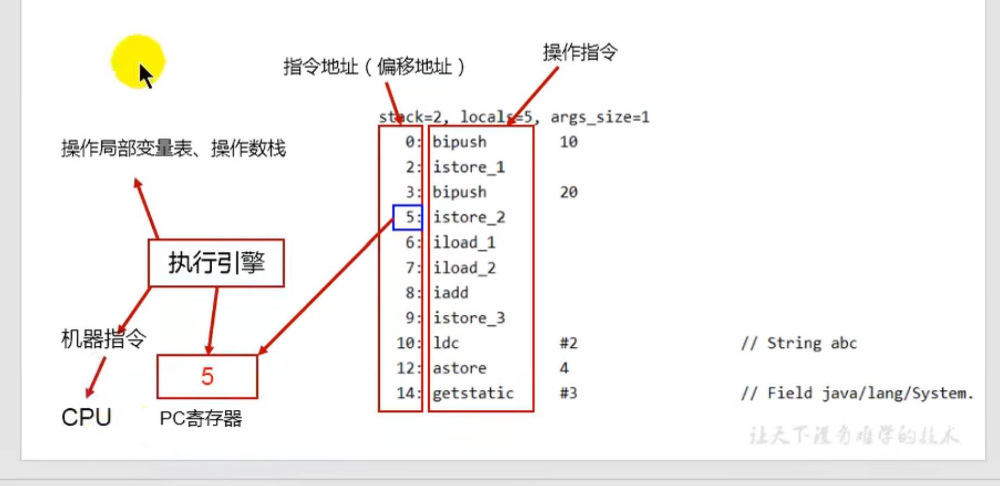

## java的编译周期
java文件-->字节码文件--->jvm虚拟机

## jvm
jvm是java的虚拟机 用于运行java编译后的字节码文件 也就是.class文件
jvm也是java能够跨越平台的原因 因为jvm他是负责运行字节码的 只要有对应的编译器 编译为符合java标准的字节码文件 就可以运行

## Hotspot
该虚拟机是Oracle公司提供的虚拟机 也就是java的默认的虚拟机

## jvm架构模型
 - 基于栈的指令集架构
  1 设计和实现更简单 使用在资源受限的系统中
  2 避开了寄存器的分配难题 使用零地址指令方式分配
  3 指令流中的指令大部分是零地址指令 其执行过程依赖与操作栈 指令集更小
    编译器更容易实现
  4 不需要硬件支持 可移植性更好 更好的跨平台 
   
 - 基于寄存器的指令集架构
  1 典型的应用是x86的二进制的指令集 比如传统的pc以及安卓的Davlik虚拟机
  2 指令集架构 完全依赖硬件 可移植性差
  3 性能优秀并且执行更加高效
  4 花费更少的指令去完成一项操作
  5 在大部分的情况下 基于寄存器架构的指令集往往都一地址指令 二地址指令
    和三地址指令为主 而基于栈架构的指令集却是以0地址为主
   
## 反编译操作
 - 反编译
javap -v xx.class
 - 查看jvm的进程
 jps
## jVM的生命周期
虚拟机的启动
  Java的虚拟机的启动是通过引导类加载器(bootstrap class loader)创建一个初始类
来完成的 这个类是由虚拟机的具体实现指定的

虚拟机的运行
  一个运行中的java的虚拟机有着一个清晰的任务 --执行java程序
  程序开始时他才运行 结束时他就停止
  执行一个所谓的java程序的时候 真真正正的是执行力一个叫做java虚拟机的一个进程

  {
  运行ing  运行java虚拟机进程
  41364 RemoteMavenServer36
  41780 Stack   --java程序运行时占用的进程
  45592 Launcher
  34060 Jps
  44780

  结束  自动回收进程
  12804 Jps
  41364 RemoteMavenServer36
  45592 Launcher
  44780

}

虚拟机的退出
 java虚拟机退出的几种情况
  1 程序正常执行结束
  2 程序在执行过程中遇到了异常或者错误而异常终止
  3 由于操作系统出现了错误而导致java虚拟机进程终止 
  4 某线程调用Runtime类或者System类的exit方法 或Runtime的halt方法
并且 java安全管理器也允许这次的exit或者halt操作

## java的三大虚拟机
HotSpot VM 
  默认的虚拟机
J9 VM  
  IBM自己的虚拟机 也比较快 定位于HotSpot接近 服务器端 嵌入式开发 桌面应用都有涉及
Jrockit VM
专注于服务器的开发 没有解析器(因为不用在意服务启动速度) 其所有命令都靠即使编译器来运行

所有虚拟机的原则 一次编译 到处运行(one compiler,run everywhere)

## 其他高性能的虚拟机

Azul Vm

 前面三大"高性能Jvm' 使用在通用硬件平台上
 这里AZUL VM 个 BEA Liquid VM 是于特定硬件平台绑定 软硬件配合专有虚拟机
  - 高性能jvm的战斗机

## Graal VM
2018.04月 发布的新一代虚拟机 号称 'Run Programs Faster AnyWhere' 于java的'write once,run everywhere' 一致

 -  Graal VM 在hotspot基础上面增强而成的跨语言全栈虚拟机 可以作为任何语言的运行平台使用
   包括 java scala groovy kotlin c c++ javascript ruby python 等
   - 支持不同语言中混用对方的接口和对象 支持这些语言使用已经编写好的本地文件
  - 工作原理就是将这些源代码编译后的格式 通过解释器转换为能够被Graal VM 接收的中间标识 
  - 如果有一天hotspot被取代 该vm的希望最大

## 内存结构概述

 - 简图
 
   

## 类加载器子系统过程
 
.class文件(字节码文件)  --> 加载阶段 --> 链接阶段 ---> 初始化

  - 类加载器的作用负责从本地or网络上面加载class文件 
  - 类加载器只负责加载class 至于是否可以运行 则由Execution Engine决定
  - 加载后的类信息存放在一块叫做方法区的内存空间 除了类的信息之外
  还会存放运行时的常量池信息 可能还包括字符串字面量和数字常量
 
## 类加载器的加载阶段
1 通过一个类的全限定名称获取定义此类的二进制字节流
2 在这个字节流所代表的静态存储结构转化为方法区的运行时数据结构
3 在内存中生成一个代表这个类的java.lag.Class对象(对象.class) 作为方法区的各种数据的访问入口

## 类加载器的链接阶段
验证
 目的在于确保class文件的字节流中包含信息符合当前虚拟机的要求
主要包含四种特征 文件格式验证 元数据验证 字节码验证 符号引用验证

准备
为类变量 分配内存 并且设置该变量的默认初始值 即0

这里不包含有final(常量)修饰的static 因为final在编译时后就会分配了 准备阶段会显示初始化

这里不会为实例变量分配初始化 类变量会在分配方法区中 而实例变量会随着对象一起被分配到堆内存中

解析
将常量池的符号引用改为直接引用的过程
直接引用就是直接指向目标的指针 
引用要使用的类
例如代码中含有 System.out.print("") 那么就会在解析阶段引入 com.java.System类 java.lang.String类.........

## ；类加载器的初始化阶段
- [初始化阶段但就是执行类的构造器方法(clinit())的过程]

-[ ****此方法不需定义 是javac编译器自动手机类中的所有类的变量的赋值动作和静态代码块中的语句合并而来]
  [构造器方法 中指令按照语句在源文件中出现的顺序执行]
  
- [若该类存在父类 则jvm会保证在子类cinit执行前 父类cinit已经执行完毕]
  
//父类
  public class Father {
  public static int num = 1;

  static {
  Father.num = 2;
  }
  }

//子类
public class Son extends Father {
//    获取父类变量 测试启动类有父类的情况下 父类是否会先调用clinit方法来初始化
  public static void main(String[] args) {
   System.out.println(num); //结果为2 说明父类已经在内部执行了一次 因为调用了静态代码块
  }

}

-[ 需必须保证一个类的<clinit> 方法在多线程下被同步加锁]

{

[创建一个多线程的类]
public class ThreadTest {
//    多线程
public static void main(String[] args) {
Runnable r = () -> {

//            if (Thread.currentThread().getName().equals("Thread-0")) {
//                try {
//                    Thread.sleep(5000);
//                } catch (InterruptedException e) {
//                    e.printStackTrace();
//                }
//            }
System.out.println(Thread.currentThread().getName() + "开始");
System.out.println(1);
//            创建对象 证明多线程环境下 对象只会被初始化一次 不会初始化第二次 因为cinit有同步锁
Dead dead = new Dead();
System.out.println(Thread.currentThread().getName() + "结束");

        };
        Thread t1 = new Thread(r);
        Thread t2 = new Thread(r);
        Thread t3 = new Thread(() -> {
            try {
                Thread.sleep(5000);
            } catch (InterruptedException e) {
                e.printStackTrace();
            }
            System.out.println("t3");
        });
        t3.start();
        t1.start();
        t2.start();

    }
}
class  Dead{
static  {
System.out.println(Thread.currentThread().getName()+"加载");
}
}

}

## cinit方法字节码解析
0 iconst_1  //创建一个变量 值为1
1 putstatic #3 <com/misaka/java/Init.a : I> //将1给一个静态变量作为值 静态变量的地址为#3
4 iconst_2 //创建一个量 值为2 也可以写  bipush 值
5 putstatic #3 <com/misaka/java/Init.a : I>//将2给一个静态变量作为值 静态变量的地址为#3
8 return

## 任何一个类在通过类声明后 在内部至少存在一个类的构造器

## Day3 图解

## Day3 复习

## 类加载器对象
 类加载器对象直接的关系 并非传统的继承 而是层级的关系

(默认类加载器 )最低层级  系统类加载器也叫应用类加载器  systemClassLoader(AppClassLoader)  该类为classloader的最低层

  上一层  扩展类加载器 ExtClassLoader对象 通过systemClassLoader.parent()方法获取
[查看指定对象所使用的类加载器 xxx.class.getClassLoader()]
  最高层 引导类加载器 bootstrapClassLoader 对象 Java的核心类库都是使用的该类加载器加载的 如 java.lang java.util

## 引导类加载器 
这个类使用的时c/c++ 语言实现的 嵌套在jvm内部

它用来加载java的核心类库(JAVA_HOME/jre/lib...)用于提供JVM自身需要的类

并不继承自java.lang.ClassLoader 没有父加载器

扩展类加载器和系统加载器 的父类加载器

出于安全考虑 该加载器只加载包名为java,javax,sun等开头的类

## 自定义类加载器
再Java的日常应用开发中 类的加载几乎是由上述三种类加载器相互配合运行的
在必要时 我们可以自定义类加载器 来定制类的加载方法

为什么要自定义
 隔离加载类
 修改类的加载方法
 扩展加载原
 防止源码泄漏

## 关于classLoader对象
  CLassLoader类 他是一个抽象列 其后所有的类加载器都继承字ClassLoader
  (不包括bootstrapClassLoader 因为是c/c++语言的)
  
## 获取ClassLoader的途径
 1 获取当前类的ClassLoader
   xx.class.getClassLoder()
   Class.forname(全限定名称).getClassLoader
 2 根据线程上下文对象来获取类加载器
 Thread.currentThread().getContextLoader()

 3 CLassLoader.getSystemLoader() 获取
 

# 双亲委派机制
 - 什么是双亲委派机制 
    java对class文件采用的是按需加载的方法 也就是当需要用到该类时
   才会将它的class文件加载到内存中生成 class对象 
   而加载某个类的class文件时 java虚拟机采用的是双亲委派模式 既把请求交给父类处理  (类似于前端的事件的委派触发(子元素事件托付给父元素事件通过e.target处理))
   他也是一种任务委派模式
   
## 双亲委派场景
 例如 
 我们也创建一个对象 并且包名为java.lang
类名为String 当我们创建对象时会发生什么事情呢?
 答案是 还是会使用java.lang.String(原)

## 双亲委派原理
 当一个类加载器收到了一个类的加载请求时(new xx())
那么 该请求首先会向上委派 也就是如果是AppClassLoader收到的请求
首先会给他的.parent()对象 如果还有.parent()对象则继续委派
如果父类加载器可以完成委派任务 那么就返回 倘若不能 则尝试使用子类加载器来初始化
这就是双亲委派机制

代码解释
public Class<T> getClass(ClassLoader cl){
    //判断是否为顶层
    if(cl.parent()!=null){
     //还没有达到顶层
     //继续递归
      getClass(cl.parent());
     // 这下面的代码是递归返回时调用的
     {判断该子类加载器可以类加载吗}

   }else{
    // 到达顶层
     {这里代码判断引用类加载器是否可以实现类加载}
   }
}

## 双亲委派图解

就是一个请求由低到高层传递 如果高层不能解决则再往下传递

## 双亲委派的作用
为了避免 自定义的类冲突了java底层的类 
并且避免了 类的重复加载
 并且防止核心api的源代码被修改

## 沙箱安全机制
 该机制就是防止包名为java,javax开头的类 使用main方法
如果使用 那么就会直接报错提示

## 在jvm中 一个类如何判断是否为同一个类
1 全限定名称必须一致
2 ClassLoader的种类也必须一致
  例如 应用类加载器 引导类加载器 扩展类加载器
 例如           1                     2
 name    java.lang.String       java.lang.String 
 Loader  BootStrapClassLoader   AppClassLoader     
 上面两种因为Loader不同 所以不是同一个类 并且第二个类会因为沙箱安全机制而被限制使用Main方法

## 以上就是类加载器的内容

## 运行时数据区
一个jvm只有一个运行时数据区
 - 运行时数据区的布局
  
   
 - 详细布局

   

在运行时区中 方法区(元空间) 和 堆区 都是一个进程一份
其他的如 PC寄存器 本地方法栈 虚拟机栈 都是一个线程一份
一个进程可以有多个线程

## jvm线程
JVM允许多个线程并发
在 hotspot中 每一个线程都与本地操作系统的本地线程直接映射

## PC寄存器
JVM中的程序计数寄存器（Program Counter Register）
 - PC寄存器是一个很小的内存空间 几乎可以忽略不计 也是运行速度最快的内存空间
 - 在jvm规范中 每一个线程都有自己的PC寄存器 是线程私有的 声明周期 与线程的生命周期保持一致
 - 任何事件一个线程都只有一个方法在执行 也就是所谓的当前的方法
   程序计数器就会存储当前线程正在执行的java方法的JVM指令地址 
   如果是在执行native方法*(本地方法) 则是未指定值(undefined) 
## Pc寄存器的作用
PC寄存器用来存储指向下一条指令的指令地址 也就是即将要执行的指令
代码 由执行引擎读取并且执行下一条指令

##  main方法字节码解析
`
  - 指令地址            操作指令                         读取常量池 #2对应的是  常量池里的指令地址为#2的对象 后面的<>里面的内容就是常量池里的内容的简述
  -  0                bipush 10
  -  2                istore_1
  -  3                bipush 20
  -  5                istore_2
  -  6                iload_1
  -  7                iload_2
  -  8                iadd 
  -  9                istore_3   
  -  10               getstatic                        #2 <java/lang/System.out : Ljava/io/PrintStream;>
  -  13               iload_3                   
  -  14               invokevirtual                    #3 <java/io/PrintStream.println : (I)V>
  -  17               return     
`

 --- 在上面的结构中 PC寄存器在哪里呢?
 -复习PC寄存器概念
  [ PC寄存器用来存储指向下一条指令的指令地址 也就是即将要执行的指令 代码 由执行引擎读取并且执行下一条指令]

 假设 我们的程序刚好运行到了  下面的代码
 指令地址    指令
 5         istore_2
 6          iload_1
那么PC寄存器就会保存改指令的指令地址[5]    并且执行引擎会到PC寄存器中读取该值 并且通过该值作为一个指针获取对应的指令[istore_2]
当改行代码运行结束时 PC寄存器会再次获取下一行指令的指令地址[6] 并且重复上面的操作 直到程序结束

## 字节码main方法图解

## PC寄存器的两个面试问题
使用PC寄存器存储字节码指令地址有什么用吗?
  - 因为cpu要不停的切换线程 这时候切换回来之后 就要知道接着从哪里开始继续执行

为什么使用PC寄存器记录当前线程的执行地址呢?
 -  JVM字节码解释器 就需要通过改变PC寄存器的值
来明确下一条应该执行什么样的字节码指令 
    
## 为什么PC寄存器要设置线程私有的呢
无线程私有场景
例如 
运行了一个java程序进程里面有三个线程 
 首先线程一运行到了第5个指令 指令地址为7 在这时Cpu开始运行第二个线程
 第二个线程运行到了第一个指令 指令地址为1 由于没有线程私有 所有的线程公共使用一个PC寄存器
 所以线程一的值被覆盖 当PC寄存器回到线程1时 就无法找到上一次运行的位置

而线程私有就可以做到每一个线程都有一个PC计数器 所以就不会出现指令地址覆盖的问题

## 虚拟机栈概述
 - 初步印象
   以前对内存区理解只有 java堆栈结构
   
 - 栈和堆
  栈是运行时单位
  堆是存储的单位
   
 - 是什么
  java虚拟机栈 在java线程中会自动生成一个 是[线程私有]的
   其内部包含一个个栈帧
   
- 生命周期
  生命周期与线程一致
  
- 作用
 主管java程序的运行 他保存的方法的局部变量 部分结果 并参与方法的
  调用与返回
  
- 虚拟机栈的栈帧
一个栈帧对应一个方法 栈顶的方法为当前方法 与js的方法栈一致
   - [与js的执行栈十分类似!]
## 栈可能会出现的异常
栈内存允许java栈大小是动态or固定

OutOfMemoryError 内存溢出异常 java虚拟机尝试动态扩展 但是内存不足无法创建虚拟机栈 就报错(栈内存动态) 
StackOverFlowError 栈溢出 线程请求超出方法栈容量 也就是死递归 (栈内存固定)

## 栈的存储单位和运行原理
每一个线程都有一个虚拟机栈 里面的数据都是以[栈帧]的格式存在
每一个栈帧就是一个方法 
栈帧是一个内存区块 是一个数据集 维系着方法的执行过程中的任何数据信息
## 栈的运行原理
虚拟机栈和普通栈一致 都要遵循 先进后出的原则
在一条线程上 一个时间点上 只有一个活动的栈帧 即只有当前正在执行的方法的栈帧(栈顶)
这个栈帧被称为 [当前栈帧]  栈帧对应的方法叫 [当前方法] 定义该方法的类叫做 [当前类]

 - 图解

   

## 栈帧的结构
 - 局部变量表 
      - 是一个数字数组 主要用于存储方法参数和定义在方法体内的局部变量
       这些数据包括基本数据类型 对象引用 以及返回值类型
      - 由于局部变量表是建立在线程的栈上 所以没有安全问题
        - 可以在字节码文件中找到 locals=9  这个就代表当前栈帧中含有9个局部变量([局部变量最大槽数])
          LocalVariableTable: 该属性里面可以查看当前栈帧中所有的变量以及它的数据类型
      - 局部变量表生命周期就是线程结束 就销毁
      - [变量槽]
        变量槽就是局部变量表的容器 是一个数组的结构
        32位占一个槽 int object...
        64位占两个 long double 
        变量槽的先后依照变量的创建时间来决定 越早创建就越早入槽
        this会第一个放在当前方法的局部变量表中 这也是为什么静态方法获取不到this的原因 因为静态方法当前的局部变量表中没有this
        { [测试 解析为什么static方法不能调用this?]
          [结果 因为static方法的局部变量表中没有this!!]
        `
             public void Test1(){
             //        测试 非静态方法的局部变量表
             //        结果
             //        局部变量表中有this
             //        Slot长度为 2    分别为 this 和 s
             String s = new String();

             }
             public static  void xx(){
             //        测试 静态类局部变量表
             //        结果
             //        局部变量表中无 this
             //        Slot长度为1   T
        /    // 因为当前方法的局部变量表中没有this!!
             int T = 102;
             }
             public Slot(){
             //        测试 构造器局部变量表
             //        结果
             //        局部变量表中有this
             //        SLot长度为1 this
             this.c=10;
             }
        `
        }
        

   [变量槽还有一个功能叫做槽位回收 功能是 回收局部变量开辟的槽位 给下一个变量 就不用多开一个槽位了 例如下面的代码]
   `
   public void TestBack(){
      //        测试下槽位的回收
      int a=10;
      //        创建一个局部作用域
      {
         int b=a;
         b=b+a;
      }
      int c=10;
   //        上面的Slot长度是多少呢? 答案是3
   // 虽然`` 有 this a b c 4个局部变量 但是 其中b变量在38行之后就不能使用了 所以空出来的槽位就给了变量c
   // 所以最后只有 this a c 三个局部变量
   }
    `
      - 图解
      
   

 - 操作数栈(或表达式栈)
   
 - 动态链接(或指向运行时常量池的方法引用)
 - 方法返回地址(或方法正常退出或者异常退出的定义)
 - 附加消息
